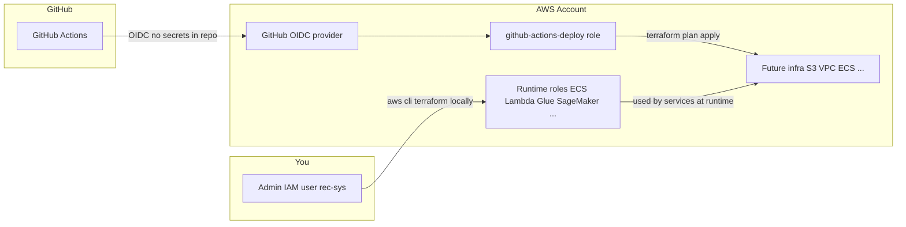

# AWS & Terraform — Initial Setup (v1)

| Field | Value |
|---|---|
| **Purpose** | Document what was configured on a fresh AWS account before deploying the full v1 stack |
| **Related** | [`v1-hld.md`](../../system-design/v1/v1-hld.md) · [`v1-infrastructure-layer.md`](../../system-design/v1/v1-infrastructure-layer.md) |
| **Region** | `us-east-1` |
| **Project prefix** | `fashion-reco-dev` |

---

## 1. Why this setup exists

The v1 architecture runs on AWS (ECS Fargate, Lambda, Glue, SageMaker, S3, Redis, etc.). Before any of that can be deployed, three foundations are needed:

| Foundation | Problem it solves |
|---|---|
| **Secure AWS account access** | Root user is too powerful for daily work |
| **IAM roles** | AWS services need permission to call each other (Lambda → S3, Fargate → SageMaker, etc.) |
| **CI/CD trust** | GitHub Actions must deploy to AWS **without** storing long-lived access keys in the repo |

This guide records what was done in the **initial bootstrap** — IAM only. S3, VPC, ECS, and the rest come in later Terraform applies.

---

## 2. Big picture (what talks to what)



**Key idea:** Humans and CI use **different** identities. Services at runtime use **roles**, not users.

---

## 3. Setup phases (order matters)

### Phase 0 — Account security (manual, one-time)

| Step | What | Why |
|---|---|---|
| Root MFA | Multi-factor auth on root login | Protects billing and account-level settings |
| Admin IAM user | e.g. `rec-sys` with admin access + MFA | Day-to-day work; never use root for Terraform |
| AWS CLI | `aws configure` with admin user keys | Lets scripts and Terraform talk to AWS |

**Done:** Root MFA enabled; admin user `rec-sys` configured.

---

### Phase 0.1 — Local config (`.env.local`)

Copy `.env.example` → `.env.local` (gitignored). **No access keys** in this file — only profile names, bucket names, and role ARNs.

| Setting | Purpose |
|---|---|
| `AWS_PROFILE` | Optional. Use `default` for `rec-sys` keys in `~/.aws/credentials`, or a named SSO profile later |
| `S3_BUCKET`, `AWS_REGION` | Object storage targets |
| `SAGEMAKER_ROLE_ARN` | SageMaker / MLflow jobs (from `infra/bootstrap/iam-outputs.json`) |

**How it is loaded:**

| Context | Mechanism |
|---|---|
| Python package / `scripts/*.py` | `fashion_recommendation_system.config` loads `.env.local` on import |
| Notebooks | `load_dotenv(REPO_ROOT / ".env.local")` in the setup cell (see notebook 05) |
| AWS CLI in PowerShell | Uses `~/.aws/credentials` (`[default]` when `AWS_PROFILE` unset). Match `.env.local` if you use a non-default profile: `$env:AWS_PROFILE = "default"` |

**Verify:**

```powershell
aws sts get-caller-identity
python scripts\upload_local_s3_mirror.py --verify-only
```

---

### Phase 1 — CI/CD role (GitHub OIDC)

**Trusted entity type in IAM console:** Web identity (not “AWS service”).

| Resource | Name | Purpose |
|---|---|---|
| OIDC provider | `token.actions.githubusercontent.com` | Lets GitHub prove “this workflow is from your repo” |
| IAM role | `fashion-reco-dev-github-actions-deploy` | Role GitHub Actions assumes to run Terraform / deploy |

**Why OIDC instead of access keys?**

- No `AWS_ACCESS_KEY_ID` / secret in GitHub
- Short-lived credentials per workflow run
- Trust limited to `rahulvansh66/fashion-recommendation-system` on branch `main`

**GitHub repository variables set:**

| Variable | Purpose |
|---|---|
| `AWS_ROLE_ARN` | ARN of the deploy role above |
| `AWS_REGION` | `us-east-1` |

**Applied via:** `infra/scripts/bootstrap-iam.ps1` (see §6).

---

### Phase 2 — Runtime service roles

**Trusted entity type in IAM console:** AWS service → pick the matching service (ECS, Lambda, Glue, etc.).

These roles are what **AWS services assume when they run** — not humans, not GitHub.

| Role | AWS service | Used by (v1 HLD) |
|---|---|---|
| `fashion-reco-dev-ecs-task-execution` | ECS | Pull Docker from ECR, write logs |
| `fashion-reco-dev-ecs-app-task` | ECS | FastAPI app: invoke SageMaker, Lambda, read S3 |
| `fashion-reco-dev-lambda-faiss` | Lambda | FAISS search: read index from S3 |
| `fashion-reco-dev-lambda-prewarm-producer` | Lambda | Nightly: enqueue cache pre-warm jobs to SQS |
| `fashion-reco-dev-lambda-prewarm-consumer` | Lambda | Run full recommendation pipeline, write Redis |
| `fashion-reco-dev-lambda-faiss-index-build` | Lambda | ML pipeline: build FAISS index → S3 |
| `fashion-reco-dev-glue-etl` | Glue | Batch ETL: raw → clean → features |
| `fashion-reco-dev-sagemaker-execution` | SageMaker | Training, MLflow, endpoints, Model Registry |
| `fashion-reco-dev-step-functions` | Step Functions | Orchestrate Glue + SageMaker Pipeline |
| `fashion-reco-dev-eventbridge` | EventBridge | Cron triggers (weekly batch, daily pre-warm) |

**Design rule (from v1 requirements):** One role per service type, least privilege — each role only gets permissions it needs.

**Important ARN for local ML work:**

```text
SAGEMAKER_ROLE_ARN=arn:aws:iam::<account-id>:role/fashion-reco-dev-sagemaker-execution
```

Set in `.env.local` when running SageMaker training or MLflow locally against AWS.

---

### Phase 3 — Terraform (Infrastructure as Code)

Terraform defines the **same** roles and future resources in code so they are repeatable and version-controlled.

```
infra/
├── bootstrap/              # Phase 1: GitHub OIDC (Terraform equivalent of bootstrap script)
├── modules/
│   └── iam_runtime/        # Phase 2: all 10 runtime roles
├── scripts/
│   └── bootstrap-iam.ps1   # What we actually ran (Windows-friendly)
├── main.tf                 # Wires modules; MLflow/Optuna gated by flags
├── environments/dev/
│   └── terraform.tfvars    # Dev settings (IAM on; MLflow/RDS off until VPC exists)
└── bootstrap/iam-outputs.json   # Local role ARNs after bootstrap (gitignored)
```

**Why both Terraform *and* a PowerShell script?**

- Terraform is the **long-term source of truth** (matches v1 HLD §14).
- On Windows, the Terraform AWS provider failed locally during bootstrap, so roles were created with **`bootstrap-iam.ps1`** via AWS CLI instead.
- GitHub Actions runs Terraform on **Linux**, where the provider works — so CI uses Terraform; local bootstrap used the script.

**Current dev tfvars flags:**

| Flag | Value | Reason |
|---|---|---|
| `enable_iam_runtime` | `true` | Create runtime roles |
| `enable_mlflow` | `false` | Needs S3 bucket first |
| `enable_optuna_rds` | `false` | Needs VPC + subnets first |

---

## 4. GitHub Actions workflow

**File:** `.github/workflows/terraform.yml`

| Trigger | Action |
|---|---|
| Push/PR to `main` touching `infra/**` | `terraform fmt -check` + `terraform plan` |

**How auth works:**

1. Workflow requests OIDC token from GitHub (`permissions: id-token: write`).
2. `aws-actions/configure-aws-credentials` exchanges it for AWS credentials via `AWS_ROLE_ARN`.
3. Terraform runs **plan only** (no auto-apply yet).

**To activate:** Push the workflow file to `main`, then check the **Actions** tab.

---

## 5. Tools installed on dev machine

| Tool | Purpose |
|---|---|
| **AWS CLI** | Call AWS APIs; used by bootstrap script |
| **Terraform** | Declare and apply infrastructure (`infra/`) |
| **Git** | Push code (was already installed) |
| **GitHub CLI (`gh`)** | Set repo variables, manage Actions from terminal |

---

## 6. How to re-run or verify bootstrap

### Verify roles exist

```powershell
aws iam list-roles --query "Roles[?contains(RoleName, 'fashion-reco')].RoleName"
```

### Re-run bootstrap (idempotent)

```powershell
powershell -ExecutionPolicy Bypass -File infra\scripts\bootstrap-iam.ps1
```

Skips resources that already exist. Outputs saved to `infra/bootstrap/iam-outputs.json`.

### Verify GitHub variables

```powershell
gh variable list
```

---

## 7. IAM cheat sheet for newcomers

| Question | Answer |
|---|---|
| Do I create a **user** before a **role**? | No. Users (humans) and roles (services) are independent. |
| Which trusted entity for Lambda/ECS? | **AWS service** |
| Which trusted entity for GitHub Actions? | **Web identity** (OIDC) |
| Who uses the admin IAM user? | You — for first-time bootstrap and local Terraform |
| Who uses `github-actions-deploy` role? | GitHub Actions only |
| Who uses `lambda-faiss` role? | The FAISS Lambda function at runtime |

---

## 8. What is **not** done yet

These are the **next** Terraform modules per v1 HLD — not part of initial IAM bootstrap:

| Resource | Why needed |
|---|---|
| S3 data lake bucket | Store raw data, features, models, FAISS indices |
| VPC + subnets | Redis, SageMaker VPC mode, optional private Fargate |
| ECS Fargate service | Host FastAPI monolith |
| ElastiCache Redis | Result cache + feature cache |
| Lambda functions | FAISS search, pre-warm |
| API Gateway + Cloud Map | Public ingress |
| SageMaker endpoints | User-tower + XGBoost inference |

Until S3/VPC exist, keep `enable_mlflow = false` and `enable_optuna_rds = false` in dev tfvars.

---

## 9. Quick reference — repo paths

| Path | What it is |
|---|---|
| `.env.example` | Template for local `.env.local` (profile, bucket, role ARNs) |
| `scripts/upload_local_s3_mirror.py` | Sync local `s3/` mirror to AWS bucket (reads `.env.local` via `config.py`) |
| `scripts/setup-aws-cli-ca-for-cursor.ps1` | One-time Avast/SSL fix for AWS CLI in Cursor terminals |
| `infra/scripts/bootstrap-iam.ps1` | One-command IAM bootstrap (Phase 1 + 2) |
| `infra/bootstrap/terraform.tfvars.example` | Template for GitHub OIDC Terraform stack |
| `infra/modules/iam_runtime/` | Terraform definition of all runtime roles |
| `infra/environments/dev/terraform.tfvars` | Dev environment variables |
| `.github/workflows/terraform.yml` | CI: Terraform plan via OIDC |
| `infra/bootstrap/iam-outputs.json` | Generated role ARNs (local only, gitignored) |

---

## 10. Security reminders

- Do **not** commit `.env.local`, access keys, or `terraform.tfvars` with secrets.
- Rotate GitHub PAT if it was ever exposed in a terminal log.
- Destroy costly resources (`terraform destroy` or stop SageMaker endpoints) between learning sessions — see v1 HLD cost section.
