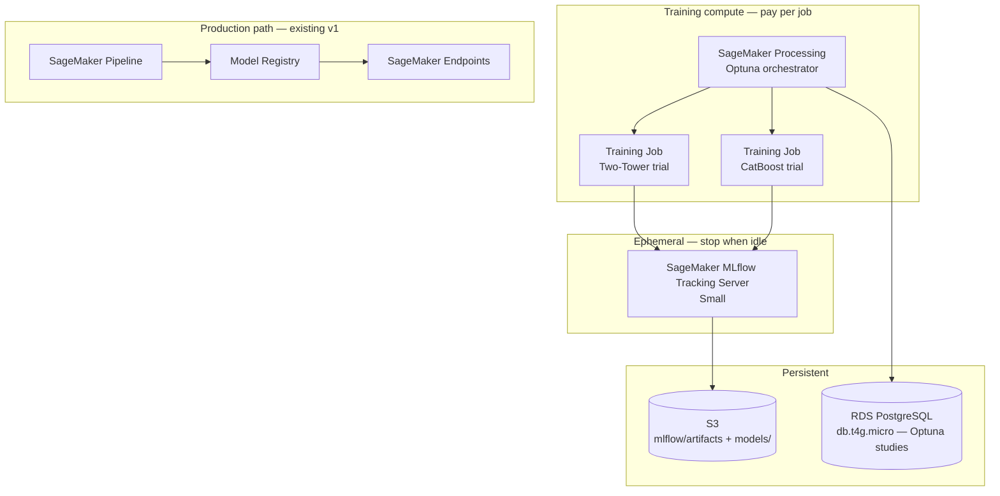

# MLflow + Optuna Experiment Tracking Guide

**Contract:** [`v1-requirements.md`](../../system-design/v1/v1-requirements.md) FR-BATCH-04, [`v1-hld.md`](../../system-design/v1/v1-hld.md) §11 / §12.3, [`v1-infrastructure-layer.md`](../../system-design/v1/v1-infrastructure-layer.md)  
**Related:** [`two-tower-retrieval-training-guide.md`](../two-tower-model/two-tower-retrieval-training-guide.md) · [`two-tower-retrieval-implementation-guide.md`](../two-tower-model/two-tower-retrieval-implementation-guide.md) · [`ranking-model-training-guide.md`](./ranking-model-training-guide.md) · [`features-eng.md`](./features-eng.md)  
**Purpose:** Document how to run hyperparameter experiments with **Optuna** and track them with **AWS Managed MLflow**, using a cost-conscious **stop (don't delete)** lifecycle that preserves experiment history across sessions.

This guide covers the **R&D / HPO phase** only. Production retraining (weekly SageMaker Pipeline → Model Registry → endpoints) uses **frozen hyperparameters** from a winning experiment — it does not run Optuna on every schedule.

---

## 1. Role in the system

Three layers serve different purposes. Do not conflate them.

| Layer | Tool | Purpose | Lifetime |
|-------|------|---------|----------|
| **Experiment tracking** | AWS Managed MLflow | Params, metrics, plots, trial artifacts, run comparison | Ephemeral **compute**; persistent **data** |
| **Hyperparameter search** | Optuna | Search space, trial scheduling, pruning, study persistence | Persistent study DB (cheap RDS or local SQLite) |
| **Production governance** | SageMaker Model Registry + Endpoints | Approval-gated promotion, serving, drift monitoring | Already defined in v1 HLD |

```text
Exploration (this guide)              Production (existing v1 pipeline)
────────────────────────              ──────────────────────────────────
Optuna study + many trials            SageMaker Pipeline (fixed configs/*.yaml)
        │                                      │
        ▼                                      ▼
MLflow logs every trial                 Train → eval → register → deploy
        │                                      │
        └──── best params → configs/*.yaml ────┘
                    │
                    ▼
           SageMaker Model Registry → Endpoints
```

**Online serving is unchanged.** MLflow is never on the request path. Fargate still calls SageMaker endpoints and FAISS Lambda per [`v1-hld.md`](../../system-design/v1/v1-hld.md) §9.

---

## 2. AWS Managed MLflow — components and persistence

SageMaker MLflow Tracking Server has three parts ([AWS docs](https://docs.aws.amazon.com/sagemaker/latest/dg/mlflow.html)):

| Component | Where it lives | Who pays | Survives server stop? |
|-----------|----------------|----------|------------------------|
| **Tracking server compute** | SageMaker-managed | You, while **Running** | N/A (stateless compute) |
| **Backend metadata store** (experiments, runs, params, metrics) | SageMaker service account | Included in managed service | **Yes** (while server resource exists) |
| **Artifact store** (models, checkpoints, plots) | Your S3 bucket | S3 storage (~pennies) | **Yes** (always) |

### 2.1 Stop, don't delete

AWS recommends **stopping** the tracking server when idle, not deleting it ([cleanup guide](https://docs.aws.amazon.com/sagemaker/latest/dg/mlflow-cleanup.html)).

| Action | Compute cost | Metadata (runs, params, UI history) | S3 artifacts |
|--------|--------------|---------------------------------------|--------------|
| **Stop** | ~$0 | Preserved | Preserved |
| **Start** (next session) | Billed while Running | Full history restored in UI | Preserved |
| **Delete + recreate** | ~$0 when gone | **Likely lost** — backend is tied to the server resource | Preserved if bucket kept |

Because SageMaker owns the metadata backend (unlike self-hosted MLflow + RDS), **deleting and recreating a tracking server is not a reliable way to reload old experiment history.** Artifacts remain in S3, but the searchable run index may be gone.

**V1 cost pattern:** treat the MLflow tracking server like SageMaker inference endpoints — **stop between learning sessions**, start only when experimenting.

```bash
# End of experiment session
aws sagemaker stop-mlflow-tracking-server \
  --tracking-server-name fashion-reco-mlflow-dev

# Next session (allow ~25 min for cold start)
aws sagemaker start-mlflow-tracking-server \
  --tracking-server-name fashion-reco-mlflow-dev
```

If you run `terraform destroy` on the full stack, either:
- **Exclude** the MLflow tracking server resource (keep it Stopped), or
- **Export** study results to S3 before destroy (§8.3).

---

## 3. S3 layout

Extend the existing data lake layout from [`v1-hld.md`](../../system-design/v1/v1-hld.md) §10.1:

```text
s3://fashion-reco-{env}/
├── mlflow/
│   └── artifacts/                 # MLflow artifact root (set at tracking-server create time)
├── experiments/
│   └── optuna/                    # optional: study exports, run manifests
├── features/                      # existing — training inputs
├── models/                        # existing — promoted production artifacts
│   ├── two_tower/version={vN}/
│   └── catboost/version={vN}/
└── ...
```

Production model artifacts under `models/` are written by SageMaker Training Jobs and the weekly pipeline. MLflow artifacts under `mlflow/artifacts/` are experiment outputs; only the **winning run** is promoted to `models/` and Model Registry.

---

## 4. Architecture



### 4.1 Where Optuna runs

| Pattern | When to use | Notes |
|---------|-------------|-------|
| **A. Optuna in SageMaker Processing** (orchestrator launches child Training Jobs) | Parallel trials, production-like | Shared RDS backend required ([AWS blog](https://aws.amazon.com/blogs/machine-learning/implementing-hyperparameter-optimization-with-optuna-on-amazon-sagemaker/)) |
| **B. Optuna inside one Training Job** (sequential trials) | Dev sample (~1K users), simpler | One `ml.m5.large` spot job |
| **C. Local notebook / script** | Fast iteration, $0 AWS | SQLite + local MLflow server |

For v1 dev sample scale, **B or C** is sufficient to start. Move to **A** when parallel trials justify the orchestration cost.

---

## 5. Configuration (migration-friendly)

Follow the hybrid config pattern from [`project-structure.md`](../../system-design/project-structure.md) §4:

- **Infrastructure endpoints** → `config.py` (env vars only)
- **Hyperparameters and search spaces** → `configs/` YAML

### 5.1 Environment variables

```python
# config.py — infra only; never hard-code ARNs in training code
MLFLOW_TRACKING_URI = os.getenv("MLFLOW_TRACKING_URI", "http://127.0.0.1:5000")
OPTUNA_STORAGE_URI  = os.getenv("OPTUNA_STORAGE_URI", "sqlite:///optuna.db")
MLFLOW_EXPERIMENT   = os.getenv("MLFLOW_EXPERIMENT", "fashion-reco-dev")
S3_BUCKET           = os.getenv("S3_BUCKET", "local-dev-bucket")
```

| Concern | Local | AWS |
|---------|-------|-----|
| `MLFLOW_TRACKING_URI` | `http://127.0.0.1:5000` | SageMaker tracking server ARN |
| MLflow artifacts | `./mlflow-artifacts/` or LocalStack S3 | `s3://fashion-reco-{env}/mlflow/artifacts/` |
| `OPTUNA_STORAGE_URI` | `sqlite:///optuna.db` | `postgresql+psycopg2://…@optuna-db…/optuna` |
| Training compute | SageMaker SDK `instance_type='local'` | `ml.m5.large` spot |
| **Training script (`train.py`)** | **Identical** | **Identical** |

### 5.2 Local MLflow server

```bash
mlflow server \
  --backend-store-uri sqlite:///mlflow.db \
  --default-artifact-root ./mlflow-artifacts \
  --host 127.0.0.1 --port 5000
```

Set `MLFLOW_TRACKING_URI=http://127.0.0.1:5000` in your local `.env`.

### 5.3 AWS MLflow tracking server (Terraform / CLI)

Create once; reuse across sessions via stop/start:

```bash
aws sagemaker create-mlflow-tracking-server \
  --tracking-server-name fashion-reco-mlflow-dev \
  --artifact-store-uri s3://fashion-reco-dev/mlflow/artifacts/ \
  --role-arn arn:aws:iam::ACCOUNT:role/SageMakerMLflowRole \
  --mlflow-version 3.0 \
  --tracking-server-size Small
```

Requirements:
- IAM role with S3 read/write on the artifact bucket and SageMaker Model Registry access (for optional auto-registration).
- Creation can take up to **25 minutes**; server starts automatically when ready.
- Note the tracking server **ARN** for `MLFLOW_TRACKING_URI`.

In training code:

```python
import mlflow

mlflow.set_tracking_uri(os.environ["MLFLOW_TRACKING_URI"])  # ARN on AWS
mlflow.set_experiment(os.environ.get("MLFLOW_EXPERIMENT", "fashion-reco-dev"))
```

---

## 6. Optuna + MLflow integration

### 6.1 Study storage (must outlive compute)

Optuna defaults to in-memory storage — lost when the process exits. Use a persistent backend:

```python
import optuna

storage = os.environ["OPTUNA_STORAGE_URI"]

study = optuna.create_study(
    study_name="two_tower_hpo_v1",
    storage=storage,
    load_if_exists=True,
    direction="maximize",
)
```

On AWS, a small **RDS PostgreSQL** (`db.t4g.micro`) dedicated to Optuna studies is sufficient. Keep it in a persistent Terraform module (like S3) so studies survive training-compute teardown.

### 6.2 Nested runs (parent study, child trials)

Log each Optuna trial as a nested MLflow run under a parent study run:

```python
import mlflow
import optuna
from optuna.integration import MLflowCallback

mlflow.set_tracking_uri(os.environ["MLFLOW_TRACKING_URI"])
mlflow.set_experiment("two-tower-hpo")

def objective(trial: optuna.Trial) -> float:
    lr = trial.suggest_float("lr", 1e-4, 1e-2, log=True)
    emb_dim = trial.suggest_categorical("embedding_dim", [16, 32, 64, 128])
    batch_size = trial.suggest_categorical("batch_size", [512, 1024, 2048])
    # ... run training, return validation metric
    return val_recall_at_100

with mlflow.start_run(run_name="two_tower_study_v1") as parent:
    mlflow.set_tags({
        "git_sha": os.environ.get("GIT_SHA", "unknown"),
        "feature_cutoff": "2020-03-31",
        "model": "two_tower",
        "split_role": "val",
    })
    mlflow.log_params({"n_trials": 30})

    callback = MLflowCallback(
        tracking_uri=os.environ["MLFLOW_TRACKING_URI"],
        metric_name="recall_at_100",
        mlflow_kwargs={"nested": True},
    )
    study = optuna.create_study(
        study_name="two_tower_hpo_v1",
        storage=os.environ["OPTUNA_STORAGE_URI"],
        load_if_exists=True,
        direction="maximize",
    )
    study.optimize(objective, n_trials=30, callbacks=[callback])

    mlflow.log_params({f"best_{k}": v for k, v in study.best_params.items()})
    mlflow.log_metric("best_recall_at_100", study.best_value)
```

Use `@MLflowCallback.decorate` on the objective if you need to log extra metrics or artifacts inside each trial.

### 6.3 Required run tags (reproducibility)

Tag every parent run and trial:

| Tag | Example | Why |
|-----|---------|-----|
| `git_sha` | `a1b2c3d` | Code version |
| `feature_snapshot` | `features/2026-06-01` | S3 path or manifest hash |
| `feature_cutoff` | `2020-03-31` | Temporal split contract |
| `model` | `two_tower` / `catboost` | Filter in MLflow UI |
| `data_env` | `dev` / `local` | Environment |

Without these tags, experiments are not reproducible.

---

## 7. Model-specific guidance

Use **val split only** for Optuna objective and early stopping. Never tune on **test** or **drift** slices ([`ranking-model-training-guide.md`](./ranking-model-training-guide.md) §7.4).

### 7.1 Two-Tower retrieval

Detail: [`two-tower-retrieval-training-guide.md`](../two-tower-model/two-tower-retrieval-training-guide.md) (model semantics) · [`two-tower-retrieval-implementation-guide.md`](../two-tower-model/two-tower-retrieval-implementation-guide.md) (repo runbook).

| Item | Guidance |
|------|----------|
| **Objective metric** | `recall@100` on val label window (`2020-04-01` → `2020-05-15`) |
| **Search space** | `lr`, `embedding_dim`, `batch_size`, `weight_decay`, tower hidden dims |
| **Log per trial** | Train/val loss curves, `recall@100`, checkpoint |
| **Artifact** | `mlflow.pytorch.log_model` or log checkpoint path to S3 |

### 7.2 CatBoost ranker

Detail: [`ranking-model-training-guide.md`](./ranking-model-training-guide.md).

| Item | Guidance |
|------|----------|
| **Objective metric** | `AUC-PR` on val pairs |
| **Search space** | `depth`, `learning_rate`, `l2_leaf_reg`, `iterations` (with early stopping) |
| **Fixed (do not tune)** | `scale_pos_weight=5`, 1:5 window-aware negatives, feature list from `configs/` |
| **Artifact** | `mlflow.catboost.log_model` → `.cbm` file |

### 7.3 What to log as artifacts

- Model checkpoint or exported artifact
- Optuna plots: optimization history, parameter importance (save PNG via `optuna.visualization`)
- Eval report JSON (metrics table for val split)
- `configs/` snapshot used for the trial (YAML copy)

---

## 8. Session lifecycle and cost control

Align with the v1 **Phase 2 AWS session** pattern from [`v1-infrastructure-layer.md`](../../system-design/v1/v1-infrastructure-layer.md):

```text
Session start
  1. start-mlflow-tracking-server   (or terraform apply mlflow module)
  2. Wait until status = Started      (~25 min cold start if fully stopped)
  3. Set MLFLOW_TRACKING_URI to tracking server ARN
  4. Run Optuna HPO (Processing job or local)

Session end
  1. Export best params → configs/models/*.yaml
  2. stop-mlflow-tracking-server
  3. terraform destroy sagemaker endpoints (existing pattern)
  # Keep: S3 bucket, RDS (Optuna), Stopped MLflow server resource
```

### 8.1 Optional: auto-stop idle server

EventBridge + Lambda can call `StopMlflowTrackingServer` after N hours of no new runs — same pattern as SageMaker cost-optimization tooling. Useful if you forget to stop manually.

### 8.2 MLflow tracking server sizing

| Size | When |
|------|------|
| **Small** (default) | Dev sample, single user, ≤ few parallel trials |
| **Medium** | Many parallel trials or large artifact volume |

Start Small; upgrade only if the MLflow UI or API becomes slow.

### 8.3 Pre-destroy export (if full terraform destroy is required)

If you must delete the tracking server resource:

```python
import mlflow
import pandas as pd

mlflow.set_tracking_uri(tracking_server_arn)
runs = mlflow.search_runs(experiment_names=["two-tower-hpo", "catboost-hpo"])
runs.to_parquet("s3://fashion-reco-dev/experiments/mlflow_export/runs.parquet")
```

Also export the Optuna study:

```python
import optuna

study = optuna.load_study(study_name="two_tower_hpo_v1", storage=storage_uri)
# Save best params and trials dataframe to S3
```

This is a fallback — **stop/start is the primary pattern.**

---

## 9. Handoff to production pipeline

After HPO completes:

1. **Select best trial** — highest val metric on the correct split; confirm tags match expected feature snapshot.
2. **Freeze hyperparameters** — write `study.best_params` to `configs/models/two_tower.yaml` and/or `configs/models/catboost.yaml`.
3. **Register model** — optionally register the best MLflow run to SageMaker Model Registry (managed MLflow supports this via `mlflow.register_model` or automatic model registration at tracking-server create time).
4. **Run weekly pipeline** — SageMaker Pipeline trains once with frozen YAML, evaluates on **test**, gates on `recall@100` + `AUC-PR` + `hit_rate@10` (FR-BATCH-04).
5. **Tag registry version** — add `mlflow.run_id` and `optuna.study_name` as Model Registry tags for lineage.

```text
Optuna best trial
    → configs/*.yaml (frozen)
    → SageMaker Pipeline (weekly, no Optuna)
    → eval on test
    → Model Registry approval
    → endpoint canary deploy
```

Do **not** run Optuna inside the weekly EventBridge-triggered pipeline — too expensive and non-deterministic for production promotion.

---

## 10. Local vs AWS workflow summary

| Phase | Local ($0) | AWS session |
|-------|------------|-------------|
| Feature pipeline | PySpark `local[*]` on `dataset/sample/` | Glue (or pre-materialized S3 features) |
| MLflow | Local server + SQLite backend | Managed tracking server (Stopped between sessions) |
| Optuna | SQLite storage | RDS PostgreSQL |
| HPO | Notebook or script, sequential trials | Processing orchestrator or sequential Training Job |
| Promotion | Copy best params to YAML manually | Same + optional Model Registry register |
| Serving | Local inference stubs | SageMaker Endpoints (destroy between sessions) |

---

## 11. Anti-patterns

| Don't | Do instead |
|-------|------------|
| Delete MLflow tracking server to save cost | **Stop** it; metadata persists |
| Tune on test or drift slices | Tune on **val** only; test for final gate |
| Run Optuna in weekly production pipeline | Freeze params after HPO; pipeline trains once |
| Use both SageMaker Hyperparameter Tuning Jobs and Optuna | Pick Optuna; one HPO system |
| Put MLflow on the online request path | SageMaker Endpoints + Redis cache (unchanged) |
| Skip run tags (`git_sha`, feature snapshot) | Tag every parent run and trial |
| Store secrets in MLflow params | SSM Parameter Store; env vars in `config.py` only |

---

## 12. Planned repo layout (implementation target)

Per [`project-structure.md`](../../system-design/project-structure.md):

```text
pipelines/
├── training/
│   ├── two_tower/train.py          # MLflow logging inside training loop
│   └── catboost/train.py
├── hpo/
│   ├── optuna_objective_two_tower.py
│   ├── optuna_objective_catboost.py
│   └── run_study.py                # local entry point
└── sagemaker/
    └── hpo_processing_job.py       # AWS orchestrator (optional)

configs/
├── models/
│   ├── two_tower.yaml              # frozen after HPO
│   └── catboost.yaml
└── hpo/
    ├── two_tower_search_space.yaml
    └── catboost_search_space.yaml

infra/modules/
├── mlflow_tracking_server/         # create + stop/start outputs
└── optuna_rds/                     # persistent PostgreSQL
```

Notebooks under `notebooks/` (e.g. `04_two_tower_experiments.ipynb`) may call the same `run_study.py` helpers — do not import from `src/` in notebooks per project rules.

---

## 13. Source references

| Topic | Reference |
|-------|-----------|
| AWS Managed MLflow | [SageMaker MLflow docs](https://docs.aws.amazon.com/sagemaker/latest/dg/mlflow.html) |
| Stop / delete lifecycle | [MLflow cleanup](https://docs.aws.amazon.com/sagemaker/latest/dg/mlflow-cleanup.html) |
| Optuna + SageMaker parallel HPO | [AWS ML blog](https://aws.amazon.com/blogs/machine-learning/implementing-hyperparameter-optimization-with-optuna-on-amazon-sagemaker/) |
| Optuna MLflow callback | [Optuna MLflowCallback](https://optuna.readthedocs.io/en/stable/reference/generated/optuna.integration.MLflowCallback.html) |
| Two-Tower training | [`two-tower-retrieval-training-guide.md`](../two-tower-model/two-tower-retrieval-training-guide.md) |
| CatBoost ranker training | [`ranking-model-training-guide.md`](./ranking-model-training-guide.md) |
| Production ML pipeline | [`v1-hld.md`](../../system-design/v1/v1-hld.md) §12.3 |
| Cost / destroy patterns | [`v1-infrastructure-layer.md`](../../system-design/v1/v1-infrastructure-layer.md) |
