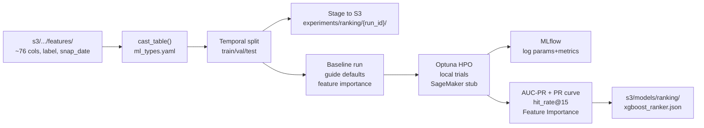

# Ranking Model Training — Implementation Plan

**Notebook:** `notebooks/06_ranking_model_training.ipynb`  
**Guide:** [`ranking-model-training-guide.md`](../guides/ranking-model-training-guide.md)  
**Features:** [`features-eng.md`](../guides/features-eng.md)  
**Pre-processing done:** [`pre-processing/README.md`](../pre-processing/README.md)

XGBoost ranker with MLflow + Optuna + SageMaker infrastructure mirroring `notebooks/05_two_tower_retrieval_experiments.ipynb`. Uses pre-engineered features with temporal splits, AUC-PR evaluation, and `hit_rate@15` computed locally on ranked test pairs.

---

## New files to create

| File | Analogous to |
|------|-------------|
| `configs/models/ranking.yaml` | `configs/models/two_tower.yaml` |
| `configs/hpo/ranking_search_space.yaml` | `configs/hpo/two_tower_search_space.yaml` |
| `notebooks/utils/ranking_training_helpers.py` | `notebooks/utils/two_tower_training_helpers.py` |
| `notebooks/06_ranking_model_training.ipynb` | `notebooks/05_two_tower_retrieval_experiments.ipynb` |

---

## Data flow



---

## Feature selection (53 features)

Decisions grounded in nb01 unsupervised EDA, nb04 supervised EDA (Spearman ρ + chi-square), and `features-eng.md` catalog.

### Categorical features — 16 (XGBoost native, `pd.Categorical`)

**Item catalog pass-throughs** (all chi-square significant vs `label` in nb04):

| Feature | EDA basis |
|---------|-----------|
| `product_type_name` | chi-square significant; finer taxonomy below garment group |
| `item_category` (`garment_group_name`) | chi-square significant |
| `item_color` (`colour_group_name`) | chi-square significant |
| `department_name` | strongest χ² of all categoricals in nb04 |
| `section_name` | structural taxonomy; complement to department |
| `index_group_name` | nb01: few values dominate catalog; significant χ² |
| `graphical_appearance_name` | product style signal |
| `product_group_name` | broad grouping; complement to product_type |
| `perceived_colour_value_name` | colour tone signal |
| `perceived_colour_master_name` | master colour family signal |
| `index_name` | index-level taxonomy |

**User preference categoricals:**

| Feature | EDA basis |
|---------|-----------|
| `user_category_pref_1y_rank1` | chi-square not significant alone (p≈0.51), but retained as categorical context for tree splits combining with category-match flags |
| `user_category_pref_1y_rank2` | same rationale |
| `user_category_pref_1y_rank3` | same rationale |
| `user_color_pref_1y_rank1` | color preference context |
| `user_color_pref_1y_rank2` | color preference context |

### Numeric features — 37

**User–item cross (dominant signal group, ρ 0.23–0.25 in nb04):**

| Feature | Spearman ρ | Note |
|---------|-----------|------|
| `user_item_repurchase` | 0.252 | strongest single feature |
| `user_item_decayed_repurchase` | 0.252 | recency-weighted complement |
| `user_item_decayed_interaction_ratio` | 0.252 | personal vs global demand |
| `user_item_repurchase_365d` | 0.249 | annual window |
| `user_item_repurchase_90d` | 0.237 | medium-term repeat |
| `user_item_sales_channel_2_count` | 0.233 | channel-specific repeat |
| `user_item_repurchase_30d` | 0.232 | short-term repeat |
| `user_item_days_since_last_purchase` | — | pair recency; complements counts |
| `user_item_price_decayed_zscore` | — | candidate price vs user budget |

**User–category cross:**

| Feature | Note |
|---------|------|
| `user_purchases_in_candidate_category_1y` | category affinity volume |
| `user_days_since_last_purchase_in_category` | ρ=−0.143; negative correlation = signal |
| `user_category_match_rank1` | binary: candidate in user top-1 preferred category |
| `user_category_match_rank2` | binary: candidate in user top-2 category |
| `user_category_match_rank3` | binary: candidate in user top-3 category |

**Item features:**

| Feature | Spearman ρ / note |
|---------|------------------|
| `item_pop_7d` | ρ=0.179; current trend |
| `item_pop_30d` | ρ=0.174; recent popularity — Mann-Whitney p≈5×10⁻²⁰ in nb04 |
| `item_pop_180d` | stable demand baseline |
| `item_pop_same_month_last_year` | seasonal demand baseline |
| `item_category_pop_30d` | category-level trend |
| `item_category_pop_180d` | category-level stable demand |
| `days_since_first_sold` | item novelty/age |
| `item_recent_to_last_180d_ratio` | trend acceleration signal |
| `item_category_recent_to_lifetime_ratio` | category trend acceleration |
| `item_seasonality_strength` | seasonal concentration of item demand |
| `item_avg_price` | Mann-Whitney p≈0.51 (weak alone), but retained as structural price anchor for `user_item_price_decayed_zscore` |
| `item_days_since_last_sold` | ρ=−0.208; strong negative signal (stale items less likely bought) |
| `item_sales_channel_2_count` | online purchase count for item |
| `item_sales_channel_2_share` | online sales share |
| `candidate_price` | actual price at this pair |

**User features:**

| Feature | Note |
|---------|------|
| `age` | nb01: bimodal demographic; price×age interactions |
| `user_days_since_last_purchase` | user recency |
| `user_purchase_count_30d` | Mann-Whitney p≈0.70 (weak alone), but retained as activity context for tree combinations |
| `user_purchase_count_180d` | stable user activity |
| `user_decayed_price_avg` | user price preference |
| `user_decayed_price_std` | user price range spread |

**Context:**

| Feature | Note |
|---------|------|
| `txn_month_sin` | cyclical month — from snap_date at train; from `current_date` at inference |
| `txn_month_cos` | paired seasonal encoding |

### Explicitly excluded

| Column | Reason |
|--------|--------|
| `customer_id`, `article_id` | IDs — join keys only |
| `snap_date`, `label` | anchor / target |
| `first_sold_date` | datetime; `days_since_first_sold` is the derived numeric form |
| `prod_name`, `detail_desc` | free text — no signal for tree models |
| `product_code`, `colour_group_code`, `index_code` | raw codes; categorical name versions included instead |
| `product_type_no`, `graphical_appearance_no`, `perceived_colour_value_id`, `perceived_colour_master_id`, `department_no`, `index_group_no`, `section_no`, `garment_group_no` | numeric IDs — categorical name versions included instead |
| `FN`, `Active` | ~65–66% missing in nb01; cast to "unknown/category" but effectively noise |
| `club_member_status`, `fashion_news_frequency` | sparse; no supervised EDA evidence of signal |
| `postal_code` | extremely high cardinality; no signal for ranking |

---

## `configs/models/ranking.yaml`

Mirrors `two_tower.yaml` structure:

```yaml
n_estimators: 100
learning_rate: 0.2
max_depth: 10
scale_pos_weight: 10         # 1:10 negatives per guide; nb02 must be updated to match
subsample: 0.8
colsample_bytree: 0.8
min_child_weight: 1
reg_lambda: 1.0
early_stopping_rounds: 10

temporal_split:
  train_snaps:               # 2020-03-24, 2020-03-31, 2020-04-07
    - { snap_date: "2020-03-24", label_start: "2020-03-25", label_end: "2020-03-31" }
    - { snap_date: "2020-03-31", label_start: "2020-04-01", label_end: "2020-04-07" }
    - { snap_date: "2020-04-07", label_start: "2020-04-08", label_end: "2020-04-14" }
  val_snaps:                 # 2020-04-14, 2020-04-28
    - { snap_date: "2020-04-14", label_start: "2020-04-15", label_end: "2020-04-21" }
    - { snap_date: "2020-04-28", label_start: "2020-04-29", label_end: "2020-05-05" }
  test_snaps:                # 2020-05-15
    - { snap_date: "2020-05-15", label_start: "2020-05-16", label_end: "2020-05-22" }

sagemaker:
  instance_type: ml.m5.large
  use_spot: true

optuna:
  study_name: ranking_hpo_v1
  n_trials: 10
  direction: maximize
  objective_metric: val_aucpr
```

---

## `configs/hpo/ranking_search_space.yaml`

```yaml
n_estimators:     { type: int,   low: 50,  high: 500 }
learning_rate:    { type: float, low: 0.01, high: 0.5,  log: true }
max_depth:        { type: int,   low: 4,   high: 12 }
min_child_weight: { type: float, low: 1.0, high: 10.0 }
subsample:        { type: float, low: 0.5, high: 1.0 }
colsample_bytree: { type: float, low: 0.5, high: 1.0 }
reg_lambda:       { type: float, low: 0.1, high: 10.0, log: true }
```

---

## `notebooks/utils/ranking_training_helpers.py`

Key functions (mirroring `two_tower_training_helpers.py`):

| Function | Purpose |
|----------|---------|
| `load_ranking_yaml(repo_root)` | loads `configs/models/ranking.yaml` |
| `load_ranking_search_space_yaml(repo_root)` | loads `configs/hpo/ranking_search_space.yaml` |
| `apply_temporal_split_ranking(df, temporal)` | returns `(train_df, val_df, test_df)` keeping **both** positives and negatives (unlike retrieval helper which keeps only `label==1`) |
| `stage_splits_local_ranking(train, val, test, local_s3_root, run_id)` | writes under `s3/experiments/ranking/{run_id}/` |
| `stage_splits_s3_ranking(train, val, test, bucket, run_id, region)` | uploads to `s3://bucket/experiments/ranking/{run_id}/` |
| `build_feature_schema(cat_cols, num_cols)` | returns dict saved as `feature_schema.json` |
| `hit_rate_at_k(model, test_df, feature_cols, k=15)` | oracle-candidate `hit_rate@k` on test pairs |
| `export_ranking_best_params(best_params, repo_root)` | writes best params to `configs/models/ranking.yaml` |

### `hit_rate_at_k` algorithm

Uses test pairs already in the dataset (oracle candidates — no retrieval stage needed):

1. Score all test rows: `scores = model.predict_proba(X_test)[:, 1]`
2. Group by `customer_id`; keep only users with ≥1 positive in test
3. For each user: rank their pairs by score → check if any `label==1` in top-k
4. `hit_rate@k = users_with_hit / total_users_with_positives`

This is the **local/oracle** variant. The full system `hit_rate@15` (using two-tower candidates) is pending two-tower integration.

---

## Notebook structure (mirrors notebook 05)

### 0. Introduction

### 1. Setup
- 1.1 Environment & credentials — `.env.local` → `MLInfraConfig.from_env()` + `validate_for_aws()`
- 1.2 Load configs — `load_ranking_yaml()`, `load_ranking_search_space_yaml()`, `load_feature_engineering_config()`
- 1.3 Verify feature schema

### 2. Infrastructure checks
- 2.1 MLflow tracking server status (`mlflow_server_status`)
- 2.2 Optuna RDS connectivity (`optuna.create_study(..., load_if_exists=True)`)

### 3. Data preparation
- 3.1 Load + cast features (`pd.read_parquet` + `cast_table`)
- 3.2 Define feature schema — 16 cat + 37 numeric; show column counts per group
- 3.3 Apply temporal split (train/val/test — both positives and negatives kept, unlike two-tower which keeps only `label==1`)
- 3.4 Stage to S3 — `stage_splits_local_ranking` (always) + `stage_splits_s3_ranking` (AWS)

### 4. Baseline training — feature importance check
- 4.1 Train single `XGBClassifier` with guide defaults (`n_estimators=100`, `learning_rate=0.2`, `max_depth=10`, `scale_pos_weight=10`) on train; evaluate val AUC-PR
- 4.2 Plot gain-based feature importance (all 53 features) — identify zero/near-zero contributors before HPO
- 4.3 Drop zero-importance features; print final active feature list passed to HPO
- 4.4 Commented stub for `pipelines/sagemaker/launch_ranking_job.py` (future AWS baseline job)

### 5. Hyperparameter optimization
- 5.1 Local Optuna study — objective trains `XGBClassifier` with trial params, returns `val_aucpr`; early stopping on val logloss inside each trial
- 5.2 SageMaker Processing stub (commented) for production scale
- 5.3 Monitor trials — `mlflow.search_runs(filter_string="tags.model = 'xgboost_ranker'")`

### 6. Final evaluation
- 6.1 Retrain with best params on train+val; evaluate on test
- 6.2 AUC-PR + Precision-Recall curve, ROC-AUC curve
- 6.3 Classification report at threshold 0.5
- 6.4 `hit_rate@15` on test (oracle-candidate)
- 6.5 Feature importance — gain-based top-25 bar chart

### 7. Results & handoff
- 7.1 MLflow runs table
- 7.2 Export best params → `configs/models/ranking.yaml` (`export_ranking_best_params`)
- 7.3 Save model (`xgboost_ranker.json`) + feature schema (`feature_schema.json`) to `s3/models/ranking/`

---

## Key implementation notes

- **scale_pos_weight=10**: aligned with 1:10 window-aware negatives per guide §4.2; nb02 must be updated to produce 10 negatives per positive before this notebook runs.
- **enable_categorical=True + tree_method="hist"**: XGBoost >= 1.6 handles pandas `Categorical` columns natively — partitions category values into two subsets at each split, no integer-ordering assumption. Columns must have `dtype=pd.Categorical` before `fit()`. No OrdinalEncoder step needed.
- **Optuna objective — maximize `val_aucpr`**: correct for this imbalanced binary ranking task. ROC-AUC inflates with 1:10 imbalance; logloss optimizes calibration not ranking quality; `hit_rate@15` is too noisy on val (small per-user N, binary outcome per user). AUC-PR is continuous, discriminative, and directly measures ranking quality under class imbalance. Within each trial, XGBoost `early_stopping_rounds` uses val logloss to halt tree growth; the trial returns `val_aucpr` at the best iteration to Optuna.
- **hit_rate@15**: oracle-candidate version — scored on test pairs already in the dataset, grouped by user. Full system metric requires two-tower retrieval (documented as future work).
- **Drift snaps**: loaded but filtered out before any training/eval pass.
- **Local vs AWS path**: same branching pattern as nb05 — `stage_splits_local_ranking` always runs; `stage_splits_s3_ranking` + SageMaker stubs are gated behind `ml_cfg.validate_for_aws()` success.
