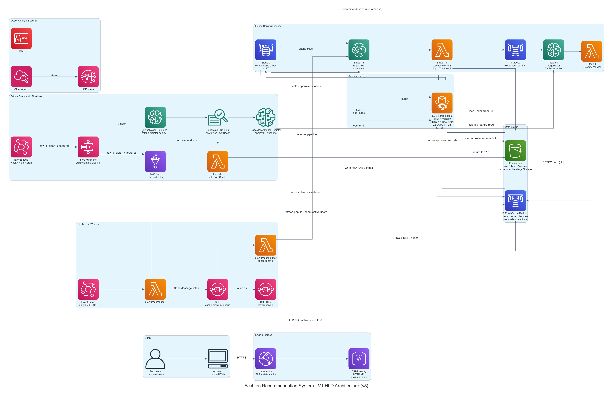

# Building an H&M Fashion Recommendation System: A System Design Walkthrough

Recommendation systems look simple when they reach the user. A person opens a page, clicks on a customer profile, and sees ten fashion items that feel relevant. The interesting work is hidden behind that moment: raw data has to become features, models have to be trained, vectors have to be searched, candidates have to be ranked, results have to be cached, and failures still need to return something useful.

This system is designed around the H&M fashion dataset. The goal is to serve personalized top-10 article recommendations while keeping the architecture realistic enough to teach production patterns: cache-first serving, two-stage machine learning, vector search, ranking, asynchronous pre-warming, observability, and infrastructure that can be deployed or destroyed without a lot of manual work.

The diagram is easier to understand block by block, so this post walks through each block in sequence. Each section explains what the component does and why it is useful in this project.

## 1. Client

<!-- Paste the Client block image here. -->

The client block is intentionally small because the user experience is intentionally focused. The user does not need a complex dashboard. They need a simple web flow that makes the recommendation system easy to demo and easy to reason about.

### End User / Portfolio Reviewer

**What it does:**  
The end user opens the application, logs in, selects a customer card, and views the recommended fashion items for that customer.

**Why it's useful in this project:**  
This project is partly an engineering demo, so the user role is framed as a reviewer or developer rather than a full production customer. That keeps the product surface small while still showing the important system behavior: cached users feel instant, non-cached users run the full pipeline, and the result is visible in the UI.

### Browser with Jinja + HTMX

**What it does:**  
The browser receives server-rendered HTML from the FastAPI application. Jinja2 renders the pages, and HTMX lets the page request recommendation fragments without a full reload.

**Why it's useful in this project:**  
HTMX gives the app a modern feel without adding a full React or SPA build pipeline. That matters here because the recommendation system is the main subject, not frontend tooling. A customer card can trigger a `GET /recommendations/{customer_id}` request, and only the recommendation section updates on the page.

## 2. Edge + Ingress

<!-- Paste the Edge + Ingress block image here. -->

The edge layer is the front door. It receives public traffic, terminates the user-facing request path, applies basic protection, and routes traffic into the application.

### CloudFront

**What it does:**  
CloudFront sits in front of the application as the edge entry point. It handles HTTPS access, can cache static assets, and gives the application a cleaner public-facing layer.

**Why it's useful in this project:**  
The app uses server-rendered pages and CDN-loaded frontend libraries, so static assets do not need to hit the backend every time. CloudFront also creates a natural place to add stronger production protections later, such as WAF rules, without changing the application code.

### API Gateway HTTP API

**What it does:**  
API Gateway receives HTTP requests from CloudFront and forwards them to the FastAPI service. It also applies stage-level throttling, with the diagram showing a 60 requests-per-second limit.

**Why it's useful in this project:**  
The recommendation path can call Redis, SageMaker, and Lambda, so uncontrolled traffic can quickly become expensive. API Gateway gives the system a first layer of protection before requests reach the application. HTTP API is also cost-friendly for a low-traffic learning project, especially compared with running an always-on load balancer just for the demo.

## 3. Application Layer

<!-- Paste the Application Layer block image here. -->

The application layer is where the product experience and API orchestration come together. This project keeps the frontend and backend in one deployable service instead of splitting them too early.

### ECS Fargate Task

**What it does:**  
The Fargate task runs the FastAPI monolith. It serves Jinja2 pages, handles HTMX requests, exposes API endpoints, checks rate limits, coordinates the recommendation pipeline, and talks to Redis, SageMaker, Lambda, and S3 when needed.

**Why it's useful in this project:**  
Fargate gives predictable always-warm application latency without managing EC2 servers. Keeping frontend and backend together also removes unnecessary network hops. For this system, one well-structured service is easier to deploy, monitor, and explain than several small services that would mostly call each other.

### FastAPI Monolith

**What it does:**  
FastAPI provides the web routes and API routes in the same Python application. It handles pages such as login and customer picker, plus endpoints such as health checks and recommendations.

**Why it's useful in this project:**  
The recommendation pipeline is already complex. A monolith keeps the application boundary simple: one codebase, one Docker image, one health check, and one set of logs. The system can still be split later if traffic or team ownership demands it, but the first version benefits from staying compact.

### ECR App Image

**What it does:**  
ECR stores the Docker image used by the Fargate task. CI/CD can build the application image, push it to ECR, and deploy that exact image into the environment.

**Why it's useful in this project:**  
Container images make local and cloud execution more consistent. The same app shape can run locally in Docker and in AWS on Fargate, with environment variables changing endpoints and configuration rather than changing business logic.

## 4. Online Serving Pipeline

<!-- Paste the Online Serving Pipeline block image here. -->

The online serving pipeline is the heart of the system. It is the path that runs when a user asks for recommendations. The design is deliberately ordered:

Cache -> Retrieve -> Filter -> Rank -> Order

The key idea is to do the cheapest useful work first and only call heavier ML services when the cache cannot answer the request.

### Stage 0: Redis Cache Check

**What it does:**  
The pipeline first checks Redis for `reco:{customer_id}`. If a fresh recommendation list exists, the application returns it immediately and skips the rest of the pipeline.

**Why it's useful in this project:**  
Recommendation results do not need to be recomputed on every page click. A 12-hour result cache makes repeated visits fast and cheap. It also creates a visible demo: pre-warmed users return in roughly cache-hit latency, while non-pre-warmed users run the full pipeline.

### Stage 1a: SageMaker User Tower

**What it does:**  
On a cache miss, the application fetches user features and sends them to a SageMaker endpoint hosting the user side of a two-tower model. The endpoint returns a user embedding.

**Why it's useful in this project:**  
The user tower turns a customer's behavior and attributes into a vector that can be compared against item vectors. This is much faster than scoring every fashion article directly. SageMaker is useful here because it provides a managed model-serving surface with deployment, monitoring, and scaling patterns that are close to real production ML systems.

### Stage 1b: Lambda + FAISS

**What it does:**  
The FAISS Lambda receives the user embedding and searches the item vector index. It returns the top candidate article IDs, usually around the top 100.

**Why it's useful in this project:**  
FAISS is a practical fit because the item index is small enough to load into Lambda memory, and warm vector search is very fast. It avoids the cost of a managed vector database while still demonstrating the retrieval pattern used in larger recommender systems.

### Stage 2: Redis Seen-Set Filter

**What it does:**  
The filter stage removes articles that the customer has already purchased. It reads a Redis set such as `seen:{customer_id}` and drops matching candidate IDs.

**Why it's useful in this project:**  
Fashion recommendations should not keep suggesting items the customer has already bought, especially in a top-10 list. Redis sets make this lookup simple and fast. The same stage also supports cold-start behavior by falling back to popular items when user information is missing.

### Stage 3: SageMaker CatBoost Ranker

**What it does:**  
The ranker receives the filtered candidates with user features, item features, and cross features. CatBoost scores each candidate by predicted purchase probability and returns a ranked list.

**Why it's useful in this project:**  
Retrieval is good at finding a broad candidate set, but ranking needs richer signals. CatBoost can use structured fashion features such as product type, color, price affinity, category preference, and recency. This two-stage setup keeps the system fast without giving up ranking quality.

### Stage 4: Diversity Reorder

**What it does:**  
The final stage adjusts the ranked list so the top recommendations are not too repetitive. The top four positions stay focused on CatBoost score, positions five and six introduce diversity, and the remaining positions return to the next strongest ranked items.

**Why it's useful in this project:**  
Fashion discovery is not only about showing the ten most similar products. A user may prefer a mix of categories, colors, and price ranges. A small diversity step makes the final list feel more natural without adding another heavy model call.

## 5. Data Stores

<!-- Paste the Data Stores block image here. -->

The data layer has a clear split: S3 is the source of truth, and Redis is the hot serving layer. That separation keeps the system understandable.

### ElastiCache Redis

**What it does:**  
Redis stores recommendation results, user features, item features, seen-item sets, active users for the picker page, fallback popular items, rate-limit counters, and pre-warm idempotency keys.

**Why it's useful in this project:**  
The online path needs millisecond reads. Redis is a strong fit for that because it supports strings, hashes, lists, and sets with native TTLs. It also keeps the app from repeatedly reading S3 or calling ML services for data that can safely be cached.

### S3 Data Lake

**What it does:**  
S3 stores the durable data and artifacts: raw H&M CSVs, cleaned parquet data, feature outputs, model artifacts, item embeddings, and FAISS index files.

**Why it's useful in this project:**  
S3 gives the system one durable storage backbone. If Redis is flushed or a cache key expires, the offline jobs can rebuild what is needed from S3. This also avoids introducing a second operational database just for the first version.

## 6. Offline Batch + ML Pipelines

<!-- Paste the Offline Batch + ML Pipelines block image here. -->

The offline side prepares everything the online path needs to stay fast. Heavy data work and model training happen before the user asks for recommendations, not during the request.

### EventBridge Weekly + Daily Cron

**What it does:**  
EventBridge schedules recurring jobs. Weekly schedules can trigger full data and ML refreshes, while daily schedules can refresh cache-friendly data such as popular items and active users.

**Why it's useful in this project:**  
The H&M dataset does not require continuous streaming for this scope. Scheduled batch updates are simpler, cheaper, and easier to operate. EventBridge gives the system a native AWS scheduler without running a separate orchestration server.

### Step Functions

**What it does:**  
Step Functions orchestrates the data and feature pipeline. It connects jobs such as raw-to-clean processing, feature generation, cache refreshes, and ML pipeline triggers.

**Why it's useful in this project:**  
The data pipeline has multiple steps that should run in order with retries and clear failure states. Step Functions makes that workflow visible and operationally manageable without introducing Airflow or another always-on tool.

### AWS Glue PySpark Jobs

**What it does:**  
Glue reads raw H&M data, validates and deduplicates it, writes clean parquet, builds user and item features, and refreshes Redis keys such as `popular:items:top100`, `seen:{customer_id}`, and `active:users:top6`.

**Why it's useful in this project:**  
Feature engineering is batch-heavy work. Glue lets the project use Spark-style processing without managing a cluster. It also keeps the online application lightweight because the app reads prepared features instead of computing them during a user request.

### SageMaker Pipelines

**What it does:**  
SageMaker Pipelines handles the ML workflow: preparing training tables, training the two-tower and CatBoost models, evaluating them, registering approved versions, computing item embeddings, and deploying model updates.

**Why it's useful in this project:**  
ML workflows need more than a script that trains a model once. They need repeatability, evaluation gates, model lineage, and safe deployment. SageMaker Pipelines provides those pieces in the same ecosystem as SageMaker endpoints.

### SageMaker Training

**What it does:**  
Training jobs train the two-tower retrieval model and the CatBoost ranking model using prepared feature data.

**Why it's useful in this project:**  
Training can be compute-heavy and does not belong in the web application. Managed training jobs keep that work isolated, repeatable, and easier to scale or shut down when not needed.

### SageMaker Model Registry

**What it does:**  
The model registry stores versioned model artifacts and approval states. Only approved models move into serving.

**Why it's useful in this project:**  
Model versions should not be deployed casually. The registry adds a production-style promotion step: train, evaluate, register, approve, and then deploy. It also makes rollback and model tracking more realistic.

### Lambda FAISS Index Builder

**What it does:**  
After item embeddings are produced, a Lambda builds a FAISS index and writes the new index file to S3.

**Why it's useful in this project:**  
The online FAISS Lambda should only load and search an index. Building the index offline keeps the serving Lambda small and fast. Storing versioned index files in S3 also makes index swaps possible without changing the whole application.

## 7. Cache Pre-Warmer

<!-- Paste the Cache Pre-Warmer block image here. -->

The pre-warmer is a small but important part of the design. It turns caching into something visible: some users are intentionally pre-computed before the first request of the day.

### EventBridge Daily 05:00 UTC

**What it does:**  
EventBridge triggers the pre-warming workflow every day at a fixed time.

**Why it's useful in this project:**  
The app can prepare recommendations before a reviewer clicks the page. That makes the cache-hit path easy to demonstrate and reduces first-request latency for selected active users.

### Prewarm Producer Lambda

**What it does:**  
The producer reads the top active users from Redis, usually from `active:users:top6`, and sends pre-warm work messages for the first three users.

**Why it's useful in this project:**  
The producer keeps scheduling separate from execution. Its job is only to decide which customers need pre-warming and place work onto the queue. That keeps the workflow simple and easy to retry.

### SQS Cache-Prewarm Queue

**What it does:**  
SQS stores pre-warm tasks as messages. Each message represents a customer whose recommendations should be computed and cached.

**Why it's useful in this project:**  
A queue decouples the producer from the consumer. If the consumer is slow or SageMaker is temporarily busy, messages can wait safely. This is also a clean example of a production work-queue pattern in a small system.

### SQS DLQ

**What it does:**  
The dead-letter queue receives messages that fail repeatedly, such as after three failed processing attempts.

**Why it's useful in this project:**  
Failed pre-warm work should not disappear silently. A DLQ gives operators something concrete to inspect and alarm on. It also prevents one poison message from being retried forever.

### Prewarm Consumer Lambda

**What it does:**  
The consumer reads each SQS message, runs the same recommendation pipeline used by the live API path, and writes the computed result into Redis with a 12-hour TTL.

**Why it's useful in this project:**  
Using the same pipeline avoids logic drift between pre-warmed recommendations and live recommendations. The consumer also uses an idempotency key such as `prewarm:done:{customer_id}:{date}`, so duplicate SQS delivery does not create duplicate work or corrupt the cache.

## 8. Observability + Security

<!-- Paste the Observability + Security block image here. -->

This block is drawn small in the diagram because it applies across the system rather than belonging to one request stage. Even so, it is essential. A recommendation system is not reliable just because the happy path works.

### IAM

**What it does:**  
IAM controls what each AWS component is allowed to access. The Fargate task, Lambdas, Glue jobs, and SageMaker workflows each use roles with scoped permissions.

**Why it's useful in this project:**  
Least-privilege IAM reduces blast radius. The pre-warm Lambda should not need broad permissions to everything, and the application should only read or call the services required for serving recommendations.

### CloudWatch

**What it does:**  
CloudWatch collects logs, metrics, alarms, and service-level signals from the application, Lambda, SageMaker, Redis, Glue, and orchestration workflows.

**Why it's useful in this project:**  
The system has multiple moving parts, so debugging by guessing would be painful. Metrics like cache hit ratio, per-stage latency, fallback counts, endpoint errors, and DLQ depth show whether the design is working in practice.

### SNS Alerts

**What it does:**  
SNS receives alarm notifications from CloudWatch and sends them to a configured destination such as email or a webhook.

**Why it's useful in this project:**  
Failures need to be visible. If pre-warming stops working, SageMaker starts returning errors, or fallback usage spikes, SNS makes the issue noticeable instead of leaving it buried in logs.

## 9. The Whole System Together

<!-- Paste the full architecture image here, or use the embedded image below. -->

When the system is viewed as a whole, the flow is straightforward.

The user starts in the browser. CloudFront and API Gateway handle the edge request and pass it into the FastAPI application running on ECS Fargate. The application first checks Redis because the best request is the one that can be answered from cache. If the recommendation result is already present and fresh, the system returns the top-10 list immediately.

On a cache miss, the application runs the online serving pipeline. It generates a user embedding through the SageMaker user tower, retrieves candidate items through FAISS in Lambda, removes already-purchased items using Redis, ranks the remaining candidates with the CatBoost SageMaker endpoint, and applies a diversity-aware reorder before writing the final result back to Redis.

The offline system keeps that online path lean. Glue prepares clean data and features. SageMaker Pipelines trains, evaluates, registers, and deploys model versions. A Lambda builds the FAISS index and stores it in S3. Redis is refreshed with hot keys such as popular items, seen sets, active users, and cached recommendations.

The cache pre-warmer connects the offline and online worlds. Every day, it selects the most active users, queues work through SQS, runs the same recommendation pipeline ahead of time, and writes the result cache before anyone clicks. That is why the UI can demonstrate two different experiences: a fast cache hit for pre-warmed users and a full live ML path for others.

The important design choice is that the system does not treat the model as the whole product. The model matters, but so do latency, caching, fallbacks, deployment safety, monitoring, and cost control. Together, these pieces turn a recommendation model into a recommendation system.

