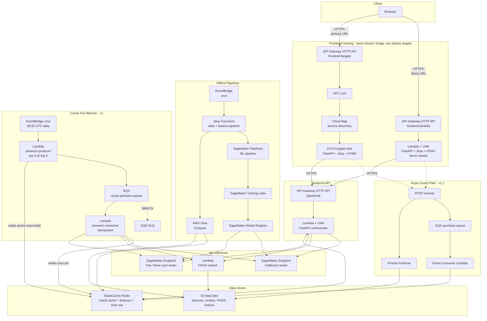
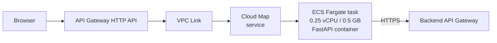
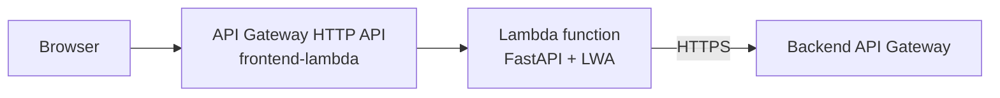
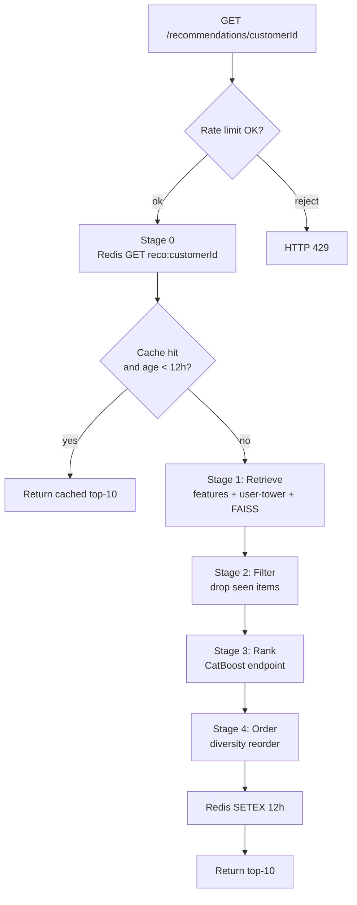
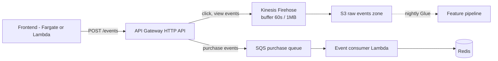
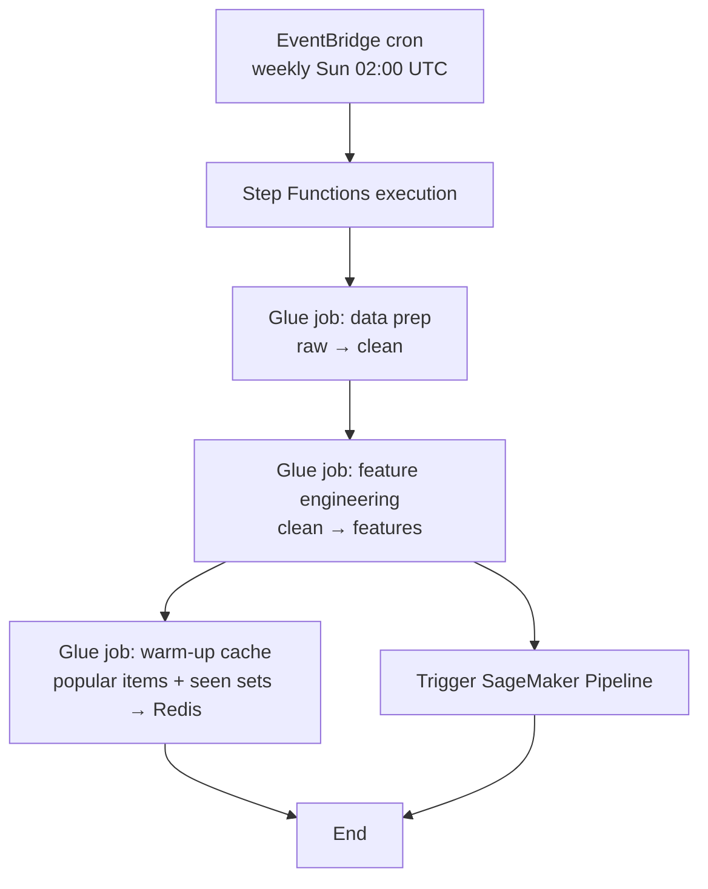
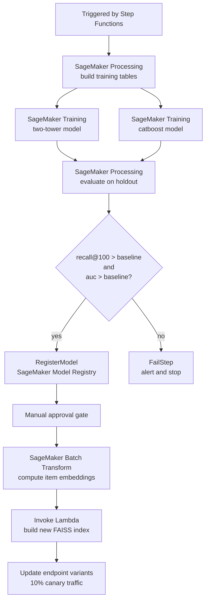
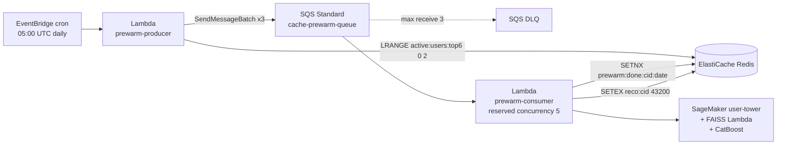
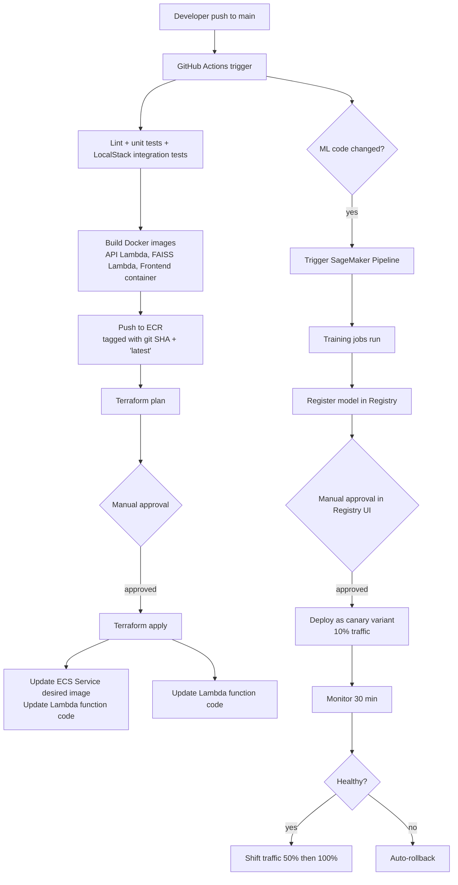

# Fashion Recommendation System — High-Level Design (HLD)

**Status:** v1.0 — design specification
**Last updated:** 2026-05-28
**Owner:** rahul.vansh
**Related docs:** [`project-description.md`](project-description.md), [`infrastructure-layer.md`](infrastructure-layer.md), [`schema-info.md`](schema-info.md), [`project-structure.md`](project-structure.md)

---

## 1. Document Purpose & Scope

This document defines the production-grade high-level architecture for the Fashion Recommendation System. It captures every component, the AWS service powering it, and the reasoning behind each choice. It is the source of truth that subsequent low-level design (LLD) and implementation work derives from.

### In scope (v1)

- Two-stage recommendation pipeline (Two-Tower retrieval + CatBoost ranking) with explicit Filter and Order stages on top
- Real-time online serving with a 12-hour result cache
- Frontend, API, ML inference, data lake, batch pipelines, CI/CD, and operations
- Cost-optimized AWS deployment that retains production-grade architectural patterns

### Explicitly out of scope (v1)

| Item | Reason |
|---|---|
| LLM Tag Extraction (`content_features/`) | Optional enrichment, not required for the core funnel |
| RAG Chatbot (`generation/rag/`) | Independent feature, separate request path; addressed in a future HLD |
| Online learning / model self-update from live events | Not needed at this stage; weekly batch retrain is sufficient |
| Multi-region active-active | Single-region (us-east-1); cost-prohibitive and unnecessary for learning |
| Real human authentication (Cognito / IdP) | V1 uses a placeholder login; documented as a production gap |

---

## 2. Executive Summary

The system serves personalized top-10 fashion-article recommendations through a five-stage online pipeline (cache check, retrieve, filter, rank, order) and a set of offline batch pipelines that train models, build feature stores, and produce vector indices.

### Key architectural choices

| Decision | Choice | Rationale |
|---|---|---|
| Serving model | Real-time per request, with a 12-hour Redis result cache | Acceptable freshness for fashion recos; cuts SageMaker invocations by ~95% on a re-visiting user |
| Pipeline shape | Cache → Retrieve → Filter → Rank → **Order (diversity)** | Production-realistic 4-stage funnel + cache; matches the Spotify/Pinterest pattern |
| Vector search | Lambda + FAISS (S3-backed `.index` file) | Pay-per-request, sub-millisecond warm latency, fits 10 GB Lambda memory |
| ML inference | SageMaker Endpoints (user-tower + CatBoost) | Native A/B testing, canary deployment, drift monitoring |
| Frontend | FastAPI + Jinja2 + HTMX + Tailwind on **ECS Fargate** | Production-grade pattern for server-rendered apps; HTMX gives a modern UI without an SPA build pipeline |
| Frontend ingress | API Gateway HTTP API + VPC Link + Cloud Map (no ALB) | Saves ~$16/mo vs. ALB; Cloud Map service discovery suits low-traffic Fargate |
| Frontend variant | **Lambda + LWA** as a parallel always-on demo deployment | Same Docker image; $0 idle cost; resume-shareable URL |
| Backend API | Lambda + AWS Lambda Web Adapter (LWA) | Same FastAPI container locally and in cloud; pay-per-request; scales to zero |
| Data lake | S3 only (no DynamoDB) | Eliminates per-read costs; user history kept in S3 + Redis |
| Cache | ElastiCache Redis | Result cache (12 h TTL) + hot user/item features + token bucket for rate limit |
| Batch processing | AWS Glue (PySpark) | Same code as `local[*]`; serverless; no cluster operations |
| Workflow orchestration | Step Functions (general) + SageMaker Pipelines (ML) + EventBridge (cron) | Native AWS, free, fits serverless theme; MWAA rejected on cost |
| IaC | Terraform | One-command apply / destroy for cost control |

### Numbers at a glance

| Metric | Target |
|---|---|
| Recommendation latency, cache hit | < 15 ms p95 |
| Recommendation latency, cache miss (warm pipeline) | < 250 ms p95 |
| FAISS Lambda warm invoke (network + search), p95 | < 20 ms |
| End-to-end availability (during active sessions) | 99.5% |
| Monthly cost during active learning sessions | $25 – $40 |
| Monthly cost when idle (Lambda + LWA variant only) | < $1 |

---

## 3. Architecture Principles

The whole system follows seven principles. Every component decision below traces back to one or more of them.

| # | Principle | What it means in practice |
|---|---|---|
| 1 | **Cost-first, learning-grade** | Default to scale-to-zero / serverless. Spend only on what teaches a production pattern. |
| 2 | **Migration-friendly** | The same Docker image and the same Python code run locally and on AWS. Differences are environment variables, never logic. |
| 3 | **SageMaker-centric ML** | All ML inference goes through SageMaker so we get A/B, canary, and Model Monitor for free. |
| 4 | **FAISS over a managed vector DB** | Portable, free, fits dataset size. OpenSearch and Pinecone documented as scale-up paths. |
| 5 | **S3 as the single data lake** | One storage substrate. No DynamoDB. Redis is a cache, not a system of record. |
| 6 | **Loose coupling, well-defined interfaces** | Each component has a single responsibility and a documented contract. Swapping a component should not require touching its neighbors. |
| 7 | **Production patterns over production scale** | We design for full H&M scale (1.37M users, 105K items, 31.8M transactions) and deploy on the dev sample (10K users, 5K items, 100K transactions). The architecture is identical; only sizing changes. |

---

## 4. System Context

### Actors

| Actor | Interaction |
|---|---|
| End user (in V1: developer / portfolio reviewer) | Logs in with `rr` / `rr`, sees 6 active-user cards. Each card shows `customer_id` and `age` (loaded from the test dataset via Redis) plus `current_date` (auto-computed on the server at page-load time — i.e., *today*). Clicks any card to view that customer's top-10 recommendations; the frontend forwards `customer_id`, `age`, and `current_date` to the inference pipeline as direct features. First 3 cards are pre-warmed (cache hit, fast); last 3 are live (cache miss, full pipeline). Identical UI on both Fargate and Lambda + LWA deployments. |
| Recommendation API consumer | `GET /recommendations/{user_id}` for top-K personalized items |
| Event producer (frontend) | Emits click/view/purchase events to the async event path (v1.1) |
| ML engineer (you) | Triggers training pipelines, reviews drift / model monitor reports, approves model promotions |

### External dependencies

| Dependency | Used for |
|---|---|
| H&M Personalization Challenge dataset | Source data (one-time import to S3 raw zone) |
| AWS managed services | All compute, storage, ML, networking |
| GitHub | Source of truth for code; CI/CD entry point |
| ECR Public Gallery | Base images (`python:3.11-slim`, AWS Lambda Web Adapter) |

---

## 5. Logical Architecture

The diagram below shows the core components and how they connect. Detailed flows live in later sections.



Both frontend deployments serve the full UI (login screen, user picker, recommendations page) — they share one Docker image and identical FastAPI + Jinja + HTMX code; only the deploy target differs. The browser loads whichever URL is shared (`frontend-fargate.<domain>` during active development, `frontend-lambda.<domain>` for the always-on resume demo), and from the user's perspective the experience is identical. Each frontend then calls the same backend API Gateway over HTTPS.

Dashed lines indicate either rare/conditional flows (the `warmQueue → warmDlq` failure path) or v1.1 components (the async event path) — documented but not on the v1 hot path.

---

## 6. Frontend Layer

### 6.1 Tech stack

| Concern | Choice | Reason |
|---|---|---|
| Framework | FastAPI + Jinja2 templates | Same Python ecosystem as the rest of the project; server-rendered HTML; no Node toolchain |
| Interactivity | HTMX | Modern partial-update UX without an SPA framework or a build pipeline |
| Styling | Tailwind CSS (via CDN initially, compiled later) | Rapid, modern UI; no JavaScript build step required for v1 |
| Server | uvicorn | Standard ASGI server; same image runs everywhere |
| Container | Single Dockerfile, AWS Lambda Web Adapter layer present (dormant on Fargate) | One image, two deploy targets |

### 6.2 Auth flow (V1, learning-only)

The frontend renders a login page server-side via Jinja with the following flow:

1. The login page asks for username and password only. It checks `username == "rr" and password == "rr"`. On match, a signed cookie session is set and the user is redirected to the user-picker page.
2. The user-picker page renders **six cards** for the top-6 most-active customers (sourced from the `active:users:top6` Redis list, populated by the nightly Glue job — see Section 13). Each card shows three values:

   | Field | Source | When it is determined |
   |---|---|---|
   | `customer_id` | Test dataset (`customers.csv`); pre-loaded into Redis by Glue | Nightly batch (stable across the day) |
   | `age` | Test dataset (`customers.csv`); pre-loaded into Redis by Glue | Nightly batch (stable across the day) |
   | `current_date` | **Auto-computed by the FastAPI handler at page-render time** — `datetime.utcnow().date().isoformat()` (or local date if preferred) | At every page load (changes naturally as the user revisits across days) |

   Each card has a button: **"Show recommendations for {customer_id}"**.

   Implementation note: `current_date` is **not** stored in any database, Redis key, or message. It is computed inside the Jinja-template-rendering FastAPI handler each time `GET /` is hit, then injected into all six cards in that page render. If the user keeps the page open across midnight, the date stays whatever was rendered; a page refresh re-computes it.

3. Clicking the button issues an HTMX `GET /recommendations/{customer_id}?age={age}&date={current_date}&k=10` request. The frontend forwards the three inputs the inference pipeline needs (`customer_id`, `age`, `current_date`); the backend uses them as direct features without an extra Redis/S3 lookup. The response is a server-rendered fragment of the top-10 article cards that swaps into the page.
4. Subsequent navigation back to the picker keeps the session cookie; the user can switch between any of the six users without re-logging in. Each fresh render re-computes `current_date`.

#### Same card UI on both deploy targets

The 6-card UI is rendered identically on both the **ECS Fargate** (primary) and **Lambda + LWA** (always-on demo) deployments. They share one Docker image and one Jinja template — only the deploy target differs, never the rendered HTML. A user opening either URL gets the same login flow, the same six cards, the same buttons, and the same observed latency split between pre-warmed and live cards.

#### Demo story — visible cache pre-warm

The first **3 of the 6 cards** correspond to customers whose recommendations were pre-warmed in Redis by the nightly SQS-driven cache-warmer (Section 13.5). When HR or a hiring manager clicks one of those three cards, the response is a **cache hit** (~15 ms p95). When they click any of the other three cards, the response is a **cache miss** that runs the full 5-stage pipeline (~190 ms p95). The latency difference is visible to the naked eye and gives the demo a concrete moment to talk about the SQS work-queue + idempotent-consumer pattern.

A small badge on the first three cards (e.g., `pre-warmed`) makes the distinction explicit during walk-throughs.

This is intentionally trivial as authentication. It demonstrates the integration pattern without standing up Cognito or a real IdP. The HLD documents this as a known production gap (see Section 18).

### 6.3 Hosting — primary path: ECS Fargate

The primary frontend deployment is an ECS Fargate service in a public subnet with a public IP, fronted by an API Gateway HTTP API via VPC Link + Cloud Map.



#### Why this stack

| Component | Why this and not alternatives |
|---|---|
| **ECS Fargate** | Production-standard for containerized server-rendered apps. Teaches VPC, task definitions, service discovery, auto-scaling. EC2 rejected (manual ops). EKS rejected (overkill, costs $73/mo for control plane). |
| **API Gateway HTTP API** (instead of ALB) | ALB is the textbook production fronting for Fargate but costs ~$16/mo idle + LCU charges. HTTP API replaces it at $1 per 1M requests (~$0 at our scale) plus ~$0.50/mo for Cloud Map. Saves ~$16/mo. |
| **Cloud Map service discovery** (instead of NLB) | A discovery layer is required for VPC Link to find Fargate tasks. Cloud Map costs ~$0.50/mo vs. ~$16/mo for NLB. ECS registers task IPs with Cloud Map automatically. |
| **Public subnet, public IP for the task** | Avoids the $32/mo NAT Gateway. Documented as a deliberate cost tradeoff. The production-hardened path (private subnet + VPC Endpoints) is documented in Section 18. |
| **Single task, desired count = 1** | Sufficient for learning load. Auto-scaling target tracking is configured (min 1, max 4) so the production pattern is in place even if it never triggers. |

#### Production-hardening path (documented, not implemented in v1)

In real production this same architecture would run with:

| Today (v1) | Production hardening |
|---|---|
| Public subnet + public IP for the task | Private subnet, no public IP |
| No NAT, no VPC endpoints | NAT Gateway (~$32/mo) **or** VPC Endpoints — Gateway endpoints for S3 (free), Interface endpoints for ECR `api`, ECR `dkr`, SageMaker Runtime (~$7/mo each) |
| Single Cloud Map service | Same |
| HTTP API | ALB if richer L7 features required (path-based routing, sticky sessions, WAF integration) |

This is a deliberate, documented cost decision. The terraform module is built so swapping subnets and adding endpoints is a config change.

### 6.4 Hosting — demo variant: Lambda + LWA

A second deployment of the **same Docker image** runs as a Lambda function with the AWS Lambda Web Adapter extension, fronted by its own API Gateway HTTP API.



#### Why also build this

- Resume-shareable URL with **$0 idle cost** and ~1 s cold start
- Validates true container portability — the same image runs on Fargate and Lambda with zero code change
- Demonstrates two compute paradigms (always-warm container vs. event-driven serverless) on the same workload, which is itself a valuable production-engineering signal

#### When each is active

| Scenario | Active deployment |
|---|---|
| Active learning / development sessions | ECS Fargate (terraform applied) |
| Between sessions, resume sharing | ECS torn down (`terraform destroy ecs_module`); Lambda + LWA stays deployed at $0 idle |
| Both active simultaneously | Possible (different domain prefixes); useful for side-by-side comparison demos |

### 6.5 CDN and TLS

- **CloudFront** sits in front of both API Gateways for TLS termination, edge caching of static assets (CSS, JS, font files), and HTTP/2 support.
- **ACM** provides the TLS certificates (free for AWS-managed certificates).
- Static asset caching at the edge keeps origin calls minimal.

---

## 7. API Gateway & Edge

The system uses **two separate API Gateway HTTP APIs**:

| API | Purpose | Backed by |
|---|---|---|
| `frontend-fargate.<domain>` | Serves the rendered HTML/HTMX UI | VPC Link → Cloud Map → ECS Fargate |
| `frontend-lambda.<domain>` | Demo variant of the same UI | Lambda + LWA |
| `api.<domain>` | JSON recommendations API consumed by both frontends | Lambda + LWA orchestrator |

All three sit behind CloudFront for TLS termination and basic edge protection (WAF managed rules optional).

### Why HTTP API and not REST API

| Feature | HTTP API | REST API |
|---|---|---|
| Cost | $1.00 per 1M requests | $3.50 per 1M requests |
| Latency overhead | ~5 ms | ~15 ms |
| Built-in JWT authorizer | Yes | Yes |
| Rate limiting (usage plans) | Stage-level throttling | Per-key usage plans (richer) |
| API keys with usage plans | Limited | Full |
| Native Lambda + ECS integration | Yes (via VPC Link) | REST is more mature for ECS via NLB |

For our scale (well under 1M req/mo) HTTP API wins on cost and latency. The richer per-key usage plans of REST API aren't needed in v1.

### Rate limiting (Pattern 2 of the 7)

Two layers:

1. **API Gateway stage throttling**: 60 RPS, burst 100, per stage. Prevents cost runaway from a buggy client.
2. **Application-level token bucket** in the API Lambda, keyed by `customer_id` in Redis. Default 30 requests / minute / user. Prevents one user from starving SageMaker capacity.

Implementation note: the application-level limit lives in the orchestrator Lambda, not in API Gateway, because per-`customer_id` keys are not first-class in HTTP API usage plans.

---

## 8. Backend API Layer

### 8.1 Compute and packaging

| Concern | Choice |
|---|---|
| Framework | FastAPI |
| Lambda packaging | Container image (Lambda function packaging type = `Image`) |
| Lambda Web Adapter | Loaded as a Lambda extension layer (`public.ecr.aws/awsguru/aws-lambda-adapter`) |
| Memory | 1024 MB (raised from default for faster cold starts; ~$0 difference at our volume) |
| Timeout | 30 s (more than enough for the 5-stage pipeline) |
| Concurrency | Reserved concurrency = 100 (cost guardrail) |

The same FastAPI container runs locally via `docker run`, on Fargate, and on Lambda. Identical code path; only the entrypoint context differs.

### 8.2 Endpoints (v1)

| Method | Path | Purpose |
|---|---|---|
| `GET` | `/health` | Liveness probe |
| `GET` | `/recommendations/{customer_id}?age={age}&date={YYYY-MM-DD}&k=10` | Top-K recommendations. `age` and `date` are inference-pipeline inputs forwarded by the card click. `date` is the **`current_date` auto-computed at page-load time** by the frontend handler (server time, today); it is *not* stored anywhere. |
| `POST` | `/login` | Trivial `rr/rr` check, sets session cookie |
| `GET` | `/users/active` | Top-6 most-active users for the user-picker cards. Returns `customer_id`, `age`, and a `prewarmed` boolean (true for the first 3). The card's `current_date` is set client-side / server-side at render (today). Reads `active:users:top6` from Redis. |

v1.1 adds:

| Method | Path | Purpose |
|---|---|---|
| `POST` | `/events` | Click / view / purchase event ingestion |

### 8.3 Why Lambda + LWA, not Fargate, for the API

Different workloads, different optimal compute models — a deliberate hybrid:

| API trait | Why Lambda fits |
|---|---|
| Bursty, low-volume | Pay-per-request cleanest |
| Stateless | No session affinity needed |
| Latency tolerance | < 250 ms p95 budget allows for ~500 ms cold start; provisioned concurrency available for hot demos |
| Scales to zero | $0 between active sessions |
| Same container as the frontend variant | Already built, already in ECR |

The frontend uses Fargate primarily for *learning the production pattern* — that learning value isn't there for the API, where Lambda is the de-facto modern choice.

---

## 9. Online Serving Pipeline — Five Stages

The orchestrator Lambda implements a five-stage pipeline. Stage 0 is the cache short-circuit; Stages 1–4 run on cache miss.



### 9.1 Stage 0 — Cache check

- Key: `reco:{customer_id}`
- Value: JSON list of 10 article IDs with scores, plus a `created_at` timestamp
- TTL: 43,200 s (12 h)
- Hit path: return immediately. Total latency budget: < 15 ms p95.

### 9.2 Stage 1 — Retrieve

Three sub-steps in order:

1. **Fetch user features**
   - Try Redis first: `HGETALL user:{customer_id}:features`
   - On miss, read from S3: `s3://.../features/users/customer_id={cid}/part-*.parquet`. Populate Redis with `EX 3600` (1 h TTL) for next call.

2. **Generate user embedding**
   - Invoke SageMaker Endpoint `two-tower-user-tower` with the feature vector.
   - Returns a 256-dim embedding.

3. **FAISS search**
   - Invoke the FAISS Lambda synchronously with the embedding.
   - Returns top-100 article IDs with similarity scores.

### 9.3 Stage 2 — Filter

- Read `seen:{customer_id}` from Redis (a set of article IDs the user has already purchased).
- Drop any candidate present in the set.
- Cold-start case: if the set is empty *and* no user features exist, short-circuit to a global "popular items" Redis key (`popular:items:top100`) prepopulated by the nightly Glue job.

### 9.4 Stage 3 — Rank

- For each remaining candidate (typically 50–100 after filter), build the feature vector: user features + item features + cross features (e.g., user's preferred category vs. item category, user's price affinity vs. item price).
- Item features are read in bulk from Redis: `HMGET item:{id1}:features ... item:{id100}:features`. Single round-trip, sub-2 ms.
- Invoke SageMaker Endpoint `catboost-ranker` with the batch of feature vectors.
- Returns scored candidates sorted by predicted purchase probability.

### 9.5 Stage 4 — Order (diversity-aware reorder)

The CatBoost output is **not** the final order. The reorder rule:

```
positions 1–4   = top 4 items by raw CatBoost score
positions 5–6   = top 2 items by diversity_score vs. positions 1–4
positions 7–10  = next 4 items by raw CatBoost score
                  (excluding any already chosen in positions 5–6)
```

#### Diversity score (V1)

For a candidate item `c` and a set `S` of items already selected for positions 1–4:

```
diversity_score(c, S) =
      w1 * categorical_diff(c.product_type_no,    S)
    + w2 * categorical_diff(c.colour_group_code,  S)
    + w3 * bucket_diff     (c.price_bucket,       S)
```

where:

- `categorical_diff(value, S)` = 1 if `value` differs from every item in `S`, else 0
- `bucket_diff(bucket, S)` = `min(|bucket - s.bucket| for s in S) / max_bucket_distance`
- Weights `w1 = w2 = w3 = 1.0` in v1; configurable via Lambda env vars

The score breaks ties by raw CatBoost score (the more relevant of two equally diverse items wins).

#### Why this rule

- The first 4 positions matter most for click-through; pure relevance there
- Positions 5–6 introduce variety so the user discovers something they wouldn't have otherwise
- Positions 7–10 fall back to relevance — by this depth, raw quality matters more than diversity

#### V2 enhancement (documented, not built)

Replace the categorical+price diversity with **embedding cosine distance** — `1 - max(cosine(c.embedding, s.embedding) for s in S)`. Captures latent style similarity (two black t-shirts of similar style get penalized even if `colour_group_code` differs). Requires loading 256-dim item embeddings into the API Lambda or a fast embedding cache.

### 9.6 Latency budget

| Stage | p50 | p95 |
|---|---:|---:|
| Stage 0: cache check + (HIT) return | 5 ms | 12 ms |
| Stage 1: feature fetch (Redis) | 2 ms | 5 ms |
| Stage 1: SageMaker user-tower invoke | 30 ms | 80 ms |
| Stage 1: FAISS Lambda invoke (warm) | 5 ms | 15 ms |
| Stage 2: filter (Redis SMEMBERS) | 2 ms | 5 ms |
| Stage 3: item features bulk read | 2 ms | 5 ms |
| Stage 3: SageMaker CatBoost invoke | 25 ms | 70 ms |
| Stage 4: diversity reorder | 1 ms | 2 ms |
| Cache write + serialize response | 3 ms | 6 ms |
| **Total — cache miss, all warm** | **~75 ms** | **~190 ms** |
| Total — cache miss, cold FAISS Lambda | ~575 ms | ~700 ms |
| Total — cache hit | ~10 ms | ~15 ms |

### 9.7 Circuit breakers and fallbacks (Pattern 5 of the 7)

Each downstream call is wrapped in a `pybreaker` circuit breaker with these defaults: 5 failures within 30 s → open; 30 s open duration; 1 half-open probe.

| Failing dependency | Behavior on open breaker |
|---|---|
| Redis (cache or feature read) | Skip cache, continue with pipeline; emit CloudWatch alarm |
| SageMaker user-tower endpoint | Fall back to a Redis-cached embedding for this user (24 h TTL set during last successful call). If absent, skip to popular items. |
| FAISS Lambda | Use precomputed `popular:items:by_category` cache (refreshed nightly) |
| SageMaker CatBoost endpoint | Return the FAISS top-K ordered by raw similarity score (no re-rank), still apply diversity reorder |
| All ML downstreams open | Return `popular:items:top100` from Redis with a `degraded=true` flag in the response payload |

Every fallback emits a CloudWatch metric (`recommendation.fallback.{component}`) and increments a counter wired to an SNS alarm.

The cache pre-warm consumer Lambda (Section 13.5) imports the same pipeline module and therefore wraps the same downstreams in the same `pybreaker` breakers — pre-warm runs and live requests share one breaker state per region, so a pre-warm failure path doesn't affect live traffic and vice-versa beyond the shared breaker signal.

---

## 10. Async Event Path (v1.1)

The synchronous request path stays free of queues to keep latency low. All asynchronous work (event ingestion, cache invalidation) runs on a parallel path, off the critical path.



### 10.1 Event types

| Event | Volume estimate | Destination | Purpose |
|---|---|---|---|
| `view` (impression) | High | Firehose → S3 raw | Aggregated nightly into engagement features |
| `click` | Medium | Firehose → S3 raw | Engagement features + future online learning |
| `add_to_cart` | Low | Firehose → S3 raw | Engagement features |
| `purchase` | Low | SQS | Two side effects: update `seen:{customer_id}`, invalidate `reco:{customer_id}` |

### 10.2 Why this split

- **Firehose** for high-volume events: native batching (60 s / 1 MB buffer), $0.029/GB ingest, dumps to S3 in parquet without a Lambda consumer.
- **SQS** for purchase events: low volume, requires a consumer that does *active work* (Redis updates), benefits from at-least-once delivery and DLQ.

### 10.3 Cache invalidation logic

The consumer Lambda processes each purchase event:

```python
# sketch only
def handle_purchase(event):
    cid = event["customer_id"]
    article_id = event["article_id"]
    redis.sadd(f"seen:{cid}", article_id)
    redis.delete(f"reco:{cid}")  # next request will recompute
```

Failures are retried by SQS (3 attempts). Persistent failures land in a DLQ with an alarm.

### 10.4 v1 vs v1.1 boundary

v1 ships **without** the `/events` endpoint. The seen set is rebuilt nightly by the feature pipeline; cache invalidation relies on the 12-hour TTL. v1.1 adds the endpoint and the consumer Lambda. The HLD documents the architecture so v1's feature pipeline already produces the seen set in Redis from day one.

---

## 11. Data Layer

### 11.1 S3 data lake layout

```
s3://fashion-reco-{env}/
├── raw/                        # Original H&M CSV (one-time import)
│   ├── articles.csv
│   ├── customers.csv
│   └── transactions_train.csv
├── clean/                      # Validated parquet, partitioned by date where applicable
│   ├── articles/
│   ├── customers/
│   └── transactions/year=YYYY/month=MM/
├── features/                   # Model-ready features
│   ├── users/customer_id={cid}/
│   ├── items/article_id={aid}/
│   └── interactions/year=YYYY/month=MM/
├── models/                     # Model artifacts (also in SageMaker Model Registry)
│   ├── two_tower/version={vN}/
│   └── catboost/version={vN}/
├── embeddings/                 # Item embeddings (256-dim) for FAISS index build
│   └── items/version={vN}/
├── indices/                    # Built FAISS indices loaded by the FAISS Lambda
│   └── faiss_items/version={vN}.index
├── enriched/                   # Reserved for content_features/ (out of scope v1)
└── events/                     # Reserved for v1.1 raw click/view events
    └── year=YYYY/month=MM/day=DD/
```

### 11.2 Why S3 only (no DynamoDB)

| Need | DynamoDB option | S3 + Redis option (chosen) |
|---|---|---|
| User feature lookup | Item read per request, ~$0.25/M | Redis HGETALL ~$0; Glue daily refresh |
| Seen-items set | DDB List, paginated reads | Redis SMEMBERS ~$0; Glue daily rebuild |
| Recommendation cache | DDB GetItem | Redis GET, native TTL |
| Cost (full scale, 100 RPS) | ~$30/mo for read capacity | ~$15/mo cache.t3.medium |
| Operational complexity | Provisioning, hot partitions | Single Redis cluster |

S3 + Redis covers every access pattern at lower cost, with Redis acting as the hot tier and S3 as the cold tier of the same data.

### 11.3 Redis key map

| Key pattern | Type | TTL | Source of truth | Purpose |
|---|---|---|---|---|
| `reco:{customer_id}` | JSON string | 12 h | Computed live OR by nightly pre-warm consumer (Section 13.5) | Result cache |
| `user:{customer_id}:features` | Hash | 1 h | S3 features/users | Feature read cache |
| `item:{article_id}:features` | Hash | 24 h | S3 features/items | Feature read cache |
| `seen:{customer_id}` | Set | none (rebuilt nightly) | S3 transactions + v1.1 events | Filter stage |
| `popular:items:top100` | List | 24 h | Glue nightly | Cold-start fallback |
| `popular:items:by_category:{cat}` | List | 24 h | Glue nightly | FAISS-failure fallback |
| `ratelimit:{customer_id}` | String + TTL | 60 s | Live | Token bucket counter |
| `embedding:user:{customer_id}` | Bytes | 24 h | Last successful user-tower call | User-tower fallback |
| `active:users:top6` | List of JSON entries `{customer_id, age, prewarmed}` | 24 h | Glue nightly cache warm-up (Section 13.1) | User-picker cards (Section 6.2) + pre-warm producer source (Section 13.5). `current_date` is set at frontend render time (today). |
| `prewarm:done:{customer_id}:{date}` | String | 24 h | Pre-warm consumer Lambda | Idempotency guard for cache pre-warm |

### 11.4 Caching strategy summary (Pattern 3 of the 7)

| Cache | Layer | TTL | Invalidation | Hit cost |
|---|---|---|---|---|
| Result cache | Redis | 12 h | Time + on purchase (v1.1) | 1 Redis GET |
| User features | Redis | 1 h | Time | 1 Redis HGETALL |
| Item features | Redis | 24 h | Time | 1 Redis HMGET (batched) |
| Popular items | Redis | 24 h | Nightly Glue refresh | 1 Redis read |
| User embedding (fallback only) | Redis | 24 h | Overwritten on success | 1 Redis GET |
| Edge static assets | CloudFront | 1 h | Versioned filenames | 0 origin call |

---

## 12. ML Layer

### 12.1 Two-Tower retrieval model

| Aspect | Choice |
|---|---|
| Framework | PyTorch |
| Architecture | Two MLP towers (user, item), final layer projects to 256-dim |
| Loss | Sampled-softmax / contrastive (in-batch negatives) |
| Training data | `transactions` joined with `users` and `articles` features |
| Training compute | SageMaker Training Job, `ml.m5.large` spot, ~30 min on the dev sample |
| Output artifact | Two `.pt` files: `user_tower.pt`, `item_tower.pt` |

#### Why two-tower

- Decouples user and item embedding generation: user embedding fresh per request, item embeddings precomputed
- Enables ANN search at retrieval time (item embeddings are static between training cycles)
- Industry-proven for retrieval at scale (YouTube, Pinterest, Etsy)

### 12.2 FAISS vector search

| Aspect | Choice |
|---|---|
| Index type | `IndexFlatIP` (small dataset) → `IndexIVFFlat` or `IndexHNSWFlat` (full dataset) |
| Storage | S3 (`indices/faiss_items/version={vN}.index`) |
| Serving | Lambda function, 2 GB memory, Python runtime, container image |
| Index load | At Lambda init (cold start), `mmap` from `/tmp` after S3 download |
| Cold start | ~500 ms (download 5–300 MB + load) |
| Warm latency | < 1 ms search for top-100 |

#### Index versioning and zero-downtime swap

The FAISS Lambda reads `FAISS_INDEX_VERSION` env var. Deploying a new index:

1. New Glue job writes `indices/faiss_items/version=v42.index` to S3.
2. Lambda env var updated to `v42` via Terraform / GitHub Actions.
3. Existing warm containers continue serving v41 until they cycle (~15 min); new containers serve v42.
4. Effectively a rolling deploy with no client downtime.

### 12.3 CatBoost ranking model

| Aspect | Choice |
|---|---|
| Framework | CatBoost |
| Features | User features + item features + ~10 cross features (e.g., user_avg_price - item_price, category_match_flag, days_since_last_purchase_in_category) |
| Loss | Logistic / pairwise depending on label availability |
| Training compute | SageMaker Training Job, `ml.m5.large`, ~15 min on dev sample |
| Inference | SageMaker Endpoint, `ml.t3.medium` (1 instance), batched per-request |
| Output artifact | `catboost_model.cbm` |

### 12.4 Diversity reorder algorithm (V1)

Implemented inline in the API Lambda (no separate service). Operates on the CatBoost-scored top-50.

1. Sort by `catboost_score` desc.
2. Take items[0..3] → positions 1–4.
3. Build `diversity_pool = items[4..30]` (next 26 candidates).
4. For each `c in diversity_pool`, compute `diversity_score(c, items[0..3])`.
5. Sort `diversity_pool` by `(-diversity_score, -catboost_score)` to break ties.
6. Take pool[0..1] → positions 5–6.
7. Build `relevance_pool = items[4..49] minus chosen for 5-6`.
8. Take relevance_pool[0..3] → positions 7–10.

Total cost: O(50 × 4) comparisons. Sub-millisecond.

---

## 13. Offline Batch Pipelines

Three orchestration tools, each picked for what it does best:

| Tool | Used for | Why |
|---|---|---|
| **EventBridge** | Cron triggers only | Native, free, simplest scheduler |
| **Step Functions** | Generic workflow orchestration (data + features + index build) | Visual DAG, retries, error handling, native Glue/Lambda integrations, near-zero cost |
| **SageMaker Pipelines** | ML-specific workflow (train → register → conditional approve → deploy) | First-class steps for Training/Processing/RegisterModel, native Model Registry integration, lineage tracking |

### 13.1 Data + feature pipeline (Step Functions)



#### Step-by-step

1. EventBridge fires the Step Functions state machine on schedule.
2. **Glue job 1 — data prep**: reads `raw/*.csv`, validates schema, deduplicates, writes `clean/*` parquet partitioned by month.
3. **Glue job 2 — feature engineering**: builds user features (purchase frequency, avg price, top categories, recency), item features (popularity score, days since first sold), and writes to `features/`.
4. **Glue job 3 — cache warm-up**: writes the top-100 popular items, per-category top items, per-user seen sets, **and the `active:users:top6` Redis list** (top-6 most-active customers from the last 7 days, each entry: `{customer_id, age, prewarmed}`) directly into Redis using the Redis Python client. The card's `current_date` is *not* stored — it's set at frontend render time (today, server time). This list backs the user-picker cards (Section 6.2) and the pre-warm producer (Section 13.5).
5. **In parallel** — fires the SageMaker Pipeline.

### 13.2 ML pipeline (SageMaker Pipelines)



#### Why SageMaker Pipelines and not just more Step Functions

- **First-class ML steps**: `TrainingStep`, `ProcessingStep`, `RegisterModelStep`, `ConditionStep` know about model artifacts, training metrics, and the Model Registry. Step Functions would require lots of plumbing to do the same.
- **Lineage**: Every artifact (training data → model → endpoint) is automatically tracked.
- **Conditional approval**: Built-in gating step pauses the pipeline until a human approves the model in the Registry UI.
- **Free**: Only the underlying compute (Training Jobs, Processing Jobs) costs anything.

### 13.3 Why not Airflow / MWAA

| Concern | Step Functions + SageMaker Pipelines | MWAA |
|---|---|---|
| Idle cost | ~$0 | ~$300+/mo always-on |
| Setup | A few Terraform resources | VPC, S3 DAG bucket, env, IAM |
| AWS-native steps | First-class | Via operators, more friction |
| Visual DAG | Yes (Step Functions console + SageMaker Studio) | Yes (Airflow UI) |
| Cross-service hooks (Snowflake, Salesforce, on-prem) | Limited | Excellent |
| Best fit | AWS-native serverless workflows | Heterogeneous enterprise stacks |

For an AWS-native, serverless-first project at our scale and budget, MWAA is overkill.

### 13.4 Cadence

| Pipeline | Schedule |
|---|---|
| Data + feature pipeline | Weekly (Sunday 02:00 UTC) — full retrain cadence |
| Cache warm-up (popular items, seen sets, active-users list) | Daily 03:00 UTC |
| Cache pre-warming work queue (Section 13.5) | Daily 05:00 UTC |
| ML pipeline | Triggered by data + feature pipeline (weekly) |
| Index build | Triggered by ML pipeline (weekly), runs after Batch Transform |
| Drift baseline computation | Daily 04:00 UTC, against last 24 h of inference logs |

### 13.5 Cache Pre-Warming (SQS work queue, v1)

**Goal.** Make the first request of the day fast for the most-active users by pre-computing their recommendations overnight and seeding Redis with a fresh 12-hour TTL. Demonstrates the SQS work-queue + idempotent-consumer + DLQ pattern (Pattern 4 of the 7).

**Product story for the demo.** The user-picker page (Section 6.2) shows 6 active-user cards. The first 3 are pre-warmed by this pipeline; the other 3 are not. Clicking the first 3 returns recommendations in ~15 ms (cache hit); clicking the other 3 takes ~190 ms (cache miss runs the full 5-stage pipeline). The latency difference is visible to the demo audience.

#### Flow



#### Components

| Component | Spec | Notes |
|---|---|---|
| **EventBridge cron** | `cron(0 5 * * ? *)` (05:00 UTC daily) | Off-peak; runs after the 03:00 cache warm-up has populated `active:users:top6` |
| **Producer Lambda** (`prewarm-producer`) | 256 MB, 30 s timeout, single invocation per cron firing | Reads top-3 entries `{customer_id, age}` from `active:users:top6`; stamps each message with today's date (`run_date = utcnow().date()`); sends 3 SQS messages with body `{customer_id, age, run_date}` via `SendMessageBatch` (one round-trip) |
| **SQS queue** (`cache-prewarm-queue`) | Standard queue, visibility timeout 90 s, max receive count 3, message retention 4 days | Standard (not FIFO) — order is irrelevant for independent users |
| **DLQ** (`cache-prewarm-dlq`) | Standard queue, retention 14 days | Receives messages after 3 consecutive consumer failures; CloudWatch alarm on `ApproximateNumberOfMessagesVisible > 0` → SNS |
| **Consumer Lambda** (`prewarm-consumer`) | 1024 MB, 60 s timeout, container image (same image as backend API), reserved concurrency = 5, SQS event source mapping with batch size 1 | Imports the shared 5-stage pipeline module from the same container as the backend API — single source of truth for the recommendation logic |

#### Consumer logic

```python
def handler(event):
    for record in event["Records"]:
        msg = json.loads(record["body"])
        cid = msg["customer_id"]
        age = msg["age"]
        run_date = msg["run_date"]  # producer stamp, e.g. "2026-05-29"

        if not redis.set(f"prewarm:done:{cid}:{run_date}", "1", nx=True, ex=86400):
            return  # already pre-warmed for this date; ack and skip

        # Same 3 inputs as the live request path: customer_id, age, current_date
        recos = pipeline.run_full_pipeline(cid, age=age, current_date=run_date)
        redis.setex(f"reco:{cid}", 43200, json.dumps(recos))
        cloudwatch.put_metric("prewarm.success", 1)
```

#### Why the design choices

| Choice | Reason |
|---|---|
| Standard SQS, not FIFO | Independent per-user work; order doesn't matter; FIFO has lower throughput and higher cost |
| Batch size 1 | Each customer's pipeline run is independent; back-pressures SageMaker invocations one at a time |
| Reserved concurrency = 5 | Caps SageMaker concurrent invocations from the warmer regardless of queue depth; protects the live-traffic path |
| Idempotency via `prewarm:done:{cid}:{date}` SETNX | At-least-once delivery is safe; duplicate messages skip; no double-charge for SageMaker |
| Same code path as API Lambda | Avoids logic divergence; shared `pipeline/` Python module imported by both Lambdas |
| DLQ with max-receive 3 | Standard production posture for poison messages; alarm catches systemic failures |
| Reads top-3 of top-6 from Redis list | Keeps producer logic stateless; the Glue cache warm-up is the source of truth for who is "active" |
| Pre-warm uses `run_date = today (UTC) at 05:00`; cache key is `reco:{cid}` (no date in key) | Matches what a user opening the app the same UTC day will see. After the next UTC midnight the cached entry was computed with yesterday's `current_date`; the 12 h TTL bounds the staleness, and demo sessions stay within the same UTC day. A stricter `reco:{cid}:{date}` key is documented as a v2 sharpening (Section 19) but adds cache-density complexity for no V1 demo benefit. |

#### Failure handling

| Failure | Behavior |
|---|---|
| Consumer Lambda errors | SQS redelivers up to 3 times (visibility timeout 90 s); on 3rd failure → DLQ |
| DLQ depth > 0 | CloudWatch alarm → SNS → ops notification |
| Active-users list missing | Producer logs a warning and exits cleanly; no DLQ messages produced |
| SageMaker endpoint unavailable | Same circuit breaker fallbacks as the live path (Section 9.7); pre-warm consumer also wraps downstream calls in `pybreaker` |
| Redis unreachable | Lambda errors → SQS retry → if persistent, message lands in DLQ |

#### Observability

| Metric | Use |
|---|---|
| `prewarm.success` | Daily count of successful pre-warms (target: 3/day) |
| `prewarm.duplicate_skip` | Idempotency hits (would indicate redelivery anomalies) |
| `prewarm.dlq.depth` | DLQ depth (alarm > 0) |
| `prewarm.consumer.duration_ms` | End-to-end pipeline duration during pre-warm |

#### Tunability

`PREWARM_TOP_N` is a Lambda env var on the producer (default 3). Bump to 10, 100, 1000 by changing the env var — no code change. At full H&M scale this would trivially be top-1000 nightly.

---

## 14. AWS Service Mapping & Rationale

The full table of every AWS service in the architecture and why it was chosen.

| Component | AWS service | Reason |
|---|---|---|
| Object storage / data lake | **S3** | Durable, cheap, native parquet, integrates with everything |
| Batch data processing | **AWS Glue (PySpark)** | Same code as `local[*]`; serverless; auto-scales DPUs |
| ML training | **SageMaker Training Jobs** | Spot pricing, managed containers, native Model Registry hand-off |
| ML inference | **SageMaker Endpoints** | A/B variants, canary, autoscaling, Model Monitor |
| ML model governance | **SageMaker Model Registry** | Approval workflow, lineage, semantic versioning |
| Vector search | **Lambda + FAISS** | Sub-ms warm latency, pay-per-request, fits 10 GB Lambda memory |
| Frontend hosting (primary) | **ECS Fargate** | Production pattern for server-rendered apps |
| Frontend hosting (demo variant) | **Lambda + LWA** | Scale-to-zero; same image as Fargate |
| Frontend ingress | **API Gateway HTTP API + VPC Link + Cloud Map** | Cheaper than ALB, sufficient for v1 traffic |
| Backend API compute | **Lambda (container image) + LWA** | True serverless, scales to zero, same container locally |
| Backend API ingress | **API Gateway HTTP API** | Cheap, low latency, native Lambda integration |
| Hot cache | **ElastiCache Redis** | Standard Redis protocol; native cluster mode for scale |
| Workflow orchestration (general) | **Step Functions** | Native, visual, retries built-in |
| Workflow orchestration (ML) | **SageMaker Pipelines** | First-class ML steps + lineage |
| Scheduling | **EventBridge** | Free cron triggers |
| Logs & metrics | **CloudWatch** | Native everywhere |
| Distributed tracing | **AWS X-Ray** | Trace across API GW → Lambda → SageMaker |
| Drift / model quality | **SageMaker Model Monitor** | Data + model quality baselines |
| Cache pre-warming work queue | **SQS Standard + DLQ** (v1) | Decouples nightly producer from variable SageMaker latency; idempotent consumer; demonstrates work-queue + DLQ patterns |
| Async event ingest (high vol) | **Kinesis Firehose** (v1.1) | Native batch-to-S3, no consumer needed |
| Async event ingest (low vol) | **SQS** (v1.1) | At-least-once + DLQ for cache invalidation |
| Container registry | **ECR** | Lambda + Fargate + SageMaker container source |
| IaC | **Terraform** | One-shot apply / destroy across all services |
| CI/CD runner | **GitHub Actions** | Free for public repos |
| Network isolation | **VPC + public subnet (v1) / private subnet + endpoints (prod hardening)** | ElastiCache and Fargate placement |
| Secrets / config | **SSM Parameter Store** | Free; sufficient for our secret count |
| TLS / CDN | **CloudFront + ACM** | Free certs, edge caching of static assets |
| Notifications | **SNS** | CloudWatch alarms → email / Slack webhook |

---

## 15. Cross-Cutting Concerns

### 15.1 The 7 system-design-for-AI patterns — applied

This system explicitly addresses the seven patterns from [Jam with AI's "System Design for AI Engineers"](https://jamwithai.substack.com/p/system-design-for-ai-engineers-7).

| # | Pattern | Where it lives in this architecture |
|---|---|---|
| 1 | API Gateway | Three API Gateways (frontend-fargate, frontend-lambda, backend-api). Auth, throttling, request validation. |
| 2 | Rate Limiting | (a) API Gateway stage throttling 60 RPS, burst 100. (b) Application-level token bucket per `customer_id` in Redis (30 req/min/user). |
| 3 | Caching | Result cache (Redis 12 h), feature cache (Redis 1–24 h), popular items cache (Redis daily), edge cache (CloudFront 1 h). Section 11.4 has the full map. |
| 4 | Message Queues | (v1) SQS Standard queue + DLQ for nightly cache pre-warming with idempotent consumer Lambda; demonstrates work-queue + dead-letter patterns (Section 13.5). (v1.1) Firehose for high-volume click/view events; SQS for purchase events with DLQ. Synchronous request path stays queue-free. |
| 5 | Circuit Breakers | `pybreaker` on every downstream (Redis, user-tower, FAISS, CatBoost). Per-stage fallback table in Section 9.7. |
| 6 | Load Balancing | Implicit via managed services: API Gateway distributes to Lambda containers; SageMaker multi-instance endpoints route internally; ECS Fargate balances across tasks via Cloud Map. No explicit ALB; documented as the scale-up choice. |
| 7 | Auto Scaling | Section 15.4 below. SageMaker target tracking, Lambda reserved concurrency caps, ECS Service Auto Scaling, ElastiCache cluster mode (production). |

### 15.2 Security

| Concern | Approach |
|---|---|
| Authentication (V1) | Trivial `rr/rr` cookie session. Documented production gap. |
| Authentication (production note) | API Gateway JWT authorizer + Cognito User Pool |
| Authorization | IAM roles per Lambda / per ECS task; least-privilege |
| Secrets | SSM Parameter Store; no secrets in env vars committed to git |
| Encryption at rest | S3 SSE-KMS; ElastiCache encryption at rest enabled; ECR images signed |
| Encryption in transit | TLS 1.2+ everywhere (CloudFront, API Gateway, internal AWS calls) |
| VPC isolation | ElastiCache only in VPC private subnet; SageMaker endpoints in VPC |
| Network egress | v1: Fargate in public subnet (cost choice). Production: private subnet + VPC Endpoints (S3 Gateway, ECR Interface, SageMaker Interface). |
| WAF | Optional CloudFront WAF managed rule set; not required for v1 |
| Audit | CloudTrail enabled on all services; logs retained 30 days |
| Data privacy | H&M dataset is pre-hashed (customer_id, postal code). No reverse-mapping attempted. |

### 15.3 Observability

| Layer | Tool | What we measure |
|---|---|---|
| API Gateway | CloudWatch metrics + X-Ray | 4xx/5xx rate, p50/p95/p99 latency, integration latency |
| Lambda | CloudWatch logs + metrics + X-Ray | Cold start count, duration, errors, throttles |
| Fargate | CloudWatch Container Insights | CPU/memory utilization, task health, restarts |
| Redis | ElastiCache CloudWatch metrics | Cache hit/miss ratio, evictions, CPU |
| SageMaker | CloudWatch + Model Monitor | Invocation count, latency, ModelLatency, OverheadLatency, drift score |
| FAISS Lambda | CloudWatch logs + custom metrics | Search latency, index version, cold-start frequency |
| End-to-end | X-Ray service map | Full trace from browser → response |

#### Custom business metrics

Pushed to CloudWatch under the `Recommendation` namespace:

| Metric | Use |
|---|---|
| `recommendation.cache.hit_ratio` | Track caching effectiveness |
| `recommendation.fallback.{component}` | Per-component fallback counter (alarm threshold: > 1% of requests) |
| `recommendation.diversity.applied` | Count of times diversity reorder changed the order |
| `recommendation.coldstart.user` | New-user requests served by popular fallback |
| `pipeline.stage.{stage}.latency_ms` | Per-stage latency histogram |

#### Dashboards

Two CloudWatch dashboards:

1. **Operational** — latency, error rate, cache hit ratio, fallback counts, Lambda concurrency
2. **ML** — model drift score, prediction distribution, feature distribution, training job success rate

#### Alarms wired to SNS

| Alarm | Threshold |
|---|---|
| API p95 latency > 500 ms | 5 min sustained |
| Recommendation 5xx rate > 1% | 5 min sustained |
| Any fallback counter > 1% of requests | 5 min sustained |
| Cache hit ratio < 30% | 30 min sustained (likely cache cluster issue) |
| SageMaker Endpoint 5xx > 0 | Immediate |
| Step Functions execution failure | Immediate |
| Drift score above baseline threshold | Immediate (Model Monitor) |

### 15.4 Auto-scaling (Pattern 7)

| Resource | Policy | Min | Max |
|---|---|---|---|
| SageMaker user-tower endpoint | Target tracking on `SageMakerVariantInvocationsPerInstance = 1000/min` | 1 (`ml.t3.medium`) | 4 |
| SageMaker CatBoost endpoint | Same target tracking, threshold 1000/min | 1 (`ml.t3.medium`) | 4 |
| Backend API Lambda | Default per-region concurrency; reserved concurrency = 100 | 0 | 100 |
| FAISS Lambda | Default per-region concurrency; reserved concurrency = 50 | 0 | 50 |
| Cache pre-warm consumer Lambda | SQS event source; reserved concurrency cap (Section 13.5) | 0 | 5 |
| ECS Fargate (frontend) | Target tracking on CPU 70% | 1 task | 4 tasks |
| ElastiCache Redis | v1: single node `cache.t3.micro`. Production: cluster mode with 1 shard, 1 replica, scale by adding shards. | 1 | n |
| Glue jobs | Glue 4.0 auto-scaling | 2 DPU | 10 DPU |

Cooldowns: 60 s scale-out, 300 s scale-in (avoid flapping during burst-quiet cycles).

---

## 16. CI/CD Pipeline Architecture

### 16.1 Overall flow



### 16.2 Pipeline stages

| Stage | Tool | Action |
|---|---|---|
| Lint | ruff, black, mypy | Static checks |
| Unit tests | pytest | Run inside Docker so LocalStack is available |
| Integration tests | pytest + LocalStack + redis-server | End-to-end flow with mocked S3 / SageMaker |
| Build | docker buildx | Multi-arch (linux/amd64, linux/arm64) |
| Push | docker push to ECR | Tag `:{git_sha}` and `:latest` |
| IaC plan | `terraform plan` | Surface diff in PR |
| Manual approval | GitHub deployment env protection | Required for `terraform apply` |
| IaC apply | `terraform apply` | Apply infra changes |
| Lambda update | `aws lambda update-function-code --image-uri` | New container deploy |
| ECS update | ECS service `forceNewDeployment` | Rolling restart with new image |
| ML pipeline | SageMaker Pipelines | Conditional, only if `models/` or `feature_pipeline/` paths changed |
| Canary | SageMaker production variants | 10% → 50% → 100% traffic shift |
| Rollback | Automatic on alarm | CloudWatch alarm fires → variant weight reset |

### 16.3 Environments

| Env | Source branch | AWS account | Auto-apply? |
|---|---|---|---|
| local | dev branch / local | LocalStack | Yes (per developer) |
| dev | `main` | Single AWS account, dev prefix | Yes (after PR merge) |
| prod | tag `v*` | Same AWS account, prod prefix (or separate account) | Manual approval gate |

For this learning project, "prod" is just a separate Terraform workspace in the same AWS account — sufficient to demonstrate the pattern without doubling baseline costs.

### 16.4 Model deployment safety

| Mechanism | How |
|---|---|
| Canary deployment | SageMaker production variants; route 10% to new model, 90% to current |
| Health check | CloudWatch alarms on 5xx and p95 latency for the canary variant |
| Auto-rollback | Lambda triggered by alarm resets variant weights to 100% on the previous model |
| Shadow testing | Optional second variant receives mirrored traffic but its responses are discarded — used for offline comparison before promotion |
| Manual approval | Model Registry approval state gates the deploy step |

---

## 17. Cost Analysis

All numbers are monthly, USD, us-east-1, on-demand pricing as of 2026.

### 17.1 During an active learning session (everything deployed)

| Component | Sizing | Cost |
|---|---|---|
| ECS Fargate (frontend) | 1 task, 0.25 vCPU, 0.5 GB, ARM Graviton2, 730 h | ~$7.50 |
| API Gateway HTTP API (frontend + backend, ~50K req/mo) | 50K × $1/M | ~$0.05 |
| Cloud Map | 1 service | ~$0.50 |
| Lambda — API orchestrator | 50K invocations × 200 ms × 1024 MB | ~$0.20 |
| Lambda — FAISS | 50K invocations × 50 ms × 2048 MB | ~$0.15 |
| Lambda — frontend (LWA variant, idle) | < 100 invocations | ~$0 |
| Lambda — cache pre-warm producer | ~30 invocations × 1 s × 256 MB | < $0.01 |
| Lambda — cache pre-warm consumer | ~90 invocations × 250 ms × 1024 MB | < $0.01 |
| SQS — cache pre-warm queue + DLQ | ~90 messages / mo (well under free tier) | $0 |
| SageMaker user-tower endpoint | 1 × `ml.t3.medium`, 730 h | ~$50 (cost driver) |
| SageMaker CatBoost endpoint | 1 × `ml.t3.medium`, 730 h | ~$50 (cost driver) |
| ElastiCache Redis | `cache.t3.micro`, 730 h | ~$13 |
| S3 | 50 MB dev sample + indices + artifacts | ~$1 |
| Glue jobs (weekly) | 4 jobs × 5 min × 2 DPU × 4 wks | ~$2 |
| SageMaker Training (weekly) | 2 jobs × 30 min × `ml.m5.large` spot | ~$1 |
| Step Functions | < 10K transitions | ~$0 |
| EventBridge | < 100 events | ~$0 |
| CloudWatch Logs + Metrics | Standard | ~$3 |
| CloudFront | < 1 GB transfer | ~$0.10 |
| **Total during active session** | | **~$128/mo** |

The two SageMaker endpoints dominate ($100/mo). Cost-control strategy: **destroy them between sessions**. With endpoints running only ~6 h/day on weekdays:

- Endpoints: ~$25/mo
- Everything else: ~$28/mo
- **Realistic learning-session total: ~$53/mo** while using; ~$25/mo on weekdays-only schedule

### 17.2 When idle (everything except Lambda + LWA torn down)

| Component | Cost |
|---|---|
| Lambda + LWA frontend variant (deployed, 0 invocations) | $0 |
| API Gateway HTTP API (frontend-lambda + backend) | $0 (free below 1M req/mo for 12 months) |
| ECR storage (images) | < $1 |
| S3 storage (artifacts) | ~$1 |
| Route 53 hosted zone (if used) | $0.50 |
| **Total idle** | **< $3/mo** |

This idle state is the resume-share configuration: HR can click the link any time, the Lambda cold-starts, and the user can demo the full app for ~10 minutes before it goes cold again.

### 17.3 Total budget projection

| Phase | Duration | Cost |
|---|---|---|
| Local development (LocalStack) | ~6 weeks | $0 |
| AWS active learning sessions | ~4 weekends + weekday evenings | ~$30 |
| Idle (Lambda + LWA only, post-launch) | Ongoing | ~$3/mo |
| **Total over 2–3 months** | | **~$30–40** |

Within the project budget.

---

## 18. Tradeoffs & Rejected Alternatives

### 18.1 Workflow orchestration: MWAA rejected

| Option | Verdict | Reason |
|---|---|---|
| Step Functions + SageMaker Pipelines (chosen) | Chosen | Free, AWS-native, sufficient for this scope |
| MWAA (Managed Airflow) | Rejected | ~$300+/mo always-on; overkill for AWS-only workflows; useful only with heterogeneous external systems |
| AWS Glue Workflows | Rejected | Free but limited to Glue jobs; can't orchestrate SageMaker steps natively |

### 18.2 Vector search: OpenSearch rejected

| Option | Verdict | Reason |
|---|---|---|
| Lambda + FAISS (chosen) | Chosen | Free Lambda tier covers our load; sub-ms warm latency; fits 10 GB memory |
| Amazon OpenSearch Serverless k-NN | Rejected | Minimum 2 OCUs (~$345/mo) — exceeds entire project budget |
| Pinecone / Weaviate Cloud | Rejected | External vendor; introduces non-AWS dependency |
| pgvector on RDS | Rejected | Requires always-on RDS; no benefit over FAISS at this scale |

### 18.3 Storage: DynamoDB rejected

| Option | Verdict | Reason |
|---|---|---|
| S3 + Redis (chosen) | Chosen | Single data substrate; no per-request charges |
| DynamoDB | Rejected | Adds a second storage paradigm for no architectural benefit at our scale |

### 18.4 Frontend ingress: ALB rejected for v1

| Option | Verdict | Reason |
|---|---|---|
| API Gateway HTTP API + Cloud Map (chosen) | Chosen | ~$16/mo savings vs. ALB; sufficient L4/L7 features for v1 |
| ALB | Documented as production scale-up | Stays the standard for production server-rendered apps with high traffic, sticky sessions, or rich path routing |
| NLB | Rejected | Same cost as ALB, fewer features for HTTP traffic |

### 18.5 Frontend hosting: EC2 / EKS rejected

| Option | Verdict | Reason |
|---|---|---|
| ECS Fargate (chosen) | Chosen | Production pattern, no cluster management, auto-scaling built in |
| EC2 with Auto Scaling Group | Rejected | Manual ops, AMI management, more for less |
| EKS | Rejected | $73/mo control plane, overkill for one container service |
| App Runner | Considered | Acceptable but doesn't teach VPC + service-discovery patterns |

### 18.6 V1 networking: private subnet rejected

| Option | Verdict | Reason |
|---|---|---|
| Public subnet + public IP for Fargate (chosen) | Chosen | Avoids ~$32/mo NAT Gateway; documented as a learning-cost tradeoff |
| Private subnet + NAT Gateway | Documented as production hardening | Standard production posture; ~$32/mo always-on |
| Private subnet + VPC Endpoints | Documented as production hardening (cheaper than NAT) | ~$21/mo for required Interface endpoints; production pattern at lower cost than NAT |

### 18.7 Diversity: embedding cosine rejected for V1

| Option | Verdict | Reason |
|---|---|---|
| Categorical + price-bucket diversity (chosen) | Chosen | <1 ms; no embedding lookup; explainable; tunable via config |
| Embedding cosine diversity | Documented as V2 | Captures latent style similarity but adds latency and complexity; swap-in compatible |

### 18.8 Auth: Cognito rejected for V1

| Option | Verdict | Reason |
|---|---|---|
| Trivial `rr/rr` cookie auth (chosen) | Chosen | Zero infra cost; sufficient for portfolio demo |
| Cognito User Pool + JWT authorizer | Documented as production gap | Production-correct; Cognito free tier covers usage but adds setup complexity |

---

## 19. Future Enhancements

| Enhancement | Why later |
|---|---|
| LLM Tag Extraction (`content_features/`) | Optional enrichment; HLD addressed separately |
| RAG Chatbot (`generation/rag/`) | Independent feature; separate request path; future HLD |
| Embedding-based diversity (V2 reorder) | Improves quality; needs embedding cache integration |
| Online learning / streaming retrain | Big complexity jump; current weekly retrain is sufficient |
| Cognito + JWT authorizer | Replaces v1 trivial auth |
| Private subnet + VPC Endpoints | Production network posture |
| Multi-region active-active | Cost / complexity not justified at this scale |
| Semantic caching of recommendations | Useful when query inputs become natural-language (RAG) |
| WAF managed rule set on CloudFront | Layer-7 protection if app goes truly public |
| Cost allocation tags + budget alerts | Useful when running multiple variants long-term |
| Date-scoped cache key `reco:{cid}:{date}` | Strict per-day caching for the recommendation result; eliminates the rare cross-midnight stale-by-date hit described in Section 13.5 |

---

## 20. Appendix

### 20.1 Glossary

| Term | Meaning |
|---|---|
| ANN | Approximate Nearest Neighbor — sub-linear-time vector search |
| LWA | AWS Lambda Web Adapter — Lambda extension that forwards events as HTTP to a local server |
| Cloud Map | AWS managed service-discovery |
| VPC Link | API Gateway feature that allows private integrations into a VPC |
| Two-Tower | Neural architecture with separate user and item encoders sharing an embedding space |
| FAISS | Facebook AI Similarity Search — open-source vector index library |
| Drift | Distribution shift between training data and live inference data |
| Canary deployment | Gradual traffic shift to a new model version |
| Production variant | SageMaker construct for hosting multiple model versions on one endpoint |
| Provisioned concurrency | Lambda feature that pre-warms function instances |
| HTMX | Library that adds AJAX, WebSocket, and SSE capabilities to plain HTML attributes |

### 20.2 Local-to-AWS quick reference

| Concern | Local | AWS |
|---|---|---|
| Object storage | LocalStack S3 (`endpoint_url`) | S3 |
| Cache | Local Redis container | ElastiCache Redis |
| Spark | `master('local[*]')` | AWS Glue |
| ML training | SageMaker SDK with `instance_type='local'` | SageMaker Training Job |
| ML inference | Local model server in container | SageMaker Endpoint |
| Vector search | Local `.index` file in container | Lambda + S3-backed `.index` |
| API | `uvicorn` in Docker | Lambda + LWA + API Gateway |
| Frontend | `uvicorn` in Docker | ECS Fargate + API Gateway HTTP API |
| Workflow | Local Python orchestration | Step Functions + SageMaker Pipelines |
| IaC | Terraform (against LocalStack provider) | Terraform (against AWS provider) |

### 20.3 Document changelog

| Date | Version | Author | Notes |
|---|---|---|---|
| 2026-05-28 | v1.0 | rahul.vansh | Initial HLD spec |


