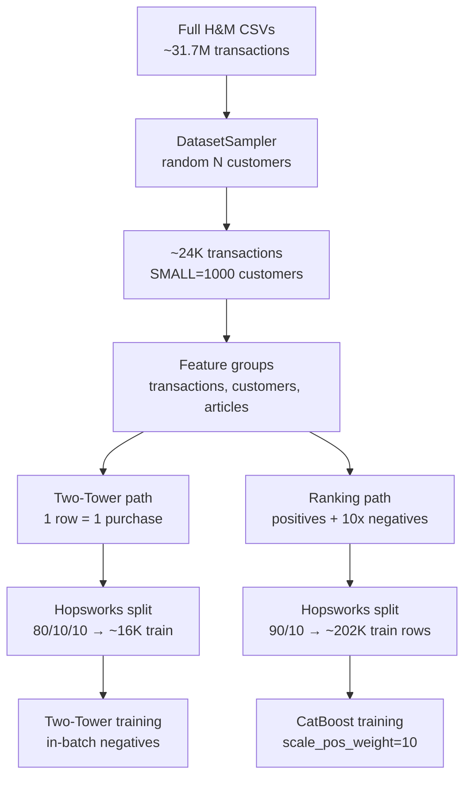

# Reference Implementation: Training Data Sampling (`tmp/recsys`)

This guide documents how the reference code under `tmp/recsys` and its notebooks reduce training data from the full H&M dataset (~31.7M transactions) for two-tower retrieval and CatBoost ranking. Sampling happens **mostly once** in the feature notebook; the training notebooks inherit that subset.

**Source notebooks:**

- `tmp/notebooks/1_fp_computing_features.ipynb` — customer sampling + ranking dataset construction
- `tmp/notebooks/2_tp_training_retrieval_model.ipynb` — two-tower training
- `tmp/notebooks/3_tp_training_ranking_model.ipynb` — CatBoost ranking training

**Key code:**

- `tmp/recsys/features/customers.py` — `DatasetSampler`
- `tmp/recsys/features/ranking.py` — `compute_ranking_dataset`
- `tmp/recsys/training/two_tower.py` — `TwoTowerDataset`
- `tmp/recsys/training/ranking.py` — `RankingModelTrainer`
- `tmp/recsys/config.py` — dataset size and split settings

---

## Pipeline overview



---

## 1. Primary reduction: customer-based sampling (notebook 1)

All downstream training is built on data sampled here, **not** on the full transaction table.

The notebook loads the full dataset from Hopsworks-hosted CSVs (`transactions_train.csv` has ~31.7M rows), then explicitly subsamples:

> We don't want to work with ~30 million transactions in these series, as everything will take too much time to run. Thus, we create a subset of the original dataset by randomly sampling from the customers' datasets and taking only their transactions.

### Implementation: `DatasetSampler`

```python
class DatasetSampler:
    _SIZES = {
        CustomerDatasetSize.LARGE: 50_000,
        CustomerDatasetSize.MEDIUM: 5_000,
        CustomerDatasetSize.SMALL: 1_000,
    }

    def sample(self, customers_df, transations_df):
        random.seed(27)
        n_customers = self._SIZES[self._size]
        customers_df = customers_df.sample(n=n_customers)
        transations_df = transations_df.join(
            customers_df.select("customer_id"), on="customer_id"
        )
        return {"customers": customers_df, "transactions": transations_df}
```

| Setting | Customers | Observed transactions (notebook run) |
|---------|-----------|----------------------------------------|
| `SMALL` (default) | 1,000 | 23,799 |
| `MEDIUM` | 5,000 | — |
| `LARGE` | 50,000 | — |

Controlled by `settings.CUSTOMER_DATA_SIZE` (default `SMALL` in `tmp/recsys/config.py`).

### Important details

- **Unit of sampling is customers**, not transactions. All purchases for sampled customers are kept; everyone else is dropped.
- **Seed 27** makes the customer draw reproducible.
- **Articles are not sampled** — all 105,542 articles are loaded and uploaded. Only transactions shrink.
- After customer feature cleaning (`drop_na_age`), positives drop slightly: **20,376** purchase rows (from 23,799).

There is **no second transaction-level subsample** inside the two-tower or CatBoost training code.

---

## 2. Two-Tower (retrieval) — notebook 2

### Training rows

Each row is one purchase from the already-sampled transaction feature group, joined with customer and article features via the `retrieval` feature view (`tmp/recsys/hopsworks_integration/feature_store.py`):

- Query features: `customer_id`, `age`, `month_sin`, `month_cos`
- Candidate features: `article_id`, `garment_group_name`, `index_group_name`

### Train/val split (not extra sampling)

`TwoTowerDataset.get_train_val_split()` uses Hopsworks' random split:

- `TWO_TOWER_DATASET_VALIDATON_SPLIT_SIZE = 0.1`
- `TWO_TOWER_DATASET_TEST_SPLIT_SIZE = 0.1`
- Batch size: `TWO_TOWER_MODEL_BATCH_SIZE = 2048`

From the notebook run on the `SMALL` sample:

| Split | Rows |
|-------|------|
| Train | 16,300 (~80% of 20,376) |
| Validation | 2,037 (~10%) |
| Test | ~10% (held out) |

Unique entities in train: **966 users**, **11,820 items** (items that appear in sampled transactions, not the full 105K catalog).

### Negative examples — no explicit negative dataset

The two-tower does **not** build a negative table. TensorFlow Recommenders' `Retrieval` task treats **other items in the same batch** as implicit negatives (contrastive / in-batch negatives):

```python
self.task = tfrs.tasks.Retrieval(
    metrics=tfrs.metrics.FactorizedTopK(
        candidates=item_ds.batch(batch_size).map(self.item_model)
    )
)
```

Retrieval training cost scales with **positive purchase rows × batching**, not with generating synthetic negatives.

---

## 3. CatBoost (ranking) — notebook 3

Ranking data is built in notebook 1 by `compute_ranking_dataset()`, still on the customer-sampled transactions.

### Positive rows

Every transaction → one `(customer_id, article_id, age)` pair with `label=1`.

### Negative rows — 10:1 random sampling

```python
positive_pairs = df.clone()
n_neg = len(positive_pairs) * 10

article_ids = df.select("article_id").unique().sample(n=n_neg, with_replacement=True, seed=2)
customer_ids = df.select("customer_id").sample(n=n_neg, with_replacement=True, seed=3)
other_features = df.select(["age"]).sample(n=n_neg, with_replacement=True, seed=4)
# → label=0
```

From the notebook run:

| Label | Count |
|-------|-------|
| 1 (purchase) | 20,376 |
| 0 (sampled) | 203,760 |
| **Total** | **224,136** |

Negatives are **independently sampled** columns (article, customer, age are not joined consistently), with fixed seeds 2/3/4. Article pool is **unique articles in the sampled transaction set**, not the full catalog.

### CatBoost train/val split

Notebook 3 uses Hopsworks `train_test_split` with `RANKING_DATASET_VALIDATON_SPLIT_SIZE = 0.1`:

- ~202K train rows
- ~22K val rows

CatBoost itself has no row subsampling; class imbalance is handled via config:

| Setting | Value |
|---------|-------|
| `RANKING_SCALE_POS_WEIGHT` | 10 |
| `RANKING_ITERATIONS` | 100 |
| `RANKING_EARLY_STOPPING_ROUNDS` | 5 |
| `RANKING_LEARNING_RATE` | 0.2 |

`scale_pos_weight=10` matches the 10:1 negative ratio.

---

## 4. What is *not* used to reduce training

| Technique | Used? |
|-----------|-------|
| Random transaction subsampling | No — only customer sampling |
| Time-based train/test split | No — Hopsworks random splits |
| Article catalog subsampling | No — full articles uploaded; models see transaction-linked subset |
| Interaction synthetic data for two-tower/CatBoost | No — `generate_interaction_data()` exists but two-tower and ranking train on **purchases**, not synthetic clicks/ignores |
| CatBoost row cap beyond upstream sampling | No |

---

## 5. Summary

**One upfront lever dominates everything:** `DatasetSampler` randomly picks 1K / 5K / 50K customers and keeps only their transactions (~31.7M → ~24K for `SMALL`). Both models train on that subset stored in Hopsworks.

| Model | Training rows | Negative strategy |
|-------|---------------|-------------------|
| **Two-Tower** | ~16K positive purchase rows | In-batch contrastive negatives (batch size 2048) |
| **CatBoost** | ~224K rows (20K pos + 204K neg) | 10× random negatives per positive; `scale_pos_weight=10` |

To train closer to full scale, raise `CUSTOMER_DATA_SIZE` to `MEDIUM` or `LARGE`, or replace `DatasetSampler` with a different strategy. The training notebooks do not re-read the full 31M-row CSV — they only see whatever was materialized into the feature store in notebook 1.

---

## Related guides

- [`sampling.md`](./sampling.md) — industry-grade sampling strategy for v1 implementation
- [`time-based-sampling-with-long-features.md`](./time-based-sampling-with-long-features.md) — time-windowed training with long feature history
