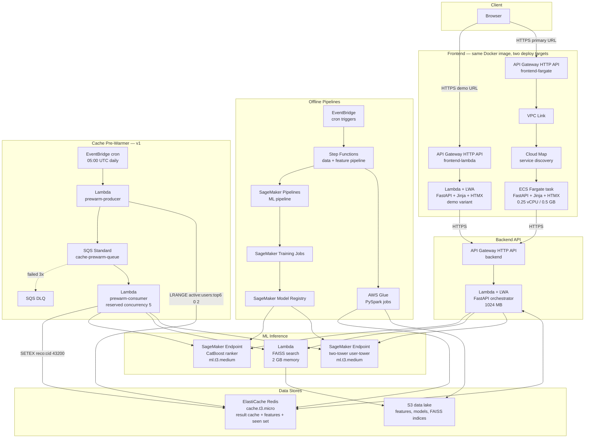
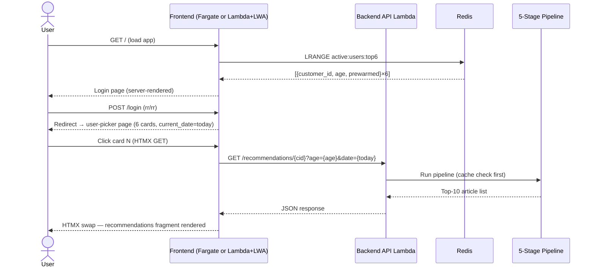
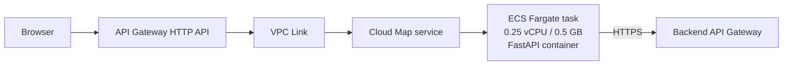
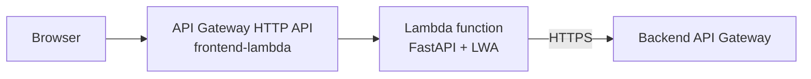
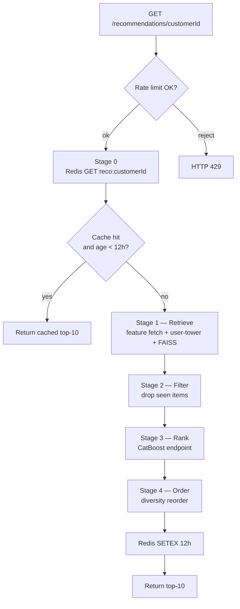
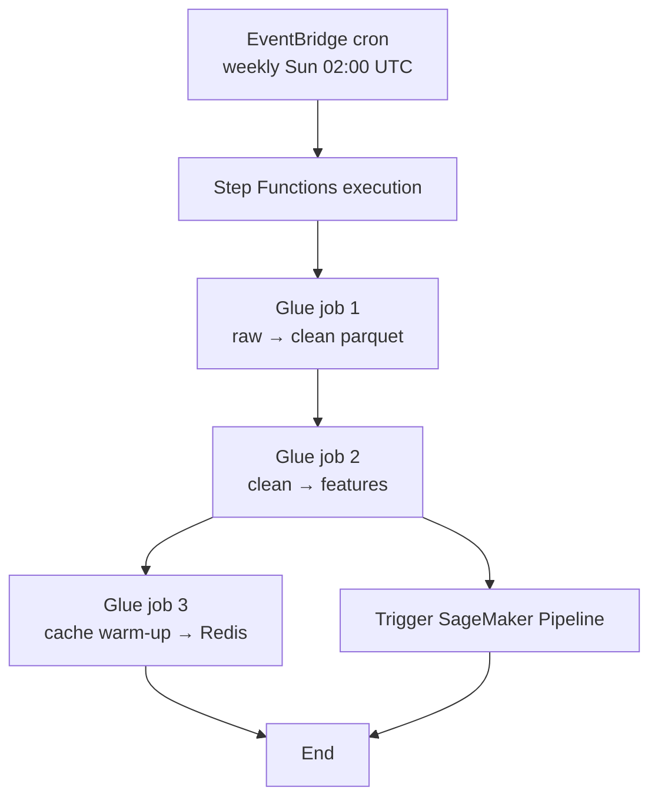
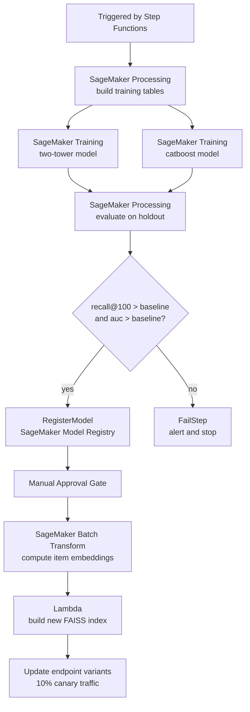
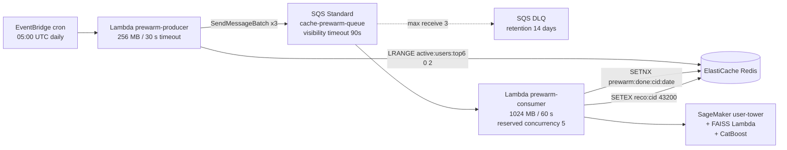
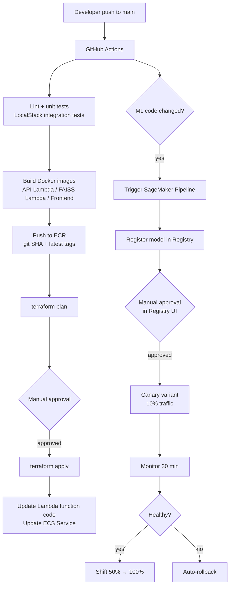

## 1. Purpose & Scope

This document is the **outdated** for the v1 architecture of the Fashion Recommendation System. It defines every component, the AWS service powering it, and the reasoning behind each choice. All subsequent low-level design (LLD) and implementation work derives from this document.

### 1.1 What V1 Delivers

A fully functional, end-to-end fashion recommendation system that:

- Serves **personalized top-10 recommendations** through a 5-stage online pipeline
- Demonstrates **visible latency patterns** (cache hit ~15 ms vs. cache miss ~190 ms) as a live engineering talking point
- Runs at **$0 idle cost** (Lambda + LWA demo variant) and **~$53/mo active** (full stack)
- Is deployable with a **single `terraform apply`** and destroyable with a single `terraform destroy`

### 1.2 V1 Scope

**In scope:**
- Two-stage ML pipeline: Two-Tower retrieval + CatBoost ranking, with Filter and Diversity Order stages
- Real-time online serving with a 12-hour Redis result cache
- Frontend (FastAPI + Jinja2 + HTMX), Backend API, ML inference, data lake, batch pipelines, CI/CD, and observability
- Cache pre-warming via SQS work-queue pattern (explicit demo of Pattern 4)
- Two simultaneous frontend deployments from the same Docker image (ECS Fargate + Lambda + LWA)

**Explicitly out of scope:**

| Item | Reason |
|---|---|
| `POST /events` endpoint + Kinesis Firehose + SQS purchase queue | Async event path — v1.1 |
| LLM Tag Extraction (`content_features/`) | Optional enrichment; separate HLD |
| RAG Chatbot (`generation/rag/`) | Independent feature; separate request path |
| Online learning / streaming retrain | Weekly batch retrain is sufficient for v1 |
| Cognito / real authentication | V1 uses `rr/rr` placeholder; documented as a production gap |
| Multi-region active-active | Single-region (us-east-1); cost-prohibitive for learning objectives |

---

## 2. Executive Summary

### 2.1 What the System Does

The system serves personalized top-10 fashion-article recommendations. The request path runs through five ordered stages: **Cache → Retrieve → Filter → Rank → Order**. Offline batch pipelines train the models, build feature stores, and produce vector indices on a weekly cadence.

### 2.2 Key Architectural Decisions

| Decision | Choice | Rationale |
|---|---|---|
| Serving model | Real-time per request + 12-hour Redis result cache | Acceptable freshness for fashion recommendations; cuts SageMaker invocations ~95% on re-visiting users |
| Pipeline shape | Cache → Retrieve → Filter → Rank → Order (diversity) | Production-realistic 4-stage funnel + cache; matches the Spotify/Pinterest pattern |
| Vector search | Lambda + FAISS (S3-backed `.index` file) | Pay-per-request, sub-millisecond warm latency, fits 10 GB Lambda memory limit |
| ML inference | SageMaker Endpoints (user-tower + CatBoost) | Native A/B testing, canary deployment, drift monitoring out of the box |
| Frontend | FastAPI + Jinja2 + HTMX + Tailwind on **ECS Fargate** | Production-grade pattern for server-rendered apps; HTMX gives modern partial-update UX without an SPA build pipeline |
| Frontend ingress | API Gateway HTTP API + VPC Link + Cloud Map (no ALB) | Saves ~$16/mo vs. ALB; Cloud Map service discovery suits low-traffic Fargate |
| Frontend demo variant | **Lambda + LWA** always-on deployment | Same Docker image; $0 idle cost; resume-shareable URL |
| Backend API | Lambda + AWS Lambda Web Adapter (LWA) | Same FastAPI container locally and in cloud; pay-per-request; scales to zero |
| Data lake | S3 only (no DynamoDB) | Eliminates per-read costs; user history kept in S3 + Redis |
| Cache | ElastiCache Redis | Result cache (12 h TTL) + hot user/item features + token bucket for rate limiting |
| Batch processing | AWS Glue (PySpark) | Same code as `local[*]`; serverless; no cluster operations |
| Orchestration | Step Functions (general) + SageMaker Pipelines (ML) + EventBridge (cron) | Native AWS, free, fits serverless theme |
| IaC | Terraform | One-command apply/destroy for cost control |

### 2.3 Target Metrics

| Metric | Target |
|---|---|
| Recommendation latency — cache hit | < 15 ms p95 |
| Recommendation latency — cache miss (warm pipeline) | < 250 ms p95 |
| FAISS Lambda warm invoke | < 20 ms p95 |
| End-to-end availability (during active sessions) | 99.5% |
| Monthly cost — active learning sessions | ~$53/mo |
| Monthly cost — idle (Lambda + LWA only) | < $3/mo |

---

## 3. Architecture Principles

Every component decision in this document traces back to one or more of these seven principles.

| # | Principle | What it means in practice |
|---|---|---|
| 1 | **Cost-first, learning-grade** | Default to scale-to-zero / serverless. Spend only on what teaches a production pattern. |
| 2 | **Migration-friendly** | The same Docker image and the same Python code run locally and on AWS. Differences are environment variables only — never business logic. |
| 3 | **SageMaker-centric ML** | All ML inference goes through SageMaker to get A/B testing, canary deployment, and Model Monitor natively. |
| 4 | **FAISS over a managed vector DB** | Portable, free, fits dataset size. OpenSearch and Pinecone are documented as scale-up paths. |
| 5 | **S3 as the single data lake** | One storage substrate. No DynamoDB. Redis is a cache layer, not a system of record. |
| 6 | **Loose coupling, well-defined interfaces** | Each component has a single responsibility and a documented contract. Swapping a component should not require touching its neighbors. |
| 7 | **Production patterns over production scale** | Architecture is designed for full H&M scale (1.37M users, 105K items, 31.8M transactions) and deployed on the dev sample (10K users, 5K items, 100K transactions). Architecture is identical; only instance sizing changes. |

---

## 4. System Context

### 4.1 Actors

| Actor | Role & Interaction |
|---|---|
| **End user** (v1: developer / portfolio reviewer) | Logs in as `rr/rr`. Sees 6 active-user cards showing `customer_id`, `age`, and `current_date`. Clicks a card to view that customer's top-10 recommendations. First 3 cards are pre-warmed (cache hit, ~15 ms); last 3 are live (cache miss, ~190 ms). |
| **Recommendation API consumer** | `GET /recommendations/{user_id}` for top-K personalized items |
| **ML engineer** | Triggers training pipelines, reviews drift reports, approves model promotions in the SageMaker Model Registry |

### 4.2 External Dependencies

| Dependency | Purpose |
|---|---|
| H&M Personalization Challenge dataset | Source data (one-time import to S3 raw zone) |
| AWS managed services | All compute, storage, ML, and networking |
| GitHub | Source of truth for code; CI/CD entry point |
| ECR Public Gallery | Base images (`python:3.11-slim`, AWS Lambda Web Adapter) |

---

## 5. Logical Architecture

### 5.1 System Diagram



### 5.2 Diagram Notes

- **Dashed lines** represent failure/exceptional paths (DLQ) — not on the hot path.
- Both frontend deployments share **one Docker image** and **identical FastAPI + Jinja2 + HTMX code**. Only the deploy target differs. The user experience is identical from both URLs.
- The async event path (Kinesis Firehose + SQS purchase queue) is **v1.1 only** — omitted from this diagram.

---

## 6. Frontend Layer

### 6.1 Tech Stack

| Concern | Choice | Reason |
|---|---|---|
| Framework | FastAPI + Jinja2 templates | Same Python ecosystem as the rest of the project; server-rendered HTML; no Node toolchain |
| Interactivity | HTMX | Modern partial-update UX without an SPA framework or build pipeline |
| Styling | Tailwind CSS (CDN) | Rapid, modern UI; no JavaScript build step required for v1 |
| Server | uvicorn | Standard ASGI server; same image runs locally and on AWS |
| Container | Single Dockerfile with AWS Lambda Web Adapter layer | One image, two deploy targets |

### 6.2 User Flow



### 6.3 User-Picker Cards

The user-picker page renders **six cards** for the top-6 most-active customers.

| Field | Source | When Set |
|---|---|---|
| `customer_id` | `customers.csv` pre-loaded into Redis by Glue | Nightly batch (stable across the day) |
| `age` | `customers.csv` pre-loaded into Redis by Glue | Nightly batch (stable across the day) |
| `current_date` | `datetime.utcnow().date().isoformat()` computed in the FastAPI handler | At every page load (changes naturally across days) |

**Demo story — visible cache pre-warm:** The first 3 cards have a `pre-warmed` badge. Clicking them returns recommendations in ~15 ms (cache hit). Clicking the last 3 cards runs the full 5-stage pipeline (~190 ms). The latency difference is visible to the naked eye and demonstrates the SQS work-queue + idempotent-consumer pattern.

### 6.4 Primary Deployment — ECS Fargate



| Component | Decision | Why |
|---|---|---|
| **ECS Fargate** | Chosen | Production-standard for containerized server-rendered apps. Teaches VPC, task definitions, service discovery. EC2 rejected (manual ops). EKS rejected ($73/mo control plane). |
| **API Gateway HTTP API** over ALB | Chosen | ALB costs ~$16/mo idle. HTTP API costs $1/M requests (~$0 at our scale). |
| **Cloud Map** over NLB | Chosen | VPC Link requires a discovery layer. Cloud Map is ~$0.50/mo vs. ~$16/mo for NLB. |
| **Public subnet, public IP** | Cost tradeoff | Avoids $32/mo NAT Gateway. Private subnet + VPC Endpoints is documented as the production-hardening path. |
| **Single task, desired count = 1** | v1 sizing | Auto-scaling (min 1, max 4) is configured so the production pattern is present even if it never triggers. |

### 6.5 Demo Variant — Lambda + LWA

A second deployment of the **same Docker image** runs as a Lambda function with the AWS Lambda Web Adapter extension.



**Why this exists:**
- Resume-shareable URL with **$0 idle cost** (~1 s cold start on first hit)
- Validates true container portability — same image on Fargate and Lambda with zero code change
- Demonstrates two compute paradigms (always-warm container vs. event-driven serverless) on the same workload

| Scenario | Active Deployment |
|---|---|
| Active development sessions | ECS Fargate (`terraform apply`) |
| Between sessions / resume sharing | ECS torn down; Lambda + LWA stays deployed at $0 |
| Side-by-side demo | Both active simultaneously on different domain prefixes |

### 6.6 TLS & CDN

- **CloudFront** sits in front of both API Gateways for TLS termination, edge caching of static assets, and HTTP/2 support.
- **ACM** provides TLS certificates (free for AWS-managed certs).

---

## 7. API Gateway & Edge

### 7.1 API Inventory

| API | Purpose | Backend |
|---|---|---|
| `frontend-fargate.<domain>` | Serves the Fargate-hosted rendered UI | VPC Link → Cloud Map → ECS Fargate |
| `frontend-lambda.<domain>` | Serves the Lambda + LWA demo variant | Lambda function |
| `api.<domain>` | JSON recommendations API consumed by both frontends | Lambda + LWA orchestrator |

All three sit behind CloudFront for TLS termination.

### 7.2 HTTP API vs. REST API

| Feature | HTTP API (chosen) | REST API |
|---|---|---|
| Cost | $1.00 per 1M requests | $3.50 per 1M requests |
| Latency overhead | ~5 ms | ~15 ms |
| Built-in JWT authorizer | Yes | Yes |
| Rate limiting | Stage-level throttling | Per-key usage plans (richer but unneeded in v1) |

### 7.3 Rate Limiting

Two layers protect against abuse and cost runaway:

| Layer | Mechanism | Limit |
|---|---|---|
| Stage-level | API Gateway throttling | 60 RPS, burst 100 per stage |
| Application-level | Token bucket per `customer_id` in Redis (API Lambda) | 30 requests / minute / user |

The application-level limit lives in the orchestrator Lambda because per-`customer_id` keys are not first-class in HTTP API usage plans.

---

## 8. Backend API Layer

### 8.1 Compute

| Concern | Choice |
|---|---|
| Framework | FastAPI |
| Packaging | Container image (Lambda function type = `Image`) |
| Lambda Web Adapter | Loaded as extension layer (`public.ecr.aws/awsguru/aws-lambda-adapter`) |
| Memory | 1024 MB |
| Timeout | 30 s |
| Reserved concurrency | 100 (cost guardrail) |

### 8.2 V1 Endpoints

| Method | Path | Purpose |
|---|---|---|
| `GET` | `/health` | Liveness probe |
| `POST` | `/login` | `rr/rr` check; sets signed session cookie |
| `GET` | `/users/active` | Returns top-6 `{customer_id, age, prewarmed}` from `active:users:top6` Redis key |
| `GET` | `/recommendations/{customer_id}?age={age}&date={YYYY-MM-DD}&k=10` | Top-K recommendations. `age` and `date` are forwarded from the card click as direct pipeline features. |

> **V1.1 addition:** `POST /events` for click/view/purchase event ingestion — not in v1.

### 8.3 Why Lambda + LWA for the API

| Trait | Why Lambda Fits |
|---|---|
| Bursty, low-volume traffic | Pay-per-request is cleanest |
| Stateless requests | No session affinity needed |
| Latency tolerance | < 250 ms p95 budget allows the occasional ~500 ms cold start |
| Scales to zero | $0 between active sessions |
| Same container | Already built and in ECR; no extra image to maintain |

---

## 9. Online Serving Pipeline

The orchestrator Lambda implements a **five-stage pipeline**. Stage 0 is the cache short-circuit; Stages 1–4 run on cache miss.

### 9.1 Pipeline Diagram



### 9.2 Stage 0 — Cache Check

| Field | Value |
|---|---|
| Key | `reco:{customer_id}` |
| Value | JSON list of 10 article IDs with scores + `created_at` timestamp |
| TTL | 43,200 s (12 h) |
| Hit behavior | Return immediately. Target: < 15 ms p95. |

### 9.3 Stage 1 — Retrieve

Three sub-steps in order:

**1. Fetch user features**
- Try Redis first: `HGETALL user:{customer_id}:features`
- On miss, read from S3: `s3://.../features/users/customer_id={cid}/part-*.parquet`. Populate Redis with 1 h TTL.

**2. Generate user embedding**
- Invoke SageMaker Endpoint `two-tower-user-tower` with the feature vector.
- Returns a 256-dimensional embedding.

**3. FAISS search**
- Invoke the FAISS Lambda synchronously with the embedding.
- Returns top-100 article IDs with similarity scores.

### 9.4 Stage 2 — Filter

- Read `seen:{customer_id}` from Redis (set of already-purchased article IDs).
- Drop any candidate present in the seen set.
- **Cold-start case:** if the seen set is empty and no user features exist, short-circuit to `popular:items:top100` Redis key (populated nightly by Glue).

### 9.5 Stage 3 — Rank

- Build feature vectors for remaining candidates: user features + item features + cross features (preferred category vs. item category, price affinity vs. item price, days since last purchase in category).
- Item features fetched in bulk: `HMGET item:{id1}:features ... item:{idN}:features` — single round-trip, sub-2 ms.
- Invoke SageMaker Endpoint `catboost-ranker` with the batch of feature vectors.
- Returns scored candidates sorted by predicted purchase probability.

### 9.6 Stage 4 — Order (Diversity-Aware Reorder)

CatBoost output is not the final order. The reorder rule:

```
positions 1–4   = top 4 items by raw CatBoost score
positions 5–6   = top 2 items by diversity_score vs. positions 1–4
positions 7–10  = next 4 items by raw CatBoost score (excluding 5–6)
```

**Diversity score formula:**

```
diversity_score(c, S) =
      w1 * categorical_diff(c.product_type_no,   S)
    + w2 * categorical_diff(c.colour_group_code, S)
    + w3 * bucket_diff(c.price_bucket,           S)
```

Where:
- `categorical_diff(value, S)` = 1 if `value` differs from every item in `S`, else 0
- `bucket_diff(bucket, S)` = `min(|bucket - s.bucket| for s in S) / max_bucket_distance`
- Weights `w1 = w2 = w3 = 1.0` in v1; configurable via Lambda environment variables

**Rationale:** Positions 1–4 maximize relevance (highest click-through impact). Positions 5–6 inject variety for discovery. Positions 7–10 fall back to relevance — at this depth quality matters more than diversity.

### 9.7 Latency Budget

| Stage | p50 | p95 |
|---|---:|---:|
| Stage 0: cache check → HIT return | 5 ms | 12 ms |
| Stage 1: feature fetch (Redis) | 2 ms | 5 ms |
| Stage 1: SageMaker user-tower invoke | 30 ms | 80 ms |
| Stage 1: FAISS Lambda invoke (warm) | 5 ms | 15 ms |
| Stage 2: filter (Redis SMEMBERS) | 2 ms | 5 ms |
| Stage 3: item features bulk read | 2 ms | 5 ms |
| Stage 3: SageMaker CatBoost invoke | 25 ms | 70 ms |
| Stage 4: diversity reorder | 1 ms | 2 ms |
| Cache write + serialize response | 3 ms | 6 ms |
| **Total — cache miss, all warm** | **~75 ms** | **~190 ms** |
| Total — cache miss, cold FAISS Lambda | ~575 ms | ~700 ms |
| Total — cache hit | ~10 ms | ~15 ms |

### 9.8 Circuit Breakers & Fallbacks

Each downstream call is wrapped in a `pybreaker` circuit breaker (5 failures within 30 s → open; 30 s open duration; 1 half-open probe).

| Failing Dependency | Fallback Behavior |
|---|---|
| Redis (cache or feature read) | Skip cache, continue with pipeline; emit CloudWatch alarm |
| SageMaker user-tower endpoint | Use Redis-cached embedding for this user (24 h TTL from last successful call). If absent, skip to popular items. |
| FAISS Lambda | Use `popular:items:by_category` cache (refreshed nightly) |
| SageMaker CatBoost endpoint | Return FAISS top-K ordered by raw similarity score, still apply diversity reorder |
| All ML downstreams open | Return `popular:items:top100` from Redis with `degraded=true` flag in response |

Every fallback emits a `recommendation.fallback.{component}` CloudWatch metric wired to an SNS alarm.

---

## 10. Data Layer

### 10.1 S3 Data Lake Layout

```
s3://fashion-reco-{env}/
├── raw/                          # Original H&M CSV (one-time import)
│   ├── articles.csv
│   ├── customers.csv
│   └── transactions_train.csv
├── clean/                        # Validated parquet, partitioned by date
│   ├── articles/
│   ├── customers/
│   └── transactions/year=YYYY/month=MM/
├── features/                     # Model-ready features
│   ├── users/customer_id={cid}/
│   ├── items/article_id={aid}/
│   └── interactions/year=YYYY/month=MM/
├── models/                       # Model artifacts (also in SageMaker Model Registry)
│   ├── two_tower/version={vN}/
│   └── catboost/version={vN}/
├── embeddings/                   # Item embeddings (256-dim) for FAISS index build
│   └── items/version={vN}/
├── indices/                      # FAISS indices loaded by the FAISS Lambda
│   └── faiss_items/version={vN}.index
├── enriched/                     # Reserved — LLM tags (future)
└── events/                       # Reserved — v1.1 raw click/view events
    └── year=YYYY/month=MM/day=DD/
```

### 10.2 Why S3 Only (No DynamoDB)

| Need | DynamoDB | S3 + Redis (chosen) |
|---|---|---|
| User feature lookup | Per-item read, ~$0.25/M | Redis HGETALL ~$0; Glue daily refresh |
| Seen-items set | DDB List with paginated reads | Redis SMEMBERS ~$0; Glue daily rebuild |
| Recommendation cache | DDB GetItem | Redis GET with native TTL |
| Cost at 100 RPS | ~$30/mo read capacity | ~$15/mo `cache.t3.medium` |
| Operational complexity | Provisioning, hot partitions | Single Redis cluster |

### 10.3 Redis Key Map

| Key Pattern | Type | TTL | Source | Purpose |
|---|---|---|---|---|
| `reco:{customer_id}` | JSON string | 12 h | Computed live or by pre-warm consumer | Recommendation result cache |
| `user:{customer_id}:features` | Hash | 1 h | S3 features/users | Feature read cache |
| `item:{article_id}:features` | Hash | 24 h | S3 features/items | Feature read cache |
| `seen:{customer_id}` | Set | None (rebuilt nightly) | S3 transactions | Filter stage input |
| `popular:items:top100` | List | 24 h | Glue nightly | Cold-start fallback |
| `popular:items:by_category:{cat}` | List | 24 h | Glue nightly | FAISS-failure fallback |
| `ratelimit:{customer_id}` | String | 60 s | Live | Token bucket counter |
| `embedding:user:{customer_id}` | Bytes | 24 h | Last successful user-tower call | User-tower circuit-breaker fallback |
| `active:users:top6` | List of JSON `{customer_id, age, prewarmed}` | 24 h | Glue nightly | Drives user-picker cards + pre-warm producer |
| `prewarm:done:{customer_id}:{date}` | String | 24 h | Pre-warm consumer | Idempotency guard |

### 10.4 Caching Strategy Summary

| Cache | Layer | TTL | Invalidation |
|---|---|---|---|
| Recommendation result | Redis | 12 h | TTL expiry (+ on purchase in v1.1) |
| User features | Redis | 1 h | TTL expiry |
| Item features | Redis | 24 h | TTL expiry |
| Popular items | Redis | 24 h | Nightly Glue refresh |
| User embedding (fallback) | Redis | 24 h | Overwritten on next success |
| Static assets | CloudFront | 1 h | Versioned filenames |

---

## 11. ML Layer

### 11.1 Two-Tower Retrieval Model

| Aspect | Choice |
|---|---|
| Framework | PyTorch |
| Architecture | Two MLP towers (user, item), final layer projects to 256-dim shared embedding space |
| Loss | Sampled-softmax / contrastive (in-batch negatives) |
| Training data | `transactions` joined with `users` and `articles` features |
| Training compute | SageMaker Training Job, `ml.m5.large` spot, ~30 min on dev sample |
| Output artifacts | `user_tower.pt`, `item_tower.pt` |
| Serving | SageMaker Endpoint `two-tower-user-tower`, `ml.t3.medium` |

**Why two-tower:** Decouples user and item embedding generation. Item embeddings are precomputed and static between retraining cycles, enabling efficient ANN search. Industry-proven at scale (YouTube, Pinterest, Etsy).

### 11.2 FAISS Vector Search

| Aspect | Choice |
|---|---|
| Index type | `IndexFlatIP` (dev sample) → `IndexIVFFlat` or `IndexHNSWFlat` (full dataset) |
| Storage | S3 (`indices/faiss_items/version={vN}.index`) |
| Serving | Lambda function, 2 GB memory, container image |
| Index load | At Lambda init (cold start) — `mmap` from `/tmp` after S3 download |
| Cold start | ~500 ms (download + load) |
| Warm search latency | < 1 ms for top-100 |

**Zero-downtime index swap:** The FAISS Lambda reads `FAISS_INDEX_VERSION` env var. A new index is uploaded to S3 with a new version tag; the env var is updated via Terraform. Existing warm containers continue serving the old version (~15 min); new containers serve the new version. Rolling deploy with no downtime.

### 11.3 CatBoost Ranking Model

| Aspect | Choice |
|---|---|
| Framework | CatBoost |
| Features | User features + item features + ~10 cross features (avg price delta, category match flag, recency in category) |
| Loss | Logistic / pairwise |
| Training compute | SageMaker Training Job, `ml.m5.large`, ~15 min on dev sample |
| Serving | SageMaker Endpoint `catboost-ranker`, `ml.t3.medium`, batched per request |
| Output artifact | `catboost_model.cbm` |

---

## 12. Offline Batch Pipelines

### 12.1 Orchestration Tool Selection

| Tool | Used For | Why |
|---|---|---|
| **EventBridge** | Cron triggers only | Native, free, simplest possible scheduler |
| **Step Functions** | Generic workflow orchestration (data + features + index build) | Visual DAG, built-in retries, native Glue/Lambda integrations, near-zero cost |
| **SageMaker Pipelines** | ML-specific workflow (train → register → approve → deploy) | First-class steps for Training/Processing/RegisterModel; native Model Registry; lineage tracking |

### 12.2 Data + Feature Pipeline (Step Functions)

**Trigger:** EventBridge cron — weekly Sunday 02:00 UTC (full retrain cadence) + daily 03:00 UTC (cache warm-up only).



| Step | Action |
|---|---|
| Glue job 1 — data prep | Reads `raw/*.csv`, validates schema, deduplicates, writes `clean/*` parquet partitioned by month |
| Glue job 2 — feature engineering | Builds user features (purchase frequency, avg price, top categories, recency) and item features (popularity score, days since first sold); writes to `features/` |
| Glue job 3 — cache warm-up | Writes popular items, per-category top items, per-user seen sets, and `active:users:top6` Redis list directly into Redis |
| SageMaker Pipeline trigger | Fires asynchronously in parallel with Glue job 3 |

### 12.3 ML Pipeline (SageMaker Pipelines)



### 12.4 Cache Pre-Warming (SQS Work Queue)

**Goal:** Pre-compute recommendations overnight for the top-3 most-active users so the first request of the day is a cache hit (~15 ms). Demonstrates Pattern 4: SQS work-queue + idempotent-consumer + DLQ.



**Consumer logic (pseudocode):**

```python
def handler(event):
    for record in event["Records"]:
        msg = json.loads(record["body"])
        cid, age, run_date = msg["customer_id"], msg["age"], msg["run_date"]

        # Idempotency guard — skip if already pre-warmed today
        if not redis.set(f"prewarm:done:{cid}:{run_date}", "1", nx=True, ex=86400):
            return

        # Same 3 inputs as the live request path
        recos = pipeline.run_full_pipeline(cid, age=age, current_date=run_date)
        redis.setex(f"reco:{cid}", 43200, json.dumps(recos))
        cloudwatch.put_metric("prewarm.success", 1)
```

**Design rationale:**

| Choice | Reason |
|---|---|
| Standard SQS (not FIFO) | Independent per-user work; order is irrelevant; FIFO has lower throughput and higher cost |
| Batch size = 1 | Each customer's pipeline run is independent; back-pressures SageMaker one at a time |
| Reserved concurrency = 5 | Caps SageMaker concurrent invocations from the warmer; protects live traffic path |
| Idempotency via SETNX | At-least-once delivery is safe; duplicate messages skip cleanly |
| Same code path as API Lambda | Avoids logic divergence; shared `pipeline/` Python module imported by both |
| DLQ with max-receive 3 | Standard production posture for poison messages; alarm catches systemic failures |

### 12.5 Pipeline Cadence

| Pipeline | Schedule | UTC |
|---|---|---|
| Data + feature pipeline | Weekly | Sunday 02:00 |
| Cache warm-up (popular items, seen sets, active-users list) | Daily | 03:00 |
| Cache pre-warming work queue | Daily | 05:00 |
| ML pipeline | Triggered by data + feature pipeline | Weekly |
| FAISS index build | Triggered by ML pipeline (after Batch Transform) | Weekly |
| Drift baseline computation | Daily | 04:00 |

---

## 13. Cross-Cutting Concerns

### 13.1 The 7 System-Design-for-AI Patterns — Applied

| # | Pattern | Where it Lives |
|---|---|---|
| 1 | **API Gateway** | Three API Gateways (frontend-fargate, frontend-lambda, backend). Auth, throttling, validation. |
| 2 | **Rate Limiting** | (a) API Gateway stage throttling 60 RPS / burst 100. (b) Per-`customer_id` token bucket in Redis, 30 req/min. |
| 3 | **Caching** | Result cache (Redis 12 h), feature cache (Redis 1–24 h), popular items (Redis daily), edge (CloudFront 1 h). Full map in Section 10.4. |
| 4 | **Message Queues** | SQS Standard queue + DLQ for nightly cache pre-warming. Idempotent consumer. Synchronous request path stays queue-free. |
| 5 | **Circuit Breakers** | `pybreaker` on every downstream (Redis, user-tower, FAISS, CatBoost). Per-stage fallback table in Section 9.8. |
| 6 | **Load Balancing** | Implicit via managed services: API Gateway distributes to Lambda containers; SageMaker multi-instance endpoints; ECS Fargate via Cloud Map. No explicit ALB (documented as scale-up choice). |
| 7 | **Auto Scaling** | See Section 13.4. SageMaker target tracking, Lambda reserved concurrency, ECS Service Auto Scaling. |

### 13.2 Security

| Concern | Approach |
|---|---|
| Authentication (v1) | `rr/rr` cookie session — documented production gap |
| Authentication (production path) | API Gateway JWT authorizer + Cognito User Pool |
| Authorization | IAM roles per Lambda / ECS task; least-privilege |
| Secrets | SSM Parameter Store; no secrets in env vars or git |
| Encryption at rest | S3 SSE-KMS; ElastiCache encryption at rest; ECR images signed |
| Encryption in transit | TLS 1.2+ everywhere (CloudFront, API Gateway, internal AWS calls) |
| VPC isolation | ElastiCache in VPC private subnet; SageMaker endpoints in VPC |
| Network egress | v1: Fargate in public subnet (cost decision). Production: private subnet + VPC Endpoints. |
| WAF | Optional CloudFront WAF managed rule set; not required for v1 |
| Audit | CloudTrail enabled; logs retained 30 days |
| Data privacy | H&M dataset uses pre-hashed identifiers. No reverse-mapping attempted. |

### 13.3 Observability

| Layer | Tool | What is Measured |
|---|---|---|
| API Gateway | CloudWatch metrics + X-Ray | 4xx/5xx rate, p50/p95/p99 latency, integration latency |
| Lambda | CloudWatch logs + metrics + X-Ray | Cold start count, duration, errors, throttles |
| Fargate | CloudWatch Container Insights | CPU/memory utilization, task health, restarts |
| Redis | ElastiCache CloudWatch | Cache hit/miss ratio, evictions, CPU |
| SageMaker | CloudWatch + Model Monitor | Invocation count, latency, drift score |
| FAISS Lambda | CloudWatch + custom metrics | Search latency, index version, cold-start frequency |
| End-to-end | X-Ray service map | Full trace from browser → response |

**Custom business metrics** (CloudWatch `Recommendation` namespace):

| Metric | Purpose |
|---|---|
| `recommendation.cache.hit_ratio` | Track caching effectiveness |
| `recommendation.fallback.{component}` | Per-component fallback counter |
| `recommendation.diversity.applied` | Count of times diversity reorder changed the order |
| `recommendation.coldstart.user` | New-user requests served by popular fallback |
| `pipeline.stage.{stage}.latency_ms` | Per-stage latency histogram |

**CloudWatch alarms → SNS:**

| Alarm | Threshold |
|---|---|
| API p95 latency > 500 ms | 5 min sustained |
| Recommendation 5xx rate > 1% | 5 min sustained |
| Any fallback counter > 1% of requests | 5 min sustained |
| Cache hit ratio < 30% | 30 min sustained |
| SageMaker endpoint 5xx > 0 | Immediate |
| Step Functions execution failure | Immediate |
| Drift score above baseline | Immediate |
| Pre-warm DLQ depth > 0 | Immediate |

### 13.4 Auto-Scaling

| Resource | Policy | Min | Max |
|---|---|---|---|
| SageMaker user-tower endpoint | Target tracking — 1000 invocations/min/instance | 1 × `ml.t3.medium` | 4 |
| SageMaker CatBoost endpoint | Target tracking — 1000 invocations/min/instance | 1 × `ml.t3.medium` | 4 |
| Backend API Lambda | Reserved concurrency cap | 0 | 100 |
| FAISS Lambda | Reserved concurrency cap | 0 | 50 |
| Pre-warm consumer Lambda | SQS event source + reserved concurrency | 0 | 5 |
| ECS Fargate (frontend) | Target tracking — CPU 70% | 1 task | 4 tasks |
| ElastiCache Redis | Single node in v1; cluster mode for production | 1 node | n |
| Glue jobs | Glue 4.0 auto-scaling | 2 DPU | 10 DPU |

Cooldowns: 60 s scale-out, 300 s scale-in.

---

## 14. CI/CD Pipeline

### 14.1 Overall Flow



### 14.2 Pipeline Stages

| Stage | Tool | Action |
|---|---|---|
| Lint | ruff, black, mypy | Static analysis |
| Unit tests | pytest (in Docker) | Unit coverage |
| Integration tests | pytest + LocalStack + redis-server | End-to-end flow with mocked S3 / SageMaker |
| Build | docker buildx | Multi-arch (linux/amd64, linux/arm64) |
| Push | ECR | Tagged `:{git_sha}` and `:latest` |
| IaC plan | `terraform plan` | Diff surfaced in PR |
| Manual approval | GitHub deployment env protection | Required before `terraform apply` |
| IaC apply | `terraform apply` | Apply infra changes |
| Lambda update | `aws lambda update-function-code --image-uri` | New container deploy |
| ECS update | ECS service `forceNewDeployment` | Rolling restart with new image |
| ML pipeline | SageMaker Pipelines | Conditional — only if `models/` or `feature_pipeline/` paths changed |
| Canary | SageMaker production variants | 10% → 50% → 100% traffic shift |
| Rollback | CloudWatch alarm | Resets variant weights to previous model |

### 14.3 Environments

| Env | Source | AWS Account | Auto-Apply? |
|---|---|---|---|
| local | Dev branch | LocalStack | Yes (per developer) |
| dev | `main` branch | Single AWS account (dev prefix) | Yes (after PR merge) |
| prod | Tag `v*` | Same account (prod Terraform workspace) | Manual approval gate |

### 14.4 Model Deployment Safety

| Mechanism | How |
|---|---|
| Canary deployment | SageMaker production variants; 10% to new model, 90% to current |
| Health check | CloudWatch alarms on 5xx and p95 latency for canary variant |
| Auto-rollback | Lambda triggered by alarm resets variant weights to 100% on previous model |
| Shadow testing | Optional — mirrored traffic, discarded responses; used for offline comparison |
| Manual approval | Model Registry approval state gates the deploy step |

---

## 15. Cost Analysis

All figures are monthly, USD, us-east-1, on-demand pricing as of 2026.

### 15.1 Active Learning Session (Everything Deployed)

| Component | Sizing | Monthly Cost |
|---|---|---|
| ECS Fargate (frontend) | 1 task, 0.25 vCPU, 0.5 GB, 730 h | ~$7.50 |
| API Gateway HTTP APIs (3 APIs, ~50K req/mo) | 50K × $1/M | ~$0.05 |
| Cloud Map | 1 service | ~$0.50 |
| Lambda — API orchestrator | 50K × 200 ms × 1024 MB | ~$0.20 |
| Lambda — FAISS | 50K × 50 ms × 2048 MB | ~$0.15 |
| Lambda — frontend demo (idle) | < 100 invocations | ~$0 |
| Lambda — pre-warm producer | ~30 invocations × 1 s × 256 MB | < $0.01 |
| Lambda — pre-warm consumer | ~90 invocations × 250 ms × 1024 MB | < $0.01 |
| SQS — pre-warm queue + DLQ | ~90 messages/mo (under free tier) | $0 |
| **SageMaker user-tower endpoint** | 1 × `ml.t3.medium`, 730 h | **~$50** |
| **SageMaker CatBoost endpoint** | 1 × `ml.t3.medium`, 730 h | **~$50** |
| ElastiCache Redis | `cache.t3.micro`, 730 h | ~$13 |
| S3 | 50 MB dev sample + artifacts | ~$1 |
| Glue jobs | 4 jobs × 5 min × 2 DPU × 4 weeks | ~$2 |
| SageMaker Training (weekly) | 2 jobs × 30 min × `ml.m5.large` spot | ~$1 |
| Step Functions + EventBridge | Minimal | ~$0 |
| CloudWatch | Standard | ~$3 |
| CloudFront | < 1 GB transfer | ~$0.10 |
| **Total — full session** | | **~$128/mo** |

> **Cost-control strategy:** The two SageMaker endpoints dominate at $100/mo combined. Destroy them between sessions. With endpoints running ~6 h/day on weekdays: **~$53/mo realistic active cost**.

### 15.2 Idle (Lambda + LWA Demo Variant Only)

| Component | Monthly Cost |
|---|---|
| Lambda + LWA frontend (0 invocations) | $0 |
| API Gateway HTTP APIs (under free tier) | $0 |
| ECR storage | < $1 |
| S3 storage (artifacts) | ~$1 |
| Route 53 hosted zone | ~$0.50 |
| **Total idle** | **< $3/mo** |

This is the resume-sharing configuration. HR or an interviewer can open the link at any time; Lambda cold-starts, and the full demo is available.

### 15.3 Total Budget Projection

| Phase | Duration | Cost |
|---|---|---|
| Local development (LocalStack) | ~6 weeks | $0 |
| AWS active learning sessions | ~4 weekends + weekday evenings | ~$30 |
| Idle (Lambda + LWA, post-launch) | Ongoing | ~$3/mo |
| **Total over 2–3 months** | | **~$30–40** |

---

## 16. Tradeoffs & Rejected Alternatives

### 16.1 Workflow Orchestration

| Option | Decision | Reason |
|---|---|---|
| Step Functions + SageMaker Pipelines | **Chosen** | Free, AWS-native, sufficient for this scope |
| MWAA (Managed Airflow) | Rejected | ~$300+/mo always-on; overkill for AWS-only workflows |
| AWS Glue Workflows | Rejected | Free but limited to Glue jobs; cannot orchestrate SageMaker steps natively |

### 16.2 Vector Search

| Option | Decision | Reason |
|---|---|---|
| Lambda + FAISS | **Chosen** | Sub-ms warm latency; pay-per-request; fits 10 GB Lambda memory |
| Amazon OpenSearch Serverless k-NN | Rejected | Minimum 2 OCUs (~$345/mo) — exceeds entire project budget |
| Pinecone / Weaviate Cloud | Rejected | External vendor; introduces non-AWS dependency |
| pgvector on RDS | Rejected | Requires always-on RDS; no benefit over FAISS at this scale |

### 16.3 Storage

| Option | Decision | Reason |
|---|---|---|
| S3 + Redis | **Chosen** | Single data substrate; no per-request charges |
| DynamoDB | Rejected | Second storage paradigm with no architectural benefit at this scale |

### 16.4 Frontend Ingress

| Option | Decision | Reason |
|---|---|---|
| API Gateway HTTP API + Cloud Map | **Chosen** | ~$16/mo savings vs. ALB; sufficient L4/L7 features for v1 |
| ALB | Documented scale-up path | Standard for production with high traffic, sticky sessions, or WAF integration |
| NLB | Rejected | Same cost as ALB, fewer L7 features for HTTP traffic |

### 16.5 Frontend Hosting

| Option | Decision | Reason |
|---|---|---|
| ECS Fargate | **Chosen** | Production pattern; no cluster management; auto-scaling built in |
| EC2 with Auto Scaling Group | Rejected | Manual ops, AMI management overhead |
| EKS | Rejected | $73/mo control plane; overkill for one service |
| App Runner | Considered | Acceptable but does not teach VPC + service-discovery patterns |

### 16.6 Networking

| Option | Decision | Reason |
|---|---|---|
| Public subnet + public IP for Fargate | **Chosen for v1** | Avoids ~$32/mo NAT Gateway; documented cost tradeoff |
| Private subnet + NAT Gateway | Production hardening | ~$32/mo always-on; standard production posture |
| Private subnet + VPC Endpoints | Production hardening (lower cost) | ~$21/mo; production pattern without the full NAT cost |

### 16.7 Diversity Algorithm

| Option | Decision | Reason |
|---|---|---|
| Categorical + price-bucket diversity | **Chosen** | < 1 ms; no embedding lookup; explainable; tunable via env vars |
| Embedding cosine distance | Documented V2 path | Captures latent style similarity; swap-in compatible; adds latency |

### 16.8 Authentication

| Option | Decision | Reason |
|---|---|---|
| `rr/rr` cookie session | **Chosen for v1** | Zero infra cost; sufficient for portfolio demo |
| Cognito User Pool + JWT authorizer | Documented production gap | Production-correct; Cognito free tier covers usage; adds setup complexity |

---

## 17. Known Gaps & Future Work

### 17.1 V1.1 (Next Iteration)

| Item | Detail |
|---|---|
| `POST /events` endpoint | Click/view/purchase event ingestion |
| Kinesis Firehose | High-volume event buffering to S3 |
| SQS purchase queue + consumer Lambda | Cache invalidation on purchase (`seen:{cid}` update + `reco:{cid}` delete) |
| Engagement features | Click and view signals aggregated into user features by Glue |

### 17.2 Documented Production Gaps

| Gap | Production Solution |
|---|---|
| `rr/rr` trivial auth | Cognito User Pool + API Gateway JWT authorizer |
| Public subnet for Fargate | Private subnet + NAT Gateway or VPC Endpoints |
| Single Redis node | ElastiCache cluster mode (1+ shards, 1 replica per shard) |

### 17.3 Future Enhancements

| Enhancement | Notes |
|---|---|
| LLM Tag Extraction (`content_features/`) | Optional enrichment; separate HLD |
| RAG Chatbot (`generation/rag/`) | Independent feature; separate request path; separate HLD |
| Embedding cosine diversity (V2 reorder) | Improves quality; needs embedding cache |
| Online learning / streaming retrain | Large complexity jump; weekly retrain sufficient |
| Date-scoped cache key `reco:{cid}:{date}` | Strict per-day caching; eliminates rare cross-midnight stale hit |
| WAF managed rule set on CloudFront | Layer-7 protection when app goes fully public |
| Multi-region active-active | Cost/complexity not justified at this scale |
| Semantic caching | Useful when queries become natural-language (RAG path) |

---

## 18. Appendix

### 18.1 AWS Service Map

| Component | AWS Service | Reason |
|---|---|---|
| Object storage / data lake | S3 | Durable, cheap, native parquet, integrates with everything |
| Batch data processing | AWS Glue (PySpark) | Same code as `local[*]`; serverless; auto-scales DPUs |
| ML training | SageMaker Training Jobs | Spot pricing, managed containers, native Model Registry hand-off |
| ML inference | SageMaker Endpoints | A/B variants, canary, autoscaling, Model Monitor |
| ML model governance | SageMaker Model Registry | Approval workflow, lineage, semantic versioning |
| Vector search | Lambda + FAISS | Sub-ms warm latency; pay-per-request |
| Frontend hosting (primary) | ECS Fargate | Production pattern for containerized server-rendered apps |
| Frontend hosting (demo variant) | Lambda + LWA | Scale-to-zero; same image as Fargate |
| Frontend ingress | API Gateway HTTP API + VPC Link + Cloud Map | Cheaper than ALB |
| Backend API | Lambda (container image) + LWA | True serverless; same container locally |
| Backend API ingress | API Gateway HTTP API | Cheap, low latency, native Lambda integration |
| Hot cache | ElastiCache Redis | Standard Redis protocol; cluster mode for scale |
| General orchestration | Step Functions | Native, visual, retries built-in |
| ML orchestration | SageMaker Pipelines | First-class ML steps + lineage |
| Scheduling | EventBridge | Free cron triggers |
| Logs & metrics | CloudWatch | Native everywhere |
| Distributed tracing | AWS X-Ray | Trace across API GW → Lambda → SageMaker |
| Model drift monitoring | SageMaker Model Monitor | Data + model quality baselines |
| Cache pre-warm queue | SQS Standard + DLQ | Work-queue + dead-letter pattern |
| Container registry | ECR | Lambda + Fargate + SageMaker container source |
| IaC | Terraform | One-shot apply / destroy across all services |
| CI/CD | GitHub Actions | Free for public repos |
| TLS / CDN | CloudFront + ACM | Free certs; edge caching of static assets |
| Secrets / config | SSM Parameter Store | Free; sufficient for secret count |
| Notifications | SNS | CloudWatch alarms → email / Slack webhook |

### 18.2 Local-to-AWS Quick Reference

| Concern | Local Development | AWS Production |
|---|---|---|
| Object storage | LocalStack S3 (`endpoint_url=localhost:4566`) | S3 |
| Cache | Local Redis container | ElastiCache Redis |
| Spark | `master('local[*]')` | AWS Glue |
| ML training | SageMaker SDK `instance_type='local'` | SageMaker Training Job |
| ML inference | Local model server in container | SageMaker Endpoint |
| Vector search | Local `.index` file in container | Lambda + S3-backed `.index` |
| API | `uvicorn` in Docker | Lambda + LWA + API Gateway |
| Frontend | `uvicorn` in Docker | ECS Fargate + API Gateway HTTP API |
| Workflow | Local Python orchestration | Step Functions + SageMaker Pipelines |
| IaC | Terraform (LocalStack provider) | Terraform (AWS provider) |

### 18.3 Glossary

| Term | Meaning |
|---|---|
| ANN | Approximate Nearest Neighbor — sub-linear-time vector search |
| LWA | AWS Lambda Web Adapter — Lambda extension that forwards invocation events as HTTP to a local server |
| Cloud Map | AWS managed service discovery |
| VPC Link | API Gateway feature for private integrations into a VPC |
| Two-Tower | Neural architecture with separate user and item encoders sharing an embedding space |
| FAISS | Facebook AI Similarity Search — open-source vector index library |
| Drift | Distribution shift between training data and live inference data |
| Canary deployment | Gradual traffic shift to a new model version (e.g., 10% → 50% → 100%) |
| Production variant | SageMaker construct for hosting multiple model versions on one endpoint |
| HTMX | Library that adds AJAX and partial-page-update capabilities via plain HTML attributes |
| Circuit breaker | Pattern that stops calling a failing service after a threshold and returns a fallback |

### 18.4 Document Changelog

| Date | Version | Author | Notes |
|---|---|---|---|
| 2026-05-28 | v1.0 | rahul.vansh | Initial v1 HLD — scoped from full HLD to v1 deliverable |
