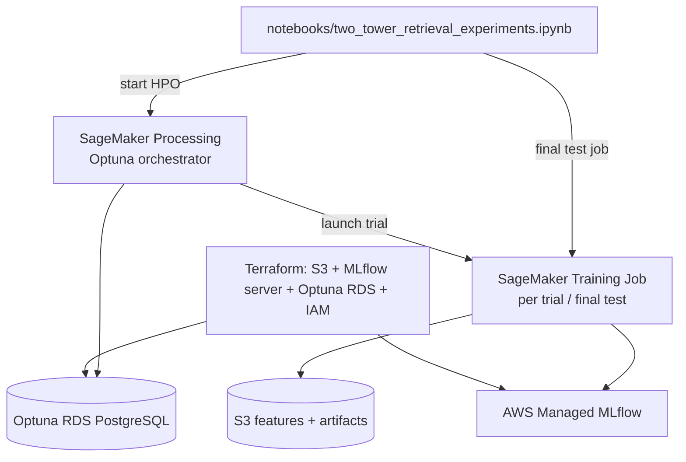

# Two-Tower Retrieval Experiments Design

## Overview

Implement Stage-1 **two-tower retrieval** training with **AWS Managed MLflow** experiment tracking and **Optuna** hyperparameter search. Work is driven by `notebooks/two_tower_retrieval_experiments.ipynb` and supporting pipeline scripts; training compute runs on **SageMaker Training Jobs** (one job per Optuna trial), orchestrated by a **SageMaker Processing** job.

**Data:** `s3://{S3_BUCKET}/dataset/sample_2000_users/features/transactions/` (local mirror: `s3/dataset/sample_2000_users/features/transactions/`).

**Reference implementation:** Architecture, default hyperparameters, in-batch negative strategy, and evaluation approach from [`two-tower-retrieval-training-guide.md`](../../implementation-info/two-tower-model/two-tower-retrieval-training-guide.md), with **log-q popularity correction** from `tmp/recsys-v2/two-tower-cg/` to debias in-batch negatives.

**Out of scope for this deliverable:** Feature-engineering changes (user extends FE separately), SageMaker weekly production pipeline (FR-BATCH-04), model registry promotion, FAISS index build.

---

## Goals

| Goal | Detail |
|------|--------|
| Retrieval model | TensorFlow + TFRS dual-encoder; val headline metric **recall@100** |
| Temporal integrity | FR-BATCH-02 train / val / test splits (not random 10/10) |
| Popularity correction | Log-q debiasing during training only |
| Experiment tracking | AWS Managed MLflow; nested runs per Optuna trial |
| HPO | Optuna on RDS PostgreSQL; **3 trials**; objective = val recall@100 |
| Final gate | One test eval Training Job with frozen `study.best_params` (informational) |
| Infrastructure | Terraform modules for MLflow tracking server + Optuna RDS; credentials via `.env` |

---

## Architecture

**Approach:** Notebook → SageMaker Processing (Optuna orchestrator) → SageMaker Training Job per trial.



### Deliverables

| Artifact | Location |
|----------|----------|
| Experiment notebook | `notebooks/two_tower_retrieval_experiments.ipynb` |
| Notebook helpers | `notebooks/utils/two_tower_training_helpers.py` |
| Training entrypoint | `pipelines/training/two_tower/train.py` |
| HPO orchestrator | `pipelines/hpo/run_two_tower_study.py`, `pipelines/sagemaker/hpo_processing_job.py` |
| Search space | `configs/hpo/two_tower_search_space.yaml` |
| Frozen defaults | `configs/models/two_tower.yaml` |
| Terraform | `infra/modules/mlflow_tracking_server/`, `infra/modules/optuna_rds/` |
| Env config | `.env.example`, `src/fashion_recommendation_system/config.py` |

**Notebook constraint:** Do not import from `src/` (per project-structure). Read YAML via `notebooks/config_loader.py`; read infra env vars directly or via `notebooks/ml_config.py`.

---

## Data & Temporal Splits

### Input path

```
s3://{S3_BUCKET}/dataset/sample_2000_users/features/transactions/
```

### Model input columns

Use **actual FE column names** — no renaming at load time.

| Column | Tower | Preprocessing |
|--------|-------|---------------|
| `customer_id` | Query | `StringLookup` + `Embedding(16)` |
| `age` | Query | `Normalization` (adapted on train) |
| `txn_month_sin` | Query | Pass-through (already ∈ [-1, 1]) |
| `txn_month_cos` | Query | Pass-through |
| `article_id` | Candidate | `StringLookup` + `Embedding(16)` |
| `item_category` | Candidate | `StringLookup` + `tf.one_hot` |
| `index_group_name` | Candidate | `StringLookup` + `tf.one_hot` |

These columns are semantically equivalent to the reference guide’s `month_sin/cos` and `garment_group_name`, but the implementation **must use `txn_month_sin`, `txn_month_cos`, and `item_category`** as the canonical names in code, configs, and MLflow params.

### FR-BATCH-02 temporal split

Applied in `train.py` on `t_dat`:

| Split | Filter | Approx. rows (current sample) |
|-------|--------|-------------------------------|
| **Train** | `t_dat <= 2020-03-31` | ~36k |
| **Val** | `2020-04-01` ≤ `t_dat` ≤ `2020-05-15` | ~2.9k |
| **Test** | `2020-05-16` ≤ `t_dat` ≤ `2020-06-30` | ~3.9k |

Drift slices (`2020-07-01` onward) are **not** used in this notebook.

### SageMaker data staging

Before Training Jobs, split Parquet is written to:

```
s3://{bucket}/experiments/two_tower/{run_id}/train.parquet
s3://{bucket}/experiments/two_tower/{run_id}/val.parquet
s3://{bucket}/experiments/two_tower/{run_id}/test.parquet
```

Training entrypoint flags: `--train-uri`, `--val-uri`, `--test-uri` (test URI used only in final eval mode).

### Vocabularies & popularity table

Built from **train split only**:

- Unique `customer_id`, `article_id`, `item_category`, `index_group_name`
- Log-q correction: `P(article_id) = count(article_id) / N_train`

---

## Model, Loss & Popularity Correction

### Two-tower architecture

Matches [`two-tower-retrieval-training-guide.md`](../../implementation-info/two-tower-model/two-tower-retrieval-training-guide.md) with updated column names:

**Query tower inputs:** `customer_id`, `age`, `txn_month_sin`, `txn_month_cos`  
→ concat (19-d) → `Dense(16, relu)` → `Dense(16)` → 16-d query embedding

**Candidate tower inputs:** `article_id`, `item_category`, `index_group_name`  
→ concat (~48-d) → `Dense(16, relu)` → `Dense(16)` → 16-d item embedding

**Positive samples:** Every row in the split Parquet is one implicit positive `(customer_id, article_id)` purchase.

**Negative samples:** In-batch contrastive — all other items in the batch (batch size 2048 → 2047 negatives per row).

### Popularity correction (training only)

From `tmp/recsys-v2/two-tower-cg/custom_cross_entropy_loss.py`:

1. Precompute `label_probs_hash_table` from train-set article frequencies.
2. During `train_step`, subtract `log(P(article))` from the logits row for the true positive.
3. Apply standard in-batch softmax cross-entropy with diagonal labels.

**Eval and test steps do not apply log-q correction.**

Implementation uses a custom `train_step` (not the stock `tfrs.tasks.Retrieval` loss path). Evaluation still uses `tfrs.metrics.FactorizedTopK` over deduplicated train articles.

### Default hyperparameters

From the training guide — used for optional smoke job, enqueued Optuna trial 0, and `configs/models/two_tower.yaml`:

| Parameter | Value |
|-----------|-------|
| `embedding_dim` | 16 |
| `batch_size` | 2048 |
| `epochs` | 10 |
| `learning_rate` | 0.01 |
| `weight_decay` | 0.001 |

**Optimizer:** `tf.keras.optimizers.AdamW`

---

## Training, HPO & Evaluation

### SageMaker instance type

| Job type | Instance | vCPU | RAM |
|----------|----------|------|-----|
| Processing (orchestrator) | `ml.m5.large` | 2 | 8 GiB |
| Training (per trial / final) | `ml.m5.large` spot | 2 | 8 GiB |

Storage: EBS only. Step up to `ml.m5.xlarge` (4 vCPU, 16 GiB) only if OOM occurs.

### Job flow

| Job | When | Purpose |
|-----|------|---------|
| **Processing** | HPO start | Optuna orchestrator; launches child Training Jobs |
| **Training** | Per Optuna trial (×3) | Train with trial hyperparams; log to MLflow; return val recall@100 |
| **Training** | After HPO | Final run with `study.best_params`; eval on **test** split |

### Optuna configuration

| Setting | Value |
|---------|-------|
| Study name | `two_tower_hpo_v1` |
| Storage | RDS PostgreSQL (`OPTUNA_STORAGE_URI`) |
| Direction | Maximize |
| Objective | `val_recall_at_100` |
| **n_trials** | **3** |
| Trial 0 | Enqueued with guide default hyperparameters |

Search space (`configs/hpo/two_tower_search_space.yaml`):

```yaml
learning_rate: {type: float, low: 1e-4, high: 1e-2, log: true}
embedding_dim: {type: categorical, choices: [16, 32, 64]}
batch_size: {type: categorical, choices: [512, 1024, 2048]}
weight_decay: {type: float, low: 1e-4, high: 1e-2, log: true}
epochs: {type: int, low: 5, high: 15}
```

**Tune on val only.** Test metrics from the final eval job are informational — never fed back to Optuna.

### Evaluation metrics

Primary (val, per trial): `top_100_categorical_accuracy` via `FactorizedTopK` (= recall@100).

Also log: top-1/5/10/50/100, train/val loss curves.

Final test job logs: `test_recall_at_100` and full top-K table.

---

## MLflow & Optuna Integration

### AWS Managed MLflow

- Terraform: `infra/modules/mlflow_tracking_server/`
- Artifact root: `s3://{bucket}/mlflow/artifacts/`
- Env: `MLFLOW_TRACKING_URI` = tracking server ARN (Terraform output)
- Experiment: `MLFLOW_EXPERIMENT` (default `fashion-reco-dev`)

**Required tags** (parent run and trials):

| Tag | Example |
|-----|---------|
| `git_sha` | commit hash |
| `feature_snapshot` | S3 path or manifest hash |
| `feature_cutoff` | `2020-03-31` |
| `model` | `two_tower` |
| `data_env` | `dev` |

Nested child runs per trial via `optuna.integration.MLflowCallback`.

### Session lifecycle

Document in notebook §2:

1. `aws sagemaker start-mlflow-tracking-server` (or Terraform apply)
2. Run HPO Processing job
3. Run final test Training Job
4. `aws sagemaker stop-mlflow-tracking-server`

Keep RDS and S3 persistent; **stop** MLflow server (do not delete).

### AWS Systems Manager Parameter Store

**Not required for v1 dev.** Terraform outputs and secrets (RDS password) go to `.env.local` (gitignored). Parameter Store may be added later for production secret rotation; hyperparameters remain in `configs/**/*.yaml`, not SSM.

---

## Terraform & Environment

### New env vars (`.env.example` + `config.py`)

```
MLFLOW_TRACKING_URI=
MLFLOW_EXPERIMENT=fashion-reco-dev
OPTUNA_STORAGE_URI=
SAGEMAKER_ROLE_ARN=
AWS_REGION=us-east-1
S3_BUCKET=fashion-reco-dev
```

AWS credentials via standard SDK chain (`AWS_ACCESS_KEY_ID`, `AWS_SECRET_ACCESS_KEY`, or SSO) in `.env.local`.

### Terraform modules

| Module | Resources |
|--------|-----------|
| `mlflow_tracking_server` | SageMaker MLflow tracking server (Small), S3 artifact URI, IAM role |
| `optuna_rds` | `db.t4g.micro` PostgreSQL, security group, credentials output |

Root `infra/` wires modules for `dev` environment; outputs feed `.env.local` after `terraform apply`.

---

## Notebook Structure

**File:** `notebooks/two_tower_retrieval_experiments.ipynb`

Organized with markdown **sections and subsections** before every code block. Functions have **docstrings**; non-obvious logic has **inline comments**.

```
# Two-Tower Retrieval Experiments

## 1. Setup
### 1.1 Environment & credentials
### 1.2 Load configs (YAML + .env)
### 1.3 Verify feature data schema

## 2. Infrastructure checks
### 2.1 MLflow tracking server status
### 2.2 Optuna RDS connectivity

## 3. Data preparation
### 3.1 Load transactions features
### 3.2 Apply temporal split & stage to S3

## 4. Baseline training (optional smoke)
### 4.1 Launch single Training Job with guide defaults

## 5. Hyperparameter optimization
### 5.1 Configure search space (n_trials=3)
### 5.2 Launch Processing orchestrator job
### 5.3 Monitor trials in MLflow

## 6. Final evaluation
### 6.1 Select best trial
### 6.2 Launch test eval Training Job

## 7. Results & handoff
### 7.1 Compare runs / plots
### 7.2 Export best params → configs/models/two_tower.yaml
```

Helper module: `notebooks/utils/two_tower_training_helpers.py` (split logic, job launch wrappers, schema validation).

---

## Artifacts & Handoff

| Output | Location |
|--------|----------|
| Query + candidate SavedModels | MLflow artifacts + `s3://.../experiments/two_tower/{run_id}/` |
| Best hyperparams | `configs/models/two_tower.yaml` (export after HPO) |
| Eval report JSON | MLflow artifact |
| Optuna plots | MLflow artifact (optimization history, param importance) |

After HPO: freeze `study.best_params` to YAML → future SageMaker weekly pipeline (FR-BATCH-04) trains with frozen config (no Optuna in production).

---

## Acceptance Criteria

1. Temporal split matches FR-BATCH-02 exactly.
2. Model uses columns `txn_month_sin`, `txn_month_cos`, `item_category` (not legacy names).
3. Architecture and default hyperparameters match the training guide.
4. Popularity correction active during training only.
5. Optuna runs **3 trials** on val recall@100; trial 0 enqueued with guide defaults.
6. One final test eval Training Job with best params (not used for tuning).
7. All trials logged to AWS Managed MLflow with required tags.
8. Terraform provisions MLflow server + Optuna RDS; credentials from `.env`.
9. Notebook is sectioned with markdown, docstrings, and comments per requirements.
10. No AWS Parameter Store required for v1 dev.

---

## References

| Resource | Location |
|----------|----------|
| Training guide | `docs/implementation-info/two-tower-model/two-tower-retrieval-training-guide.md` |
| Implementation guide | `docs/implementation-info/two-tower-model/two-tower-retrieval-implementation-guide.md` |
| MLflow + Optuna guide | `docs/implementation-info/guides/mlflow-optuna-experiment-guide.md` |
| Temporal split contract | `docs/system-design/v1/v1-requirements.md` FR-BATCH-02 |
| Reference two-tower code | `tmp/recsys/training/two_tower.py` |
| Popularity correction | `tmp/recsys-v2/two-tower-cg/custom_cross_entropy_loss.py` |
