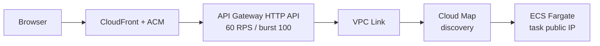
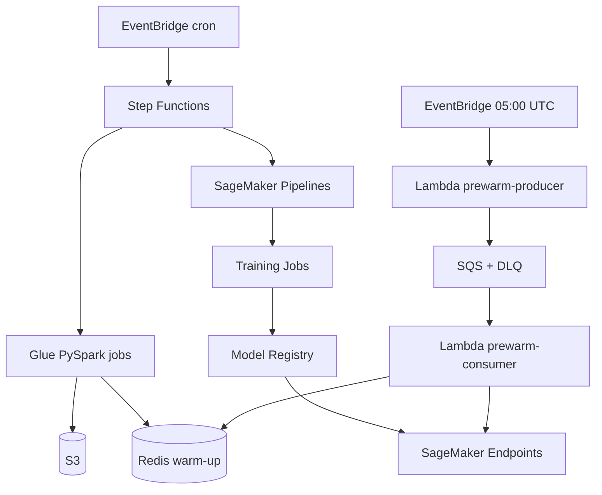

# Fashion Recommendation System — V1 Infrastructure Layer

| Field | Value |
|---|---|
| **Status** | Design Complete — Ready for Implementation |
| **Version** | v1.0 |
| **Last Updated** | 2026-05-31 |
| **Author** | rahul.vansh |
| **Source of truth (architecture)** | [`v1-hld.md`](v1-hld.md) |
| **Requirements contract** | [`v1-requirements.md`](v1-requirements.md) |
| **Parent reference (pre-v1)** | [`../infrastructure-layer.md`](../infrastructure-layer.md) |
| **Related** | [`../schema-info.md`](../schema-info.md) · [`../project-structure.md`](../project-structure.md) |

---

## Purpose

This document describes **how v1 is hosted on AWS** and **how local development mirrors production**. It adapts the pre-v1 [`infrastructure-layer.md`](../infrastructure-layer.md) to the v1 decisions in [`v1-hld.md`](v1-hld.md): unified **ECS Fargate** application, **API Gateway HTTP API** ingress (no ALB), **Lambda + FAISS** for vector search only, **SQS** cache pre-warming, and **Terraform** for one-command deploy/destroy.

For pipeline stages, Redis key semantics, and latency budgets, use the HLD. This doc focuses on **services, networking, IaC, migration patterns, and cost**.

---

## Project Goal (V1)

Ship a learning-grade, production-pattern recommendation stack that:

- Serves personalized **top-10** recommendations via **Cache → Retrieve → Filter → Rank → Order**
- Demonstrates **cache hit ~15 ms** vs **cache miss ~190 ms** (SQS pre-warm demo)
- Deploys with **`terraform apply`** and tears down with **`terraform destroy`**
- Targets **~$45/mo** realistic active cost (SageMaker endpoints ~6 h/day); **~$136/mo** if endpoints run 24/7

---

## Architecture Philosophy

| Principle | V1 decision |
|-----------|-------------|
| **Cost-first, learning-grade** | Serverless where it fits (Lambda FAISS, Glue, Step Functions); scale-to-zero mindset; destroy between sessions |
| **Migration-friendly** | Same Docker image and Python code locally and on AWS — **environment variables only**, never business-logic forks |
| **SageMaker-centric ML** | User-tower + XGBoost inference on SageMaker Endpoints (A/B, canary, Model Monitor) |
| **FAISS over managed vector DB** | Lambda + S3-backed index; OpenSearch/Pinecone documented as scale-up paths |
| **S3 as data lake** | No DynamoDB; Redis is cache only, not system of record |
| **Production patterns, dev sample scale** | Architecture matches full H&M scale; deployed on ~1K stratified users (articles and transactions derived from sampled users) |

**Target cost (from v1 HLD):** ~$45 over 2–3 months with local-first dev and SageMaker endpoints only during active sessions.

---

## Dataset

| Table | Full scale | Dev sample (v1 deploy) | Role |
|-------|-----------|------------------------|------|
| `articles.csv` | 105K | Derived from sampled users' transactions | Product catalog |
| `customers.csv` | 1.37M | ~1K users (stratified sample) | Demographics |
| `transactions_train.csv` | 31.8M | All interactions for sampled users | Purchase history |

- **Star schema** — transactions fact, articles + customers dimensions  
- **Privacy** — customer IDs and postal codes pre-hashed in source data  
- **Schema detail** — [`../schema-info.md`](../schema-info.md)  
- **Local path (pre-pipeline)** — `dataset/sample/` (produced by `notebooks/stratified_user_sampling.ipynb`); **AWS** — `s3://fashion-reco-{env}/raw/` → `clean/` → `features/`

---

## AWS Service Map (V1)

| Concern | AWS service | V1 role |
|---------|-------------|---------|
| Data lake | **S3** | `raw/`, `clean/`, `features/`, `models/`, `embeddings/`, `indices/` |
| Hot cache | **ElastiCache Redis** | `cache.t3.micro` — results, features, seen sets, rate limits, pre-warm keys |
| Batch ETL | **AWS Glue** (PySpark) | Same code as `local[*]`; nightly/weekly jobs |
| General orchestration | **Step Functions** | Data + feature pipeline DAG |
| ML orchestration | **SageMaker Pipelines** | Train → evaluate → register → embed → FAISS build → canary |
| Experiment tracking | **AWS Managed MLflow** | Track Optuna trials, parameters, metrics, and artifacts |
| Hyperparameter tuning | **Optuna** | SQLite on EBS for study persistence |
| Scheduling | **EventBridge** | Cron: weekly ETL, daily Redis warm-up, daily pre-warm |
| ML training | **SageMaker Training Jobs** | Two-Tower + XGBoost; `ml.m5.large` spot |
| ML inference | **SageMaker Endpoints** | `two-tower-user-tower`, `xgboost-ranker`; `ml.t3.medium` |
| Model governance | **SageMaker Model Registry** | Approval-gated promotion |
| Vector search | **Lambda** (container) | FAISS top-100; 2 GB; index from S3 |
| Application | **ECS Fargate** | Unified FastAPI monolith; 0.5 vCPU / 1.0 GB; desired count 1 (scale 1–4) |
| Ingress | **API Gateway HTTP API** + **VPC Link** + **Cloud Map** | No ALB (~$16/mo saved) |
| Edge / TLS | **CloudFront** + **ACM** | TLS, static asset cache |
| Pre-warm queue | **SQS Standard** + **DLQ** | Producer + consumer Lambdas |
| Pre-warm compute | **Lambda** | `prewarm-producer` (256 MB), `prewarm-consumer` (1024 MB, concurrency 5) |
| Containers | **ECR** | App, FAISS, SageMaker, Lambda images |
| Observability | **CloudWatch**, **X-Ray**, **SNS** | Metrics, traces, alarms |
| Drift | **SageMaker Model Monitor** | Baselines + alarms |
| Secrets / config | **SSM Parameter Store** | No secrets in git |
| CI/CD | **GitHub Actions** | Lint, test, build, ECR push, `terraform plan/apply` |
| IaC | **Terraform** | 100% AWS resources; LocalStack provider for local |

**Explicitly not in v1:** Cognito, Kinesis Firehose, purchase-event SQS, RAG/chatbot path, MWAA, OpenSearch, ALB, NAT Gateway (cost tradeoff — public Fargate subnet).

---

## System Layers — Infrastructure View

### 1. Network & Ingress



| Component | Decision | Notes |
|-----------|----------|-------|
| **API Gateway HTTP API** | Chosen | ~$1/M requests; stage throttling |
| **VPC Link + Cloud Map** | Chosen | Private integration to Fargate without ALB/NLB |
| **ALB / NLB** | Rejected for v1 | ~$16/mo idle; documented scale-up path |
| **Fargate networking** | Public subnet + public IP | Avoids ~$32/mo NAT; production path: private subnet + VPC endpoints |
| **ElastiCache** | VPC private subnet | App reaches Redis over VPC |
| **SageMaker endpoints** | VPC mode | Invoked from Fargate / Lambdas in VPC |

### 2. Application Compute (Unified Monolith)

| Aspect | V1 |
|--------|-----|
| Runtime | **ECS Fargate** — not Lambda for the API |
| Image | Single Docker image: FastAPI + Jinja2 + HTMX + uvicorn |
| Sizing | 0.5 vCPU, 1.0 GB RAM, 1 task (auto-scale 1–4 on CPU/memory) |
| Health | `GET /health` → ECS task health check |
| Session | `rr/rr` cookie — no Cognito in v1 |

**Why not Lambda + Lambda Web Adapter (pre-v1 reference):** v1 prioritizes **no cold starts**, server-rendered HTMX, and a single deployment unit. FAISS remains Lambda because it is bursty, memory-bound, and pay-per-invoke.

### 3. Data Stores

```
S3 data lake (system of record)
    ↓  (Glue batch)
Parquet features + artifacts
    ↓  (Glue job 3 + live path)
ElastiCache Redis (hot path only)
```

**S3 layout** (see v1 HLD §10.1):

```
s3://fashion-reco-{env}/
├── raw/ | clean/ | features/ | models/ | embeddings/ | indices/
├── mlflow/     (MLflow artifact root)
├── enriched/   (reserved)
└── events/     (reserved — v1.1)
```

**Redis** — `cache.t3.micro`; keys include `reco:{cid}`, `user:{cid}:features`, `seen:{cid}`, `active:users:top6`, `prewarm:done:{cid}:{date}`, etc. (full map: v1 HLD §10.3).

**EBS Volume** — Attached to an EC2 instance or accessed via Lambda/Fargate for persistent SQLite database used by Optuna for hyperparameter optimization studies.

### 4. ML Serving Infrastructure

| Component | Hosting | Sizing / notes |
|-----------|---------|----------------|
| Two-Tower user-tower | SageMaker Endpoint | `ml.t3.medium`; variant weights for canary |
| XGBoost ranker | SageMaker Endpoint | `ml.t3.medium`; batch per request |
| FAISS ANN | Lambda container | 2 GB; index in S3 `indices/faiss_items/version={vN}.index`; version via `FAISS_INDEX_VERSION` env |
| Item embeddings (offline) | SageMaker Batch Transform | Feeds index-build Lambda |

**FAISS Lambda**

- Cold start ~500 ms (S3 → `/tmp` → mmap)
- Warm search &lt; 1 ms; v1 NFR: &lt; 20 ms p95 end-to-end invoke
- Index &lt; 300 MB full dataset — within 10 GB Lambda limit
- Reserved concurrency cap 0–50

### 5. Online Request Path (Infrastructure Hops)

Only **one** request path in v1 (no RAG/chatbot).

```
Browser → CloudFront → API Gateway → VPC Link → Cloud Map → ECS Fargate
    ↔ ElastiCache Redis
    → SageMaker (user-tower)
    → Lambda (FAISS) → S3 (index read at cold start)
    → SageMaker (XGBoost)
```

Circuit breakers (`pybreaker`) on each downstream; fallbacks documented in v1 HLD §9.8.

### 6. Offline & Orchestration Infrastructure



| Schedule (UTC) | Infrastructure action |
|----------------|-------------------------|
| Sun 02:00 | Step Functions → Glue raw→clean→features → trigger SageMaker Pipeline |
| Daily 03:00 | Glue cache warm-up → Redis (`popular:*`, `seen:*`, `active:users:top6`) |
| Daily 04:00 | Model Monitor drift baseline |
| Daily 05:00 | Pre-warm: producer → SQS → consumer (top 3 of `active:users:top6`) |

### 7. Cache Pre-Warm Infrastructure (Pattern 4 Demo)

| Resource | Purpose |
|----------|---------|
| EventBridge rule | Daily 05:00 UTC trigger |
| Lambda `prewarm-producer` | `LRANGE active:users:top6 0 2` → `SendMessageBatch` to SQS |
| SQS Standard `cache-prewarm-queue` | Visibility 90 s; batch size 1 |
| SQS DLQ | maxReceiveCount 3; alarm on depth &gt; 0 |
| Lambda `prewarm-consumer` | Reserved concurrency **5**; full 5-stage pipeline; `SETEX reco:{cid}` 12 h |
| Redis `prewarm:done:{cid}:{date}` | SETNX idempotency |

First three user-picker cards show **pre-warmed** badge (~15 ms); last three are live (~190 ms).

### 8. Observability & Security (Infra)

| Layer | Tool |
|-------|------|
| Edge / API | CloudWatch + X-Ray on API Gateway |
| App | CloudWatch Container Insights on Fargate |
| Redis | ElastiCache metrics (hit ratio, evictions) |
| ML | SageMaker + Model Monitor → CloudWatch |
| FAISS | Custom metrics: cold start, index version |
| Alarms | SNS ← CloudWatch (latency, 5xx, fallbacks, DLQ, Step Functions failure) |

**Security (v1):** IAM role per Lambda/ECS task; TLS 1.2+; S3 SSE-KMS; Redis encryption at rest; CloudTrail 30-day retention; SSM for secrets. **Gaps:** `rr/rr` auth, public Fargate subnet — documented in v1 HLD §13.2, §17.

---

## ML Pipeline — Component Table (V1)

### Core recommendation pipeline

| Pipeline step | Local dev | AWS production | Purpose |
|---------------|-----------|----------------|---------|
| Data ingestion + preprocessing | PySpark `local[*]` | AWS Glue | Raw CSV → clean parquet |
| Feature engineering | PySpark `local[*]` | AWS Glue | Clean → model-ready features |
| Redis materialization | Local Redis CLI / script | Glue job 3 | Popular items, seen sets, `active:users:top6` |
| Two-Tower training | Docker + PyTorch / SM SDK `local` | SageMaker Training Job | User/item embeddings |
| Two-Tower inference (online) | Local server | SageMaker Endpoint `two-tower-user-tower` | User embedding at request time |
| Item embeddings (offline) | Local script | SageMaker Batch Transform | Feed FAISS build |
| Hyperparameter tuning (HPO) | Local Optuna + SQLite | Optuna + SQLite on EBS | Find best model parameters |
| Experiment tracking | Local MLflow server | AWS Managed MLflow | Track metrics, parameters, and artifacts |
| FAISS index build | Local script | Lambda (ML pipeline step) | Build `.index` → S3 |
| FAISS search | Local FAISS | Lambda + FAISS | Top-100 candidates |
| XGBoost training | Local XGBoost | SageMaker Training Job | Ranking model |
| XGBoost inference | Local server | SageMaker Endpoint `xgboost-ranker` | Re-rank candidates |
| API + 5-stage pipeline | `uvicorn` in Docker | **ECS Fargate** (same image) | Orchestrate Cache→…→Order |
| Cache pre-warm | Local SQS (LocalStack) + script | Producer/consumer Lambdas + SQS | Overnight `reco:{cid}` for top 3 users |
| Feature / result caching | Local Redis | ElastiCache Redis | Hot path |
| Storage | Local filesystem / LocalStack S3 | S3 data lake | Artifacts, indices, features |
| Orchestration | Python/Makefile | Step Functions + SageMaker Pipelines + EventBridge | Schedules and DAGs |
| IaC | Terraform (LocalStack) | Terraform (AWS) | Apply / destroy |

### Out of scope for v1 (no infra provisioned)

| Capability | Status |
|------------|--------|
| RAG chatbot (`POST /chat`, `faiss_rag.index`) | Future — separate path |
| LLM tag extraction (`content_features/`) | Future — separate HLD |
| `POST /events` + Kinesis + purchase SQS | v1.1 |
| Cognito / JWT authorizer | Documented production gap |

---

## SageMaker Managed Capabilities (Infra-Relevant)

| Capability | How (v1) |
|------------|----------|
| A/B / canary | Production variants on endpoints; CI/CD 10% → 50% → 100% |
| Model Registry | Approval gate before deploy |
| Model Monitor | Drift + quality baselines; EventBridge daily job |
| Auto-scaling | Target tracking on endpoints (1–4 instances) |
| Lineage | SageMaker Pipelines + Registry |

---

## Local-to-AWS Migration Patterns

**Core principle:** Write code as if it already runs on AWS. Migration is a **config change**, not a rewrite. All `os.getenv()` lives in `config.py`; model params in `configs/` YAML.

### Quick reference

| Concern | Local | AWS (v1) |
|---------|-------|----------|
| Object storage | LocalStack S3 (`endpoint_url=localhost:4566`) | S3 |
| Cache | Redis container (`localhost:6379`) | ElastiCache |
| Spark | `master('local[*]')` | AWS Glue |
| boto3 | `endpoint_url` for LocalStack | IAM role — no `endpoint_url` |
| ML training | SageMaker SDK `instance_type='local'` | `ml.m5.large` spot |
| ML inference | Local model server | SageMaker Endpoints |
| Experiment tracking | Local MLflow server | AWS Managed MLflow |
| Hyperparameter tuning | Local Optuna SQLite | Optuna SQLite on EBS |
| Vector search | Local `.index` file | Lambda + S3-backed index |
| **Application** | **`uvicorn` in Docker Compose** | **ECS Fargate** (same image) |
| **Ingress** | Direct `localhost:8000` | API Gateway → VPC Link → Cloud Map |
| Queues | LocalStack SQS | SQS + DLQ |
| Workflows | Local Python / Makefile | Step Functions + SageMaker Pipelines |
| IaC | Terraform + LocalStack provider | Terraform AWS provider |

---

### Pattern 1 — AWS SDK from Day 1 + LocalStack

```python
# aws_client.py — factory pattern
import boto3
import os

def get_s3_client():
    if os.getenv("ENV") == "local":
        return boto3.client("s3", endpoint_url="http://localhost:4566")
    return boto3.client("s3")
```

Identical `upload_file` / `download_file` calls in both environments.

---

### Pattern 2 — Environment-Driven Configuration

```python
# config.py — infra endpoints only; business params in configs/*.yaml
import os

S3_BUCKET          = os.getenv("S3_BUCKET", "local-dev-bucket")
REDIS_HOST         = os.getenv("REDIS_HOST", "localhost")
REDIS_PORT         = int(os.getenv("REDIS_PORT", "6379"))
SM_USER_TOWER      = os.getenv("SAGEMAKER_USER_TOWER_ENDPOINT", "http://localhost:8080/user")
SM_XGBOOST        = os.getenv("SAGEMAKER_XGBOOST_ENDPOINT", "http://localhost:8080/rank")
FAISS_LAMBDA       = os.getenv("FAISS_LAMBDA_NAME", "faiss-search-local")
FAISS_INDEX_VERSION = os.getenv("FAISS_INDEX_VERSION", "v1")
ENV                = os.getenv("ENV", "local")
```

Local `.env` vs ECS task definition / Lambda env — same keys, different values.

---

### Pattern 3 — SageMaker Python SDK for Local Testing

```python
from sagemaker.pytorch import PyTorch
import os

estimator = PyTorch(
    entry_point="train.py",
    source_dir="pipelines/training/two_tower/",
    instance_type="local" if os.getenv("ENV") == "local" else "ml.m5.large",
    # ...
)
estimator.fit({"train": f"s3://{bucket}/features/..."})
```

---

### Pattern 4 — Redis Protocol Compatibility

Same `redis-py` commands locally and on ElastiCache; only host/port change. TTLs match v1 HLD (`reco:*` 12 h, `user:*:features` 1 h, etc.).

---

### Pattern 5 — PySpark / Glue

```python
def get_spark():
    builder = SparkSession.builder.appName("FashionFeaturePipeline")
    if os.getenv("ENV") == "local":
        builder = builder.master("local[*]")
    return builder.getOrCreate()
```

On Glue, do not set `master()` — Glue manages the cluster.

---

### Pattern 6 — FastAPI on ECS Fargate (V1; replaces Lambda Web Adapter)

The **same** FastAPI application and Docker image run locally with uvicorn and on Fargate. No Lambda Web Adapter on the request path.

```dockerfile
FROM public.ecr.aws/docker/library/python:3.11-slim
WORKDIR /app
COPY requirements-serving.txt .
RUN pip install --no-cache-dir -r requirements-serving.txt
COPY src/ .
ENV PORT=8000
CMD ["uvicorn", "fashion_recommendation_system.api.main:app", "--host", "0.0.0.0", "--port", "8000"]
```

Local Compose overrides `ENV=local` and mounts `dataset/sample`. CI pushes the image to ECR; Terraform/ECS `forceNewDeployment` rolls out new tasks.

---

### Pattern 7 — Docker Compose for Local Full Stack

```yaml
# docker/docker-compose.yml (conceptual)
services:
  api:
    build:
      dockerfile: deployment/docker/recommendation_api.Dockerfile
    ports: ["8000:8000"]
    environment:
      ENV: local
      REDIS_HOST: redis
      AWS_ENDPOINT_URL: http://localstack:4566
    depends_on: [redis, localstack]
  redis:
    image: redis:7-alpine
  localstack:
    image: localstack/localstack
    environment:
      SERVICES: s3,sqs,lambda,events,stepfunctions
```

Optional: LocalStack SageMaker mock or local inference containers for integration tests (see v1 HLD §14.2).

---

## Terraform & IaC

| Rule | Detail |
|------|--------|
| Tool | **Terraform only** — no CDK/SAM/Console-only resources (v1-requirements CON-08) |
| Layout | `infra/` — `main.tf`, `variables.tf`, `outputs.tf`, `modules/`, `environments/{local,dev,aws}/` |
| Lifecycle | `terraform apply` provisions stack; `terraform destroy` removes compute (Fargate, endpoints, Lambdas) |
| State | Per-environment workspaces or separate backends (`dev` / `prod` prefix) |
| Modules (planned) | `s3`, `lambda`, `api_gateway`, `ecs`, `elasticache`, `sagemaker`, `sqs`, `eventbridge`, `step_functions` |

Outputs should expose: API Gateway URL, CloudFront domain, Redis endpoint (VPC-only), SageMaker endpoint names, FAISS Lambda ARN, S3 bucket name.

---

## CI/CD Infrastructure Touchpoints

| Stage | Infra impact |
|-------|----------------|
| Build | Docker images → **ECR** (`:{git_sha}`, `:latest`) |
| Test | LocalStack + Redis in GitHub Actions |
| Plan / apply | `terraform plan` on PR; manual approval → `terraform apply` |
| Deploy app | ECS `forceNewDeployment` (rolling; drain via task stop) |
| Deploy ML | SageMaker Pipelines on `models/` or feature path changes; canary variants |
| Rollback | Alarm-driven variant weight reset |

Environments: **local** (LocalStack), **dev** (`main` auto after gates), **prod** (tag `v*`, manual approval).

---

## Development Workflow

### Phase 1 — Local ($0 AWS)

1. `docker compose up` — API + Redis + LocalStack  
2. Seed LocalStack S3; run feature pipeline on `dataset/sample/`  
3. Train models locally or via SageMaker SDK `instance_type='local'`  
4. Build FAISS index; run full 5-stage pipeline against local Redis/inference stubs  
5. Optional: simulate pre-warm with LocalStack SQS

### Phase 2 — AWS session (cost only while up)

1. `terraform apply`  
2. Upload artifacts to S3; register models  
3. Deploy / verify SageMaker endpoints + FAISS Lambda + ECS service  
4. Run pre-warm cron or manual producer invoke; validate picker latency demo  
5. `terraform destroy` when done  

### Cost controls

- Destroy SageMaker endpoints between sessions (~$100/mo saved if 24/7)  
- Spot training jobs  
- Single Fargate task; micro Redis  
- Terraform destroy between learning sessions  

---

## Cost Summary (V1)

| Scenario | Monthly (approx.) |
|----------|-------------------|
| Local development | $0 |
| AWS — endpoints 6 h/day weekdays | **~$45** |
| AWS — full stack 24/7 | **~$136** |
| SageMaker endpoints alone (24/7, 2× `ml.t3.medium`) | ~$100 |

Dominant cost: **SageMaker inference endpoints**. Fargate + Redis + Lambda + Glue are comparatively small.

---

## V1 vs Pre-V1 Reference — Key Deltas

| Topic | Pre-v1 (`infrastructure-layer.md`) | V1 (this doc) |
|-------|-------------------------------------|---------------|
| API hosting | Lambda + Lambda Web Adapter | **ECS Fargate** monolith |
| Ingress | API Gateway → Lambda | **API Gateway → VPC Link → Cloud Map → Fargate** |
| Load balancer | Not specified | **No ALB** (cost) |
| Online stages | Retrieve → rank (4 steps in diagram) | **5 stages** incl. Filter + Order |
| Second request path | RAG `POST /chat` | **Removed** from v1 |
| Pre-warm | Not described | **SQS + 2 Lambdas** |
| Orchestration | Glue implied | **Step Functions + EventBridge + SM Pipelines** |
| Frontend | API only | **Jinja2 + HTMX** in same Fargate task |
| Budget | $25–40 total / ~$50 dev | **~$45 active** / ~$136 if always on |

---

## Directory & Implementation Pointers

- Code layout: [`../project-structure.md`](../project-structure.md) — `src/fashion_recommendation_system/`, `infra/`, `pipelines/`, `deployment/docker/`  
- Do not import from `src/` in notebooks; do not commit artifacts or full dataset  

---

## Related Documents

| Document | Use when |
|----------|----------|
| [`v1-hld.md`](v1-hld.md) | Full architecture, stage logic, Redis map, tradeoffs |
| [`v1-requirements.md`](v1-requirements.md) | MUST/SHOULD contract for implementation |
| [`v1-deliverable.md`](v1-deliverable.md) | Shipped checklist by layer |
| [`../schema-info.md`](../schema-info.md) | H&M column types and relationships |

---

## Document Changelog

| Date | Version | Notes |
|------|---------|-------|
| 2026-05-31 | v1.0 | Initial v1 infrastructure layer — adapted from `infrastructure-layer.md` per `v1-hld.md` |
